# GitHub Actions CI/CD Setup

This directory contains the GitHub Actions workflow for automated deployment of the ABC Dashboard.

## Deployment Architecture

The CI/CD pipeline uses a **containerized deployment strategy**:

- **Frontend**: Next.js application running in Docker container
- **Backend**: Node.js API running in Docker container
- **Database**: PostgreSQL running in Docker container
- **All services**: Managed by Docker Compose

## Workflow: `deploy.yml`

Triggers on:
- Push to `main` branch
- Manual trigger via GitHub UI

## Required Secrets

Add these secrets to your GitHub repository settings under "Secrets and variables" > "Actions":

### Database Configuration
- `POSTGRES_DB`: PostgreSQL database name
- `POSTGRES_USER`: PostgreSQL username
- `POSTGRES_PASSWORD`: PostgreSQL password

### Authentication
- `JWT_SECRET`: Secret key for JWT token signing

### Email Configuration
- `EMAIL_SERVICE`: Email service provider (e.g., "gmail")
- `EMAIL_HOST`: SMTP server hostname
- `EMAIL_PORT`: SMTP server port
- `EMAIL_FROM`: Sender email address
- `EMAIL_FROM_NAME`: Sender display name
- `EMAIL_USER`: SMTP username
- `EMAIL_PASS`: SMTP password

### Client Configuration
- `CLIENT_URL`: Base URL of the client application
- `NEXT_PUBLIC_API_URL`: Public API URL for the frontend

### Next.js Configuration
- `NEXT_SERVER_ACTIONS_ENCRYPTION_KEY`: Encryption key for Next.js server actions

### Optional Docker Configuration
- `DOCKER_USERNAME`: Docker Hub username (for pushing images)
- `DOCKER_PASSWORD`: Docker Hub password/token (for pushing images)

## CI/CD Flow Overview

```mermaid
flowchart TD
    A[👨‍💻 Push to main branch] --> B[🚀 GitHub Actions Trigger]

    B --> C[📥 Checkout Code]
    C --> D[📦 Setup Node.js 20<br/>with npm caching]

    D --> E[🐳 Setup Docker Buildx]
    E --> F{🔐 Docker Hub<br/>Credentials?}

    F -->|Yes| G[🔑 Login to Docker Hub]
    F -->|No| H[📝 Create .env file<br/>from GitHub Secrets]

    G --> H
    H --> I[🔧 Make build.sh executable]

    I --> J[🏗️ Run build.sh<br/>Build Docker Images]
    J --> K[🚀 Start Services<br/>docker compose up -d]

    K --> L[🩺 Health Checks]
    L --> M[💚 PostgreSQL Check]
    L --> N[🔧 Backend API Check]
    L --> O[🌐 Frontend Check]

    M --> P{All Healthy?}
    N --> P
    O --> P

    P -->|✅ Yes| Q[🎉 Deployment Success<br/>Show Status]
    P -->|❌ No| R[💥 Deployment Failed<br/>Show Error Logs]

    Q --> S[📊 Final Report]
    R --> S
```



## Quick Flow Summary

**Trigger → Setup → Build → Deploy → Verify → Report**

- **🟢 Trigger**: Code push to main branch
- **🔧 Setup**: Environment preparation (Node.js, Docker, secrets)
- **🏗️ Build**: Optimized Docker image creation with BuildKit caching
- **🚀 Deploy**: Container startup with Docker Compose
- **✅ Verify**: Health checks for PostgreSQL, Backend API, and Frontend
- **📊 Report**: Success/failure status with detailed logs

## Performance Notes

- **🚀 Fast Builds**: BuildKit with multi-layer caching (~30s subsequent builds)
- **🔄 Parallel Processing**: Frontend and backend built simultaneously
- **💾 Memory Optimized**: 4GB heap for frontend, efficient resource usage
- **🔍 Smart Health Checks**: Parallel verification with proper timeouts
- **📝 Detailed Logging**: Comprehensive error reporting for troubleshooting
- **🏗️ Advanced Caching**: GitHub Container Registry + BuildKit cache mounts
- **⚡ Cache Persistence**: Caches survive between CI/CD runs

## Caching Strategy

### **Multi-Layer Caching:**
1. **Local Cache**: `abc-dashboard-*:latest` (immediate access)
2. **Registry Cache**: `ghcr.io/*/frontend:latest` (persistent across runs)
3. **BuildKit Mounts**: npm, node_modules, build artifacts (ultra-fast)

### **Cache Optimization:**
- **npm Cache Mounts**: Dependencies cached at OS level
- **Layer Caching**: Docker layers cached and reused
- **Inline Caching**: Build metadata embedded for future builds
- **Parallel Builds**: Frontend/backend built simultaneously

## Extreme Performance Mode 🚀

If builds are still slow, here are advanced optimizations:

### **1. Pre-built Dependency Images**
```dockerfile
# Create a base image with dependencies pre-installed
FROM node:20-alpine AS deps
WORKDIR /app
COPY package*.json ./
RUN --mount=type=cache,target=/root/.npm npm ci --omit=dev

FROM deps AS builder
# Build stage uses pre-installed deps
```

### **2. GitHub Actions Enhanced Caching**
```yaml
- uses: actions/cache@v4
  with:
    path: |
      ~/.npm
      .next/cache
      **/node_modules/.cache
    key: ${{ runner.os }}-build-${{ hashFiles('**/package-lock.json') }}
    restore-keys: |
      ${{ runner.os }}-build-
```

### **3. BuildKit Advanced Configuration**
```bash
export BUILDKIT_STEP_LOG_MAX_SIZE=10485760  # 10MB log limit
export BUILDKIT_STEP_LOG_MAX_SPEED=10000000 # 10MB/s speed limit
export BUILDKIT_GC_TRIGGER_SUCCESS=1         # Aggressive GC
```

### **4. Alternative Base Images**
```dockerfile
# Faster base images
FROM node:20-slim          # Smaller than alpine (but slower downloads)
FROM node:20-bullseye-slim # Debian slim alternative
```

### **5. Dependency Optimization**
```json
// In package.json, use specific versions for faster installs
"dependencies": {
  "react": "18.2.0",  // Exact versions instead of ^
  "next": "14.0.0"
}
```

## 🚨 **WHEN BUILDS ARE STILL SLOW - Ultimate Troubleshooting Guide**

If your Docker builds are still slow despite all optimizations, here's the comprehensive troubleshooting guide for extreme cases:

## 🔍 **Advanced Diagnostics**

### **1. Real-Time Build Monitoring**
```bash
# Monitor Docker build in real-time
docker build --progress=plain --build-arg BUILDKIT_PROGRESS=plain .

# Watch system resources during build
docker stats

# Monitor BuildKit internals
export BUILDKIT_PROGRESS=plain
docker buildx build --progress=plain .
```

### **2. BuildKit Debug Mode**
```bash
# Enable detailed BuildKit logging
export BUILDKIT_DEBUG=1
export BUILDKIT_TRACE=1

# Check BuildKit cache efficiency
docker buildx du --verbose

# Inspect build cache layers
docker buildx build --cache-from type=local,src=/tmp/.buildx-cache \
                   --cache-to type=local,dest=/tmp/.buildx-cache \
                   --progress=plain \
                   --no-cache \
                   .
```

### **3. Network Analysis**
```bash
# Test registry connectivity
time curl -I https://registry.npmjs.org/

# Check DNS resolution speed
time nslookup registry.npmjs.org

# Monitor network during build
sudo iftop -i eth0  # or appropriate interface
```

## ⚡ **System-Level Optimizations**

### **1. Docker Daemon Configuration**
Create `/etc/docker/daemon.json`:
```json
{
  "builder": {
    "gc": {
      "enabled": true,
      "defaultKeepStorage": "20GB"
    }
  },
  "experimental": true,
  "features": {
    "buildkit": true
  },
  "registry-mirrors": ["https://mirror.gcr.io"],
  "max-concurrent-downloads": 10,
  "max-concurrent-uploads": 10
}
```

### **2. BuildKit Advanced Settings**
```bash
# Extreme BuildKit optimization
export BUILDKIT_STEP_LOG_MAX_SIZE=104857600  # 100MB
export BUILDKIT_STEP_LOG_MAX_SPEED=104857600  # 100MB/s
export BUILDKIT_GC_TRIGGER_SUCCESS=10         # Less aggressive GC
export BUILDKIT_FRONTEND=dockerfile.v0        # Use latest frontend
```

### **3. Filesystem Optimization**
```bash
# Use faster filesystem for Docker storage
# Check current storage driver
docker info | grep "Storage Driver"

# For overlay2 optimization
mount -t tmpfs -o size=4G tmpfs /var/lib/docker/overlay2/
```

## 🚀 **CI/CD Specific Solutions**

### **1. GitHub Actions Optimization**
```yaml
# Use larger runners for better performance
runs-on: ubuntu-latest-8-cores  # or ubuntu-latest-16-cores

# Optimize cache strategy
- uses: actions/cache@v4
  with:
    path: |
      ~/.npm
      .next/cache
      **/node_modules/.cache
    key: build-${{ github.run_id }}-${{ github.run_attempt }}
    restore-keys: |
      build-${{ github.run_id }}-
      build-

# Use Docker layer caching action
- uses: satackey/action-docker-layer-caching@v0.0.11
  with:
    key: docker-layer-{hash}
    restore-keys: |
      docker-layer-
```

### **2. Parallel Job Strategy**
```yaml
# Split build and deploy
jobs:
  build:
    runs-on: ubuntu-latest
    steps:
      - uses: docker/build-push-action@v5
        with:
          cache-from: type=gha
          cache-to: type=gha,mode=max
          push: true
          tags: your-registry.com/app:latest

  deploy:
    needs: build
    runs-on: ubuntu-latest
    steps:
      - run: docker pull your-registry.com/app:latest
```

### **3. Self-Hosted Runners**
Consider using self-hosted runners with:
- SSD storage
- 16+ CPU cores
- 32GB+ RAM
- Fast network connection
- Pre-installed Docker with optimized configuration

## 🏗️ **Alternative Build Strategies**

### **1. Multi-Stage Base Images**
Create pre-built base images:

```dockerfile
# Base image with dependencies
FROM node:20-alpine AS base-deps
WORKDIR /app
COPY package*.json ./
RUN npm ci --omit=dev && npm cache clean --force

# Use in your Dockerfile
FROM base-deps AS builder
# Skip npm install - dependencies already cached
```

### **2. Dependency Vendoring**
```bash
# Create dependency tarball
npm ci
tar -czf deps.tar.gz node_modules/
# Upload to artifact storage

# In CI/CD:
wget deps.tar.gz
tar -xzf deps.tar.gz
```

### **3. Kaniko for Google Cloud**
```yaml
# Use Kaniko for faster Google Cloud builds
- uses: gcr.io/kaniko-project/executor@v1.0.0
  with:
    dockerfile: Dockerfile
    destination: gcr.io/project/app:latest
    cache: true
    cache-ttl: 24h
```

## 📊 **Monitoring & Metrics**

### **1. Build Performance Tracking**
```bash
# Track build times
start_time=$(date +%s)
docker build .
end_time=$(date +%s)
echo "Build time: $((end_time - start_time)) seconds"

# Log to external service
curl -X POST https://api.example.com/metrics \
  -d "{\"build_time\": $((end_time - start_time)), \"service\": \"app\"}"
```

### **2. Cache Efficiency Analysis**
```bash
# Check cache hit rates
docker buildx build --cache-from type=registry,ref=your-registry.com/cache \
                   --cache-to type=registry,ref=your-registry.com/cache,mode=max \
                   --build-arg BUILDKIT_INLINE_CACHE=1 \
                   .

# Analyze cache layers
docker buildx imagetools inspect your-image:latest --format "{{json .}}"
```

## 🔥 **Emergency Measures**

### **1. Nuclear Option - Clean Everything**
```bash
# Stop all containers
docker stop $(docker ps -aq)
docker rm $(docker ps -aq)

# Clean everything
docker system prune -af
docker buildx prune -af

# Reset BuildKit
docker buildx rm default
docker buildx create --use

# Clear npm cache
npm cache clean --force
rm -rf node_modules package-lock.json
```

### **2. Alternative Container Runtimes**
Consider using alternative runtimes:
- **Podman**: `podman build` (daemonless)
- **Buildah**: More advanced caching
- **Kaniko**: Google Cloud optimized
- **img**: Fast, disk-efficient

### **3. Cloud-Specific Optimizations**

**AWS:**
```bash
# Use ECR with enhanced caching
aws ecr get-login-password | docker login --username AWS --password-stdin
docker build --cache-from your-registry.com/cache .
```

**Google Cloud:**
```yaml
# Use Cloud Build with optimizations
steps:
  - name: 'gcr.io/cloud-builders/docker'
    args: ['build', '--cache-from', 'gcr.io/$PROJECT_ID/cache', '.']
```

**Azure:**
```yaml
# Use ACR with build caching
- task: Docker@2
  inputs:
    command: 'buildAndPush'
    repository: 'app'
    dockerfile: 'Dockerfile'
    buildContext: '.'
    cacheFrom: 'acr.io/app/cache'
```

## 🎯 **Performance Targets**

| **Build Time** | **Action Required** |
|----------------|-------------------|
| **< 30 seconds** | ✅ Optimal |
| **30-60 seconds** | ⚠️ Acceptable |
| **1-2 minutes** | 🔧 Needs optimization |
| **2-5 minutes** | 🚨 Critical - investigate |
| **> 5 minutes** | 🔥 Emergency - immediate action |

## 📞 **Getting Help**

If builds are still slow after all optimizations:

1. **Check GitHub Issues**: Search for similar performance issues
2. **Docker Forums**: Post detailed diagnostics
3. **Stack Overflow**: Include build logs and system specs
4. **Professional Services**: Consider Docker performance consulting

## 📈 **Success Metrics**

Track these KPIs:
- **Build time trend** (should decrease over time)
- **Cache hit rate** (should be > 80%)
- **Failure rate** (should be < 5%)
- **Resource utilization** (CPU, memory, disk)

**Remember**: Most slow builds are caused by large build contexts (90% of cases). If you've implemented all the optimizations above and builds are still slow, the issue is likely environmental or requires architectural changes.

## Detailed Workflow Steps

1. **👨‍💻 Push to main branch**: Triggers automated deployment
2. **🚀 GitHub Actions Trigger**: Workflow starts in Ubuntu runner
3. **📥 Checkout Code**: Gets latest code from repository
4. **📦 Setup Node.js**: Installs Node.js 20 with npm dependency caching
5. **🐳 Setup Docker Buildx**: Prepares optimized Docker building
6. **🔐 Docker Hub Login**: Optional - logs in if credentials provided
7. **📝 Create .env file**: Generates environment config from GitHub secrets
8. **🔧 Make build.sh executable**: Ensures build script permissions
9. **🏗️ Run build.sh**: Builds optimized Docker images using BuildKit
10. **🚀 Start Services**: Launches containers with `docker compose up -d`
11. **🩺 Health Checks**: Parallel verification of all services
12. **📊 Report Status**: Success metrics or detailed failure information

## Local Testing

### Full Deployment (Recommended)
To test the complete deployment process locally:

```bash
# Create .env file with required variables
cp .env.example .env

# Run build script to create optimized Docker images
chmod +x build.sh
./build.sh

# Start all services
docker compose up -d

# View logs
docker compose logs -f

# Check health
curl http://localhost:3000  # Frontend
curl http://localhost:5000/api/v1/health  # Backend API
```

### Build Only
To just build Docker images without starting services:

```bash
# Create .env file with required variables
cp .env.example .env

# Run the build script
chmod +x build.sh
./build.sh
```

### Manual Service Management
After building images, you can manage services manually:

```bash
# Start services
docker compose up -d

# View specific service logs
docker compose logs -f frontend
docker compose logs -f backend

# Stop services
docker compose down

# Rebuild and restart
docker compose up -d --build
```

## Troubleshooting

### Build Performance Issues

If builds are still slow despite optimizations:

1. **Check Build Context Size**:
   ```bash
   # Analyze what Docker is sending
   ./build.sh  # Script will show context analysis
   ```

2. **Verify .dockerignore**:
   - Ensure `node_modules/`, `coverage/`, `.next/`, `out/` are ignored
   - Check for large directories being sent unnecessarily

3. **Monitor Cache Effectiveness**:
   ```bash
   # Check if registry cache is working
   docker images | grep abc-dashboard
   docker system df  # Check cache usage
   ```

4. **Common Slow Build Causes**:
   - **Large build context**: Use `.dockerignore` to exclude unnecessary files
   - **Network issues**: Dependencies downloading slowly
   - **Disk I/O**: Insufficient disk space or slow storage
   - **Memory pressure**: Not enough RAM for parallel builds
   - **Base image**: Using bloated base images

### Runtime Issues

If the workflow fails:

1. Check the "Actions" tab in GitHub for detailed logs
2. Ensure all required secrets are set
3. Verify the `.env` file is created correctly
4. Check Docker services: `docker compose logs`
5. Check container status: `docker compose ps`
6. Check individual service logs: `docker compose logs frontend` or `docker compose logs backend`
7. Check running containers: `docker ps -a`
8. Verify ports are available: `netstat -tlnp | grep -E ':(3000|5000|5433)'`

### Advanced Debugging

```bash
# Debug build process
docker build --progress=plain --no-cache .

# Check BuildKit cache
docker buildx du

# Analyze image layers
docker history <image-id>

# Check network performance
time npm install

# Monitor system resources during build
docker stats
```

## Security Notes

- Never commit sensitive data to the repository
- Use GitHub secrets for all sensitive configuration
- The workflow runs on GitHub's infrastructure, not your servers
- Consider using self-hosted runners for production deployments
