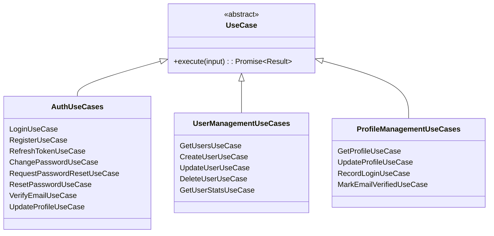
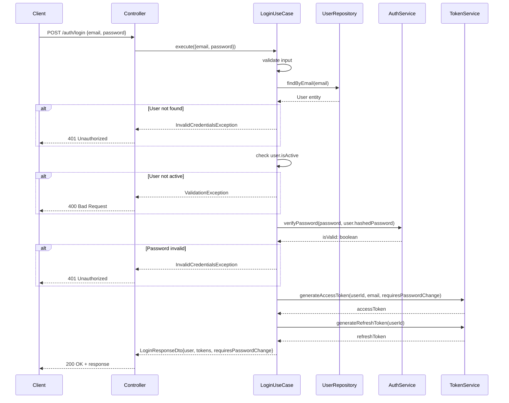
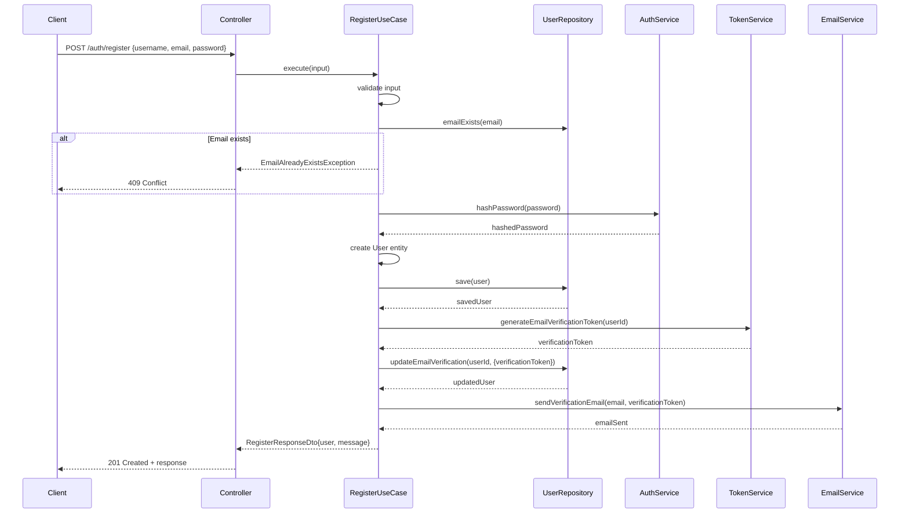
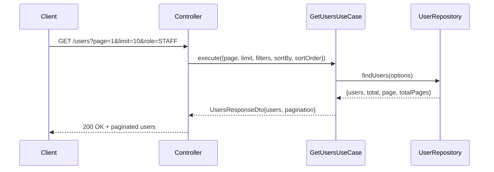
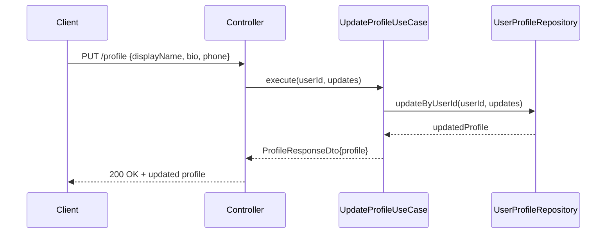
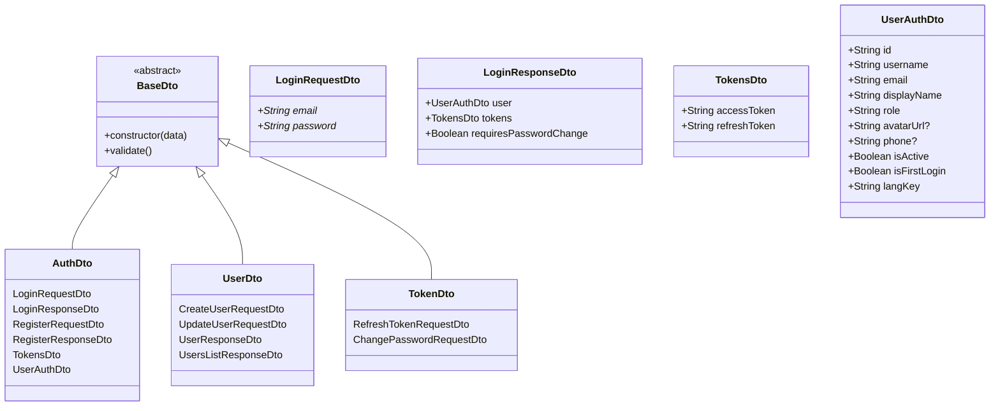
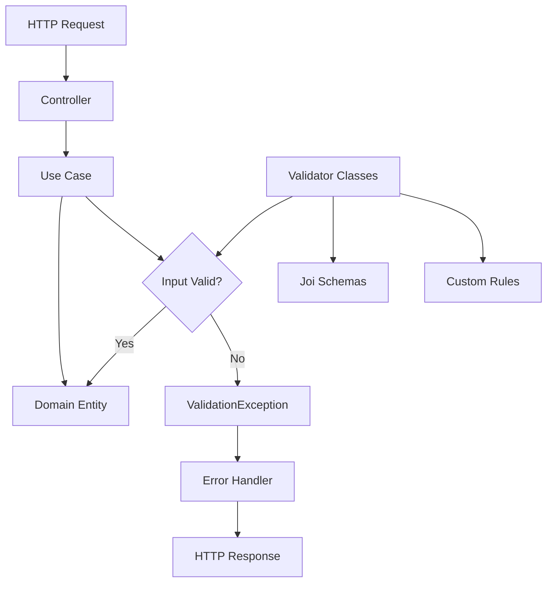
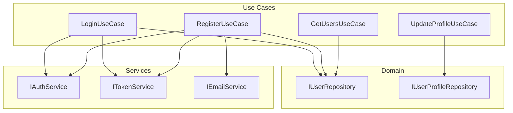

# Application Layer

The Application Layer contains use cases that orchestrate business operations, DTOs for data transfer, and validators for input validation. This layer acts as the bridge between the domain layer and infrastructure concerns.

## Use Cases Overview

Use cases represent application-specific business operations that coordinate domain entities and services. Each use case encapsulates a complete business workflow.



## Authentication Use Cases

### Login Use Case Flow



### Registration Use Case Flow



## User Management Use Cases

### Get Users Use Case Flow



## Profile Management Use Cases

### Update Profile Use Case Flow



## Data Transfer Objects (DTOs)

DTOs define the structure of data exchanged between layers and external systems.

### Authentication DTOs



### DTO Structure Examples

```javascript
// Login Request DTO
{
  email: "user@example.com",    // required
  password: "userpassword"      // required
}

// Login Response DTO
{
  user: {
    id: "user123",
    username: "johndoe",
    email: "john@example.com",
    displayName: "John Doe",
    role: "STAFF",
    avatarUrl: null,
    phone: null,
    isActive: true,
    isFirstLogin: true,
    langKey: "en"
  },
  tokens: {
    accessToken: "eyJhbGciOiJIUzI1NiIs...",
    refreshToken: "eyJhbGciOiJIUzI1NiIs..."
  },
  requiresPasswordChange: true
}
```

## Input Validation

Validators ensure data integrity before processing in use cases.

### Validation Architecture



### Auth Validator Rules

| Field | Rule | Error Message |
|-------|------|---------------|
| **email** | Required, valid email format | "Email is required" / "Invalid email format" |
| **password** | Required, 8+ chars, uppercase, lowercase, number | "Password is required" / specific strength requirements |
| **username** | Required, 3-30 chars, alphanumeric + underscore | "Username is required" / length/format constraints |
| **currentPassword** | Required for password changes | "Current password is required" |
| **newPassword** | Must differ from current password | "New password must be different from current password" |
| **refreshToken** | Required for token refresh | "Refresh token is required" |

### Password Strength Requirements

```javascript
const passwordRules = {
  minLength: 8,
  requireUppercase: true,
  requireLowercase: true,
  requireNumbers: true,
  requireSpecialChars: false  // Optional enhancement
};
```

## Service Interfaces

Application layer defines contracts for external services.

### IAuthService Interface

```mermaid
classDiagram
    class IAuthService {
        <<interface>>
        +hashPassword(password: string): Promise~string~
        +verifyPassword(password: string, hash: string): Promise~boolean~
        +generateOtp(length?: number): string
        +validatePasswordStrength(password: string): {isValid, errors}
    }

    class ITokenService {
        <<interface>>
        +generateAccessToken(payload: Object): string
        +generateRefreshToken(payload: Object): string
        +generateEmailVerificationToken(userId: string): string
        +generatePasswordResetToken(userId: string): string
        +verifyAccessToken(token: string): Object
        +verifyRefreshToken(token: string): Object
        +verifyEmailToken(token: string): Object
        +verifyPasswordResetToken(token: string): Object
    }

    class IEmailService {
        <<interface>>
        +sendVerificationEmail(email: string, token: string): Promise~void~
        +sendPasswordResetEmail(email: string, token: string): Promise~void~
        +sendWelcomeEmail(email: string, username: string): Promise~void~
        +sendPasswordChangedEmail(email: string): Promise~void~
    }
```

## Use Case Patterns

### 1. Command Pattern
Most use cases follow the Command pattern - they encapsulate a request as an object.

```javascript
class LoginUseCase {
  constructor(userRepository, authService, tokenService) {
    this.userRepository = userRepository;
    this.authService = authService;
    this.tokenService = tokenService;
  }

  async execute(input) {
    // Orchestrate domain operations
    // Return structured result
  }
}
```

### 2. Result Pattern
Use cases return structured results, not raw entities.

```javascript
class LoginUseCase {
  async execute(input) {
    // ... business logic ...

    return new LoginResponseDto({
      user: UserAuthDto.fromEntity(user),
      tokens: new TokensDto({ accessToken, refreshToken }),
      requiresPasswordChange
    });
  }
}
```

### 3. Validation First
Input validation occurs before business logic.

```javascript
class LoginUseCase {
  async execute({ email, password }) {
    // Validate input first
    if (!email || !password) {
      throw new ValidationException('Email and password are required');
    }

    // Then proceed with business logic
    // ...
  }
}
```

### 4. Error Handling Strategy
- Domain exceptions are re-thrown as-is
- Unexpected errors are wrapped with context
- Validation errors are thrown immediately

```javascript
class LoginUseCase {
  async execute(input) {
    try {
      // Business logic
    } catch (error) {
      // Re-throw domain exceptions
      if (error instanceof ValidationException) {
        throw error;
      }
      // Wrap unexpected errors
      throw new Error(`Login failed: ${error.message}`);
    }
  }
}
```

## Use Case Dependencies



## Testing Strategy

### Use Case Testing Focus
- **Unit Tests**: Test use case logic with mocked dependencies
- **Integration Tests**: Test with real repositories and services
- **Contract Tests**: Verify service interfaces are implemented correctly

### Test Structure
```javascript
describe('LoginUseCase', () => {
  let useCase;
  let mockUserRepository;
  let mockAuthService;
  let mockTokenService;

  beforeEach(() => {
    mockUserRepository = { findByEmail: jest.fn() };
    mockAuthService = { verifyPassword: jest.fn() };
    mockTokenService = { generateAccessToken: jest.fn(), generateRefreshToken: jest.fn() };

    useCase = new LoginUseCase(mockUserRepository, mockAuthService, mockTokenService);
  });

  it('should login user with valid credentials', async () => {
    // Arrange
    const input = { email: 'test@example.com', password: 'password' };
    const user = new User({ /* valid user data */ });

    mockUserRepository.findByEmail.mockResolvedValue(user);
    mockAuthService.verifyPassword.mockResolvedValue(true);
    mockTokenService.generateAccessToken.mockReturnValue('access-token');
    mockTokenService.generateRefreshToken.mockReturnValue('refresh-token');

    // Act
    const result = await useCase.execute(input);

    // Assert
    expect(result.user.email).toBe(user.email);
    expect(result.tokens.accessToken).toBe('access-token');
  });
});
```
