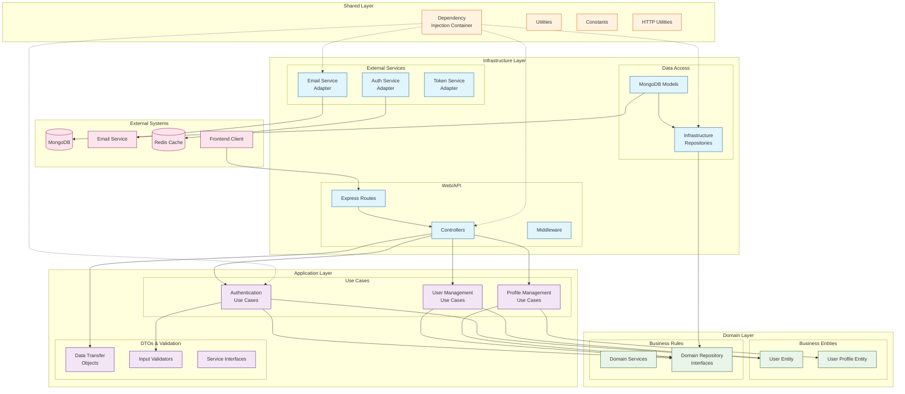

# Architecture Overview

## Clean Architecture Implementation

The ABC Dashboard backend follows Clean Architecture principles, organizing code into concentric layers where each layer has specific responsibilities and dependencies flow inward.



## Layer Responsibilities

### Domain Layer (Core Business Logic)
- **Entities**: `User`, `UserProfile` - Core business objects with validation rules
- **Repository Interfaces**: Define contracts for data access
- **Domain Services**: Business logic that spans multiple entities
- **Domain Exceptions**: Custom business rule violations

### Application Layer (Use Cases)
- **Use Cases**: Application-specific business operations (Login, Register, GetUsers, etc.)
- **DTOs**: Data Transfer Objects for request/response contracts
- **Validators**: Input validation using Joi schemas
- **Interfaces**: Contracts for external services (Email, Auth, Token)

### Infrastructure Layer (External Concerns)
- **Controllers**: HTTP request handlers and response formatting
- **Routes**: URL routing and middleware composition
- **Models**: Database schema definitions (MongoDB/Mongoose)
- **Repositories**: Data access implementations
- **Services**: External service adapters (Email, JWT, Auth)
- **Middleware**: Cross-cutting concerns (Auth, Logging, Security)
- **Config**: Environment-specific configuration

### Shared Layer (Cross-cutting Concerns)
- **Kernel**: Dependency Injection container for wiring dependencies
- **Utilities**: Common helper functions
- **Constants**: Application-wide constants and enums
- **HTTP Utils**: Response transformers and error handlers

## Key Architectural Patterns

### 1. Dependency Inversion
- Higher-level modules don't depend on lower-level modules
- Both depend on abstractions (interfaces)
- Domain layer defines repository interfaces
- Infrastructure layer implements them

### 2. Dependency Injection
- Container manages object creation and wiring
- Controllers receive use cases as dependencies
- Use cases receive repositories and services as dependencies
- Enables testability and flexibility

### 3. Repository Pattern
- Abstracts data access behind interfaces
- Domain layer defines what operations are needed
- Infrastructure layer implements how they're done
- Supports multiple database implementations

### 4. Use Case Pattern
- Each business operation is a separate use case
- Use cases orchestrate domain objects and repositories
- Controllers are thin adapters between HTTP and use cases

### 5. Entity Pattern
- Domain entities contain business rules and validation
- Entities are pure business objects (no infrastructure concerns)
- Entities emit domain events for important state changes

## Data Flow

```
HTTP Request
    ↓
Routes (middleware composition)
    ↓
Controllers (request parsing, response formatting)
    ↓
Use Cases (business logic orchestration)
    ↓
Domain Entities (business rules validation)
    ↓
Repository Interfaces (data access contracts)
    ↓
Infrastructure Repositories (actual data access)
    ↓
Database/External Services
```

## Technology Stack

- **Runtime**: Node.js with ES6 modules
- **Web Framework**: Express.js
- **Database**: MongoDB with Mongoose ODM
- **Authentication**: JWT tokens with refresh tokens
- **Validation**: Joi schemas
- **Email**: Nodemailer
- **Security**: Helmet, CORS, rate limiting
- **Documentation**: Swagger/OpenAPI
- **Testing**: Jest with Supertest
- **Linting**: ESLint with Prettier
- **Process Management**: PM2
- **Containerization**: Docker

## Development Principles

- **SOLID Principles**: Single responsibility, Open/closed, Liskov substitution, Interface segregation, Dependency inversion
- **DRY**: Don't Repeat Yourself - shared utilities and base classes
- **KISS**: Keep It Simple, Stupid - clear separation of concerns
- **Testability**: Dependency injection enables comprehensive testing
- **Maintainability**: Clear structure and documentation
