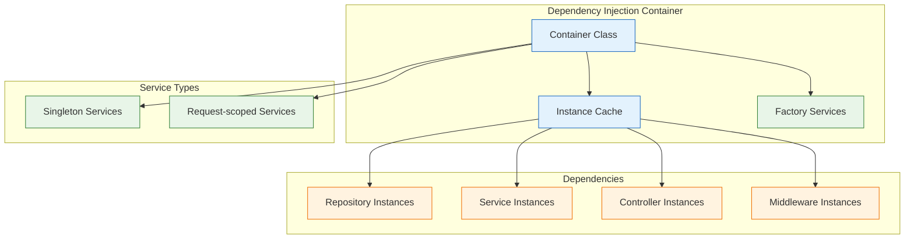
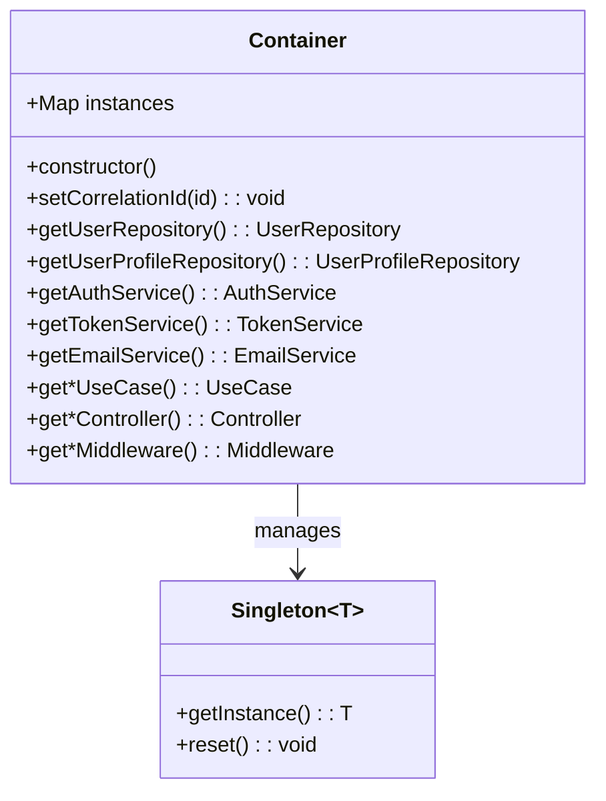
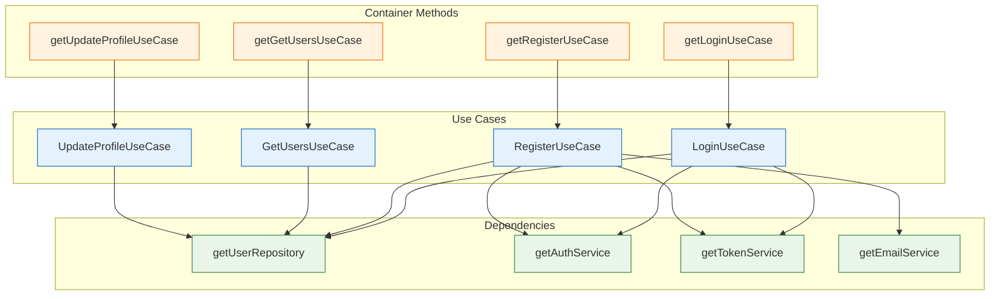
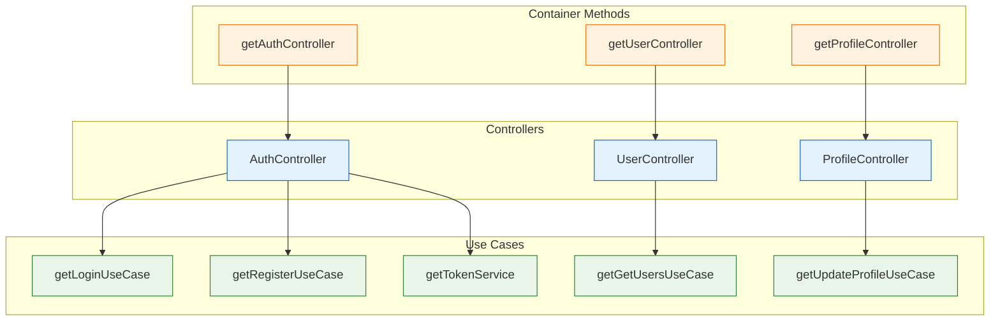
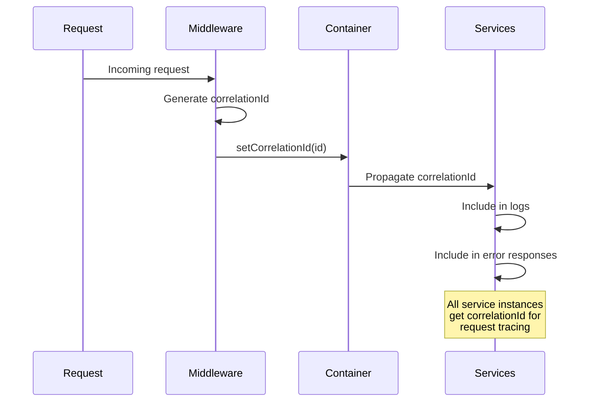
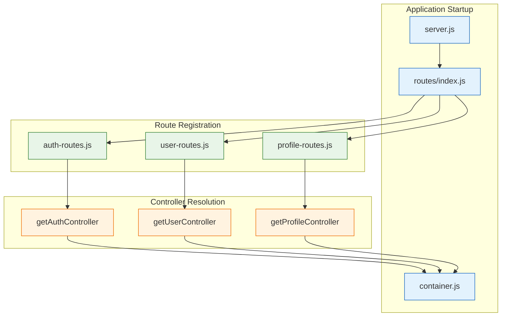
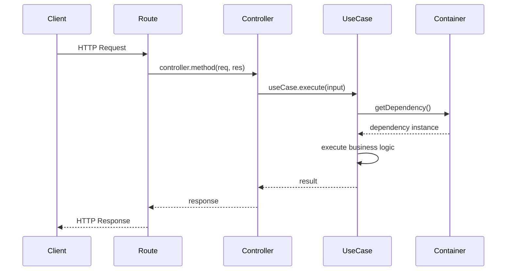
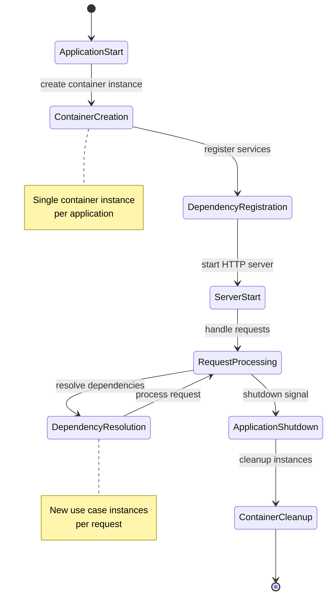

# Dependency Injection

The ABC Dashboard backend uses a centralized Dependency Injection (DI) container to manage object creation, wiring, and lifecycle. This ensures loose coupling, testability, and maintainability across the Clean Architecture layers.

## Container Architecture



## Container Implementation

### Core Container Class



### Singleton Pattern Implementation

```javascript
class Container {
  constructor() {
    this.instances = new Map();
  }

  // Singleton repositories
  getUserRepository() {
    if (!this.instances.has('userRepository')) {
      this.instances.set('userRepository', new UserRepository(UserModel));
    }
    return this.instances.get('userRepository');
  }

  // Singleton services
  getAuthService() {
    if (!this.instances.has('authService')) {
      this.instances.set('authService', new AuthService());
    }
    return this.instances.get('authService');
  }
}
```

## Dependency Wiring

### Use Case Dependencies



### Controller Dependencies



## Service Registration Pattern

### Infrastructure Service Registration

```javascript
// Container registration methods
getAuthService() {
  if (!this.instances.has('authService')) {
    this.instances.set('authService', new AuthService());
  }
  return this.instances.get('authService');
}

getTokenService() {
  if (!this.instances.has('tokenService')) {
    this.instances.set('tokenService', new TokenService());
  }
  return this.instances.get('tokenService');
}

getEmailService() {
  if (!this.instances.has('emailService')) {
    this.instances.set('emailService', new EmailService());
  }
  return this.instances.get('emailService');
}
```

### Repository Registration

```javascript
// Repository singletons (currently MongoDB only)
getUserRepository() {
  if (!this.instances.has('userRepository')) {
    this.instances.set('userRepository', new UserRepository(UserModel));
  }
  return this.instances.get('userRepository');
}

getUserProfileRepository() {
  if (!this.instances.has('userProfileRepository')) {
    this.instances.set('userProfileRepository', new UserProfileRepository(UserProfileModel));
  }
  return this.instances.get('userProfileRepository');
}
```

## Request-Scoped Dependencies

### Correlation ID Propagation



### Correlation ID Implementation

```javascript
class Container {
  // Set correlation ID on all instances for request-scoped tracking
  setCorrelationId(correlationId) {
    // Set on repositories
    const userRepo = this.instances.get('userRepository');
    if (userRepo) {
      userRepo.setCorrelationId(correlationId);
    }

    const userProfileRepo = this.instances.get('userProfileRepository');
    if (userProfileRepo && userProfileRepo.setCorrelationId) {
      userProfileRepo.setCorrelationId(correlationId);
    }

    // Set on services
    const authService = this.instances.get('authService');
    if (authService) {
      authService.correlationId = correlationId;
    }

    const tokenService = this.instances.get('tokenService');
    if (tokenService) {
      tokenService.correlationId = correlationId;
    }

    const emailService = this.instances.get('emailService');
    if (emailService) {
      emailService.correlationId = correlationId;
    }

    // Set on middleware
    const authMiddleware = this.instances.get('authMiddleware');
    if (authMiddleware && authMiddleware.setCorrelationId) {
      authMiddleware.setCorrelationId(correlationId);
    }
  }
}
```

## Factory Pattern for Use Cases

### Use Case Factory Methods

```javascript
// Use case factories (new instance per request)
getLoginUseCase() {
  return new LoginUseCase(
    this.getUserRepository(),
    this.getAuthService(),
    this.getTokenService()
  );
}

getRegisterUseCase() {
  return new RegisterUseCase(
    this.getUserRepository(),
    this.getAuthService(),
    this.getTokenService(),
    this.getEmailService()
  );
}

getRefreshTokenUseCase() {
  return new RefreshTokenUseCase(
    this.getUserRepository(),
    this.getTokenService()
  );
}
```

### Controller Factory Methods

```javascript
// Controller factories
getAuthController() {
  return new AuthController(
    this.getLoginUseCase(),
    this.getRegisterUseCase(),
    this.getRefreshTokenUseCase(),
    this.getAuthVerifyEmailUseCase(),
    this.getMarkEmailVerifiedUseCase(),
    this.getChangePasswordUseCase(),
    this.getRequestPasswordResetUseCase(),
    this.getResetPasswordUseCase(),
    this.getTokenService()
  );
}

getUserController() {
  return new UserController(
    this.getGetUsersUseCase(),
    this.getCreateUserUseCase(),
    this.getUpdateUserUseCase(),
    this.getDeleteUserUseCase(),
    this.getGetUserStatsUseCase()
  );
}
```

## Dependency Resolution Flow

### Application Startup Wiring



### Runtime Request Flow



## Testing with Dependency Injection

### Unit Test Mocking

```javascript
describe('LoginUseCase', () => {
  let useCase;
  let mockUserRepository;
  let mockAuthService;
  let mockTokenService;

  beforeEach(() => {
    // Create mocks
    mockUserRepository = {
      findByEmail: jest.fn(),
    };
    mockAuthService = {
      verifyPassword: jest.fn(),
    };
    mockTokenService = {
      generateAccessToken: jest.fn(),
      generateRefreshToken: jest.fn(),
    };

    // Inject mocks via constructor
    useCase = new LoginUseCase(
      mockUserRepository,
      mockAuthService,
      mockTokenService
    );
  });

  it('should login user successfully', async () => {
    // Arrange
    mockUserRepository.findByEmail.mockResolvedValue(user);
    mockAuthService.verifyPassword.mockResolvedValue(true);
    mockTokenService.generateAccessToken.mockReturnValue('token');

    // Act
    const result = await useCase.execute({ email, password });

    // Assert
    expect(result.tokens.accessToken).toBe('token');
  });
});
```

### Integration Test Container

```javascript
describe('Auth API Integration', () => {
  let container;
  let server;

  beforeAll(async () => {
    // Create test container with test dependencies
    container = createTestContainer();
    server = await startTestServer(container);
  });

  afterAll(async () => {
    await stopTestServer(server);
  });

  it('should register user', async () => {
    const authController = container.getAuthController();

    const response = await request(server)
      .post('/api/v1/auth/register')
      .send({
        email: 'test@example.com',
        password: 'password123',
        firstName: 'Test',
        lastName: 'User'
      });

    expect(response.status).toBe(201);
  });
});
```

## Benefits of DI Container

### 1. Centralized Configuration
- All dependencies configured in one place
- Easy to change implementations
- Clear dependency graph

### 2. Testability
- Easy to inject mocks
- Isolated unit testing
- Integration testing with real dependencies

### 3. Flexibility
- Runtime dependency swapping
- Environment-specific configurations
- Feature toggling

### 4. Maintainability
- Clear dependency relationships
- Easy to add new dependencies
- Refactoring safety

### 5. Performance
- Singleton management
- Lazy initialization
- Instance reuse

## Container Lifecycle

### Application Lifecycle



### Memory Management

```javascript
class Container {
  // Cleanup method for testing/hot reloading
  reset() {
    this.instances.clear();
  }

  // Get instance count for monitoring
  getInstanceCount() {
    return this.instances.size;
  }

  // List all registered instances
  getRegisteredInstances() {
    return Array.from(this.instances.keys());
  }
}
```

## Future Extensions

### Multi-Database Support

```javascript
class Container {
  getUserRepository() {
    if (!this.instances.has('userRepository')) {
      // Factory pattern for different databases
      const dbType = config.DATABASE_TYPE;

      switch (dbType) {
        case 'mongodb':
          this.instances.set('userRepository', new MongoUserRepository(UserModel));
          break;
        case 'postgresql':
          this.instances.set('userRepository', new PostgresUserRepository(UserTable));
          break;
        default:
          throw new Error(`Unsupported database type: ${dbType}`);
      }
    }
    return this.instances.get('userRepository');
  }
}
```

### Service Discovery

```javascript
class Container {
  // Future: Service discovery for microservices
  async getUserService() {
    if (!this.instances.has('userService')) {
      const serviceUrl = await this.discoverService('user-service');
      this.instances.set('userService', new HttpUserService(serviceUrl));
    }
    return this.instances.get('userService');
  }
}
```

### Configuration-Driven Dependencies

```javascript
class Container {
  // Configuration-driven service selection
  getCacheService() {
    if (!this.instances.has('cacheService')) {
      const cacheType = config.CACHE_TYPE;

      if (cacheType === 'redis') {
        this.instances.set('cacheService', new RedisCacheService());
      } else {
        this.instances.set('cacheService', new InMemoryCacheService());
      }
    }
    return this.instances.get('cacheService');
  }
}
```

## Best Practices

### 1. Interface Segregation
- Define clear interfaces for each service type
- Keep interfaces small and focused
- Use role interfaces when needed

### 2. Singleton vs Factory
- Use singletons for stateless services
- Use factories for stateful or request-scoped objects
- Consider thread safety for shared instances

### 3. Error Handling
- Handle dependency resolution failures
- Provide meaningful error messages
- Log dependency injection issues

### 4. Performance Considerations
- Lazy initialization for expensive resources
- Connection pooling for databases
- Cache frequently used instances

### 5. Testing Strategy
- Test with real container in integration tests
- Mock dependencies in unit tests
- Use test-specific container configurations
