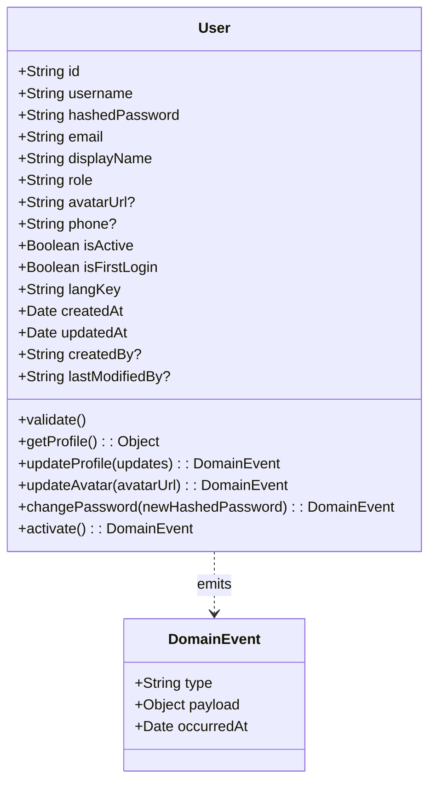
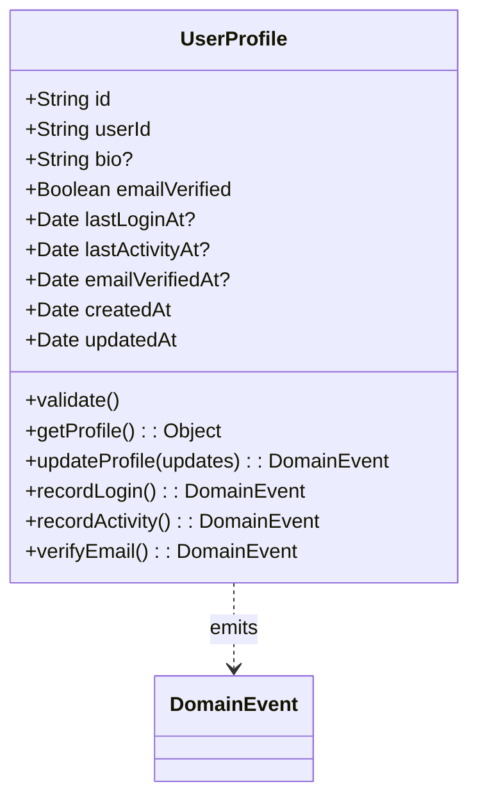
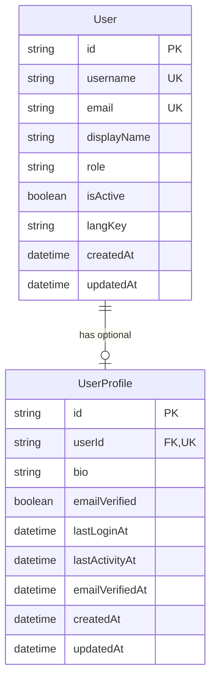
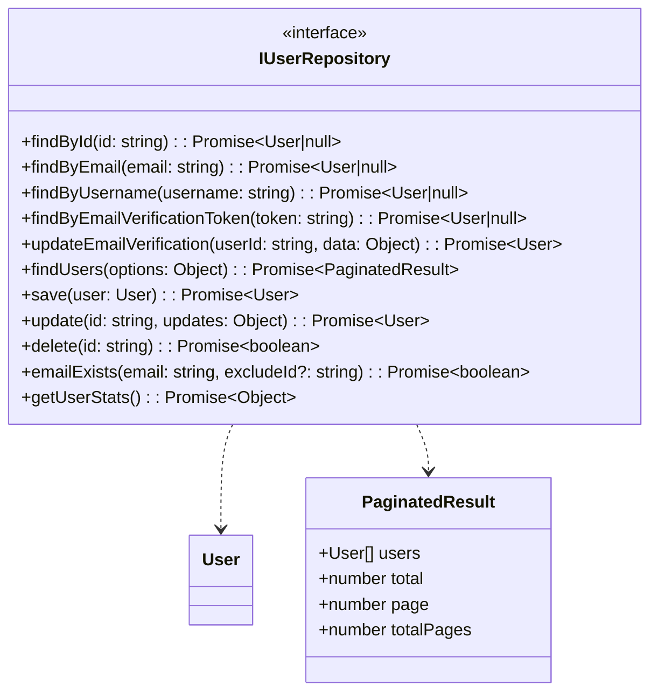
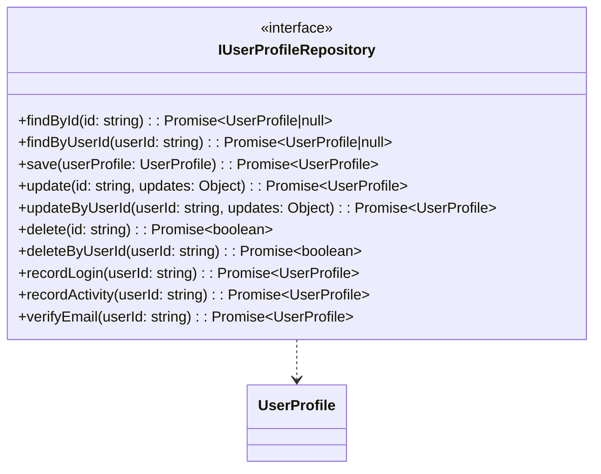
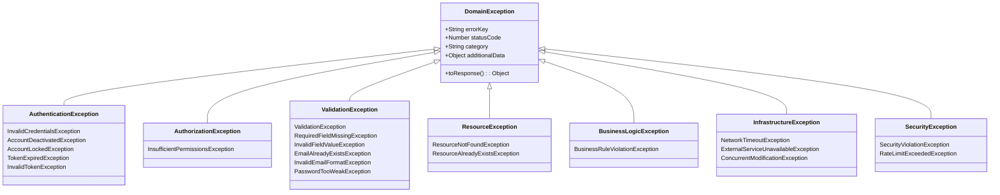
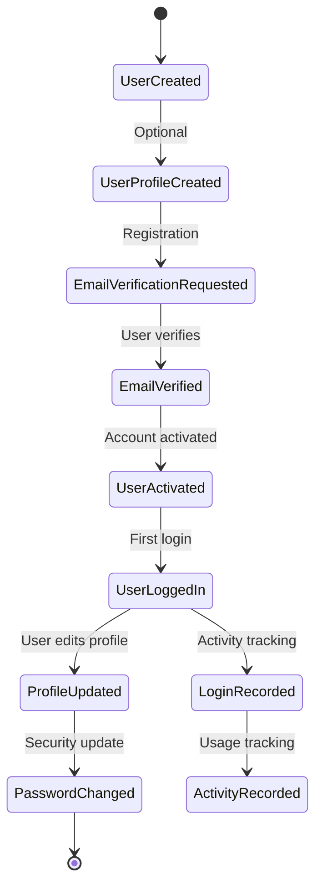

# Domain Layer

The Domain Layer contains the core business logic and represents the heart of the application. It defines business entities, business rules, and contracts for data access.

## Domain Entities

### User Entity

The User entity represents the core business concept of a system user with authentication and authorization capabilities.

**Key Business Rules:**
- Email must be valid format
- Username must be 3+ characters, alphanumeric + underscore only
- Display name is required
- Role must be one of predefined values (ADMIN, MANAGER, STAFF)
- Language key validation

**Domain Events:**
- `UserProfileUpdated`: Profile information changed
- `UserAvatarUpdated`: Avatar URL updated
- `UserPasswordChanged`: Password changed
- `UserActivated`: Account activated after email verification

### UserProfile Entity

The UserProfile entity represents extended, optional profile information that complements the core User entity.

**Key Business Rules:**
- UserId is required and must reference existing User
- Bio cannot exceed 500 characters
- Email verification timestamp required when email is verified
- Email cannot be marked verified without verification timestamp

**Domain Events:**
- `UserProfileUpdated`: Profile information updated
- `UserLoginRecorded`: User login activity tracked
- `UserActivityRecorded`: User activity tracked
- `UserEmailVerified`: Email verification completed

## Entity Relationships

## Repository Interfaces

### IUserRepository

Defines the contract for user data operations in the domain layer.

**Key Operations:**
- **Identity Queries**: `findById`, `findByEmail`, `findByUsername`
- **Verification**: `findByEmailVerificationToken`, `updateEmailVerification`
- **CRUD Operations**: `save`, `update`, `delete`
- **Bulk Queries**: `findUsers` with pagination and filtering
- **Business Checks**: `emailExists`
- **Analytics**: `getUserStats`

### IUserProfileRepository

Defines the contract for user profile data operations.

**Key Operations:**
- **Identity Queries**: `findById`, `findByUserId`
- **CRUD Operations**: `save`, `update`, `delete`
- **Activity Tracking**: `recordLogin`, `recordActivity`
- **Email Verification**: `verifyEmail`

## Domain Exceptions

The domain layer defines specific exception types for different categories of business rule violations.

### Exception Categories

| Category | Purpose | Examples |
|----------|---------|----------|
| **Authentication** | Login/credential issues | Invalid credentials, account locked |
| **Authorization** | Permission/access issues | Insufficient permissions |
| **Validation** | Input/data validation | Required fields, invalid formats |
| **Resource** | Entity existence issues | Not found, already exists |
| **Business Logic** | Business rule violations | Domain-specific constraints |
| **Infrastructure** | External system issues | Network timeouts, service unavailable |
| **Security** | Security violations | Rate limiting, injection attempts |

## Business Rules Summary

### User Entity Rules
1. **Email Validation**: Must be valid email format
2. **Username Constraints**: 3+ chars, alphanumeric + underscore only
3. **Display Name**: Required field
4. **Role Validation**: Must be predefined role (ADMIN, MANAGER, STAFF)
5. **Language Support**: Optional language key for internationalization

### UserProfile Entity Rules
1. **User Association**: Must reference valid User entity
2. **Bio Length**: Maximum 500 characters
3. **Email Verification Logic**: Timestamp required when verified
4. **Activity Tracking**: Login and activity timestamps

### Cross-Entity Rules
1. **Email Uniqueness**: Email addresses must be unique across users
2. **Profile Completeness**: UserProfile is optional extension of User
3. **Activation Flow**: User must be activated before full access
4. **Email Verification**: Separate verification process with tokens

## Domain Event Flow

## Design Principles

### 1. Entity Purity
- Entities contain only business logic and validation
- No infrastructure concerns (database, HTTP, external services)
- Self-validating with domain rules

### 2. Repository Abstraction
- Domain defines what data operations are needed
- Infrastructure implements how they're performed
- Enables database flexibility and testing

### 3. Exception Hierarchy
- Structured exception types for different error categories
- Consistent error handling across application layers
- HTTP status code mapping in infrastructure layer

### 4. Domain Events
- Entities emit events for important state changes
- Enables event-driven architecture possibilities
- Audit trail and business process tracking

### 5. Business Rule Encapsulation
- Validation logic encapsulated within entities
- Business rules clearly expressed in code
- Self-documenting validation methods
