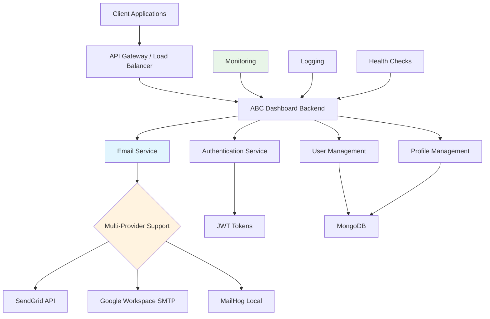

# ABC Dashboard Backend Documentation

Welcome to the comprehensive documentation for the ABC Dashboard Backend API. This documentation provides everything you need to understand, deploy, and maintain the email service architecture.

## 📚 Documentation Overview

| Section                                | Description                                      | Audience               |
| -------------------------------------- | ------------------------------------------------ | ---------------------- |
| **[Getting Started](./)**              | Quick start guide, prerequisites, basic setup    | New Developers         |
| **[Architecture](../architecture/)**   | System design, Clean Architecture, layer details | Architects, Developers |
| **[API Reference](../api-reference/)** | Complete API documentation and endpoints         | Frontend Developers    |
| **[Operations](../operations/)**       | Deployment, monitoring, production setup         | DevOps, SysAdmins      |
| **[Guides](../guides/)**               | Specific setup guides and workflows              | Developers, SysAdmins  |

## 🚀 Quick Start

### Prerequisites

- Node.js 20+
- MongoDB 6+
- npm 8+

### Basic Setup

```bash
# Install dependencies
npm install

# Configure environment (see .env.example)
cp .env.example .env
# Edit .env with your configuration

# Run database migrations
npm run migrate

# Seed with test data
npm run seed

# Start development server
npm run dev
```

### Email Configuration

```bash
# Test email configuration
npm run test:email-config

# For MailHog (development)
EMAIL_SERVICE=mailhog

# For SendGrid (production)
EMAIL_SERVICE=sendgrid
SENDGRID_API_KEY=SG.your-api-key

# For Google Workspace (production)
EMAIL_SERVICE=google-workspace
EMAIL_USER=your-email@domain.com
EMAIL_PASS=your-app-password
```

## 🏗️ Architecture Overview



## 📧 Email Service Architecture

The email service supports multiple providers with automatic failover and comprehensive error handling:

### Service Comparison

| Feature              | MailHog     | SendGrid         | Google Workspace |
| -------------------- | ----------- | ---------------- | ---------------- |
| **Environment**      | Development | Production       | Production       |
| **Daily Limit**      | Unlimited   | 100 → 100K+      | 500 → 10K        |
| **Setup Complexity** | Low         | Medium           | Medium           |
| **Cost**             | Free        | Free → $89/month | Free → $18/user  |
| **Analytics**        | Basic       | Advanced         | Basic            |

### Key Features

- ✅ **Multi-provider support** (SendGrid, Google Workspace, MailHog)
- ✅ **Automatic failover** and circuit breaker pattern
- ✅ **Comprehensive error handling** with service-specific error codes
- ✅ **Rate limiting** and quota management
- ✅ **Health monitoring** and alerting
- ✅ **Retry logic** with exponential backoff
- ✅ **Template support** with Handlebars
- ✅ **DKIM/SPF compatibility**

## 🔧 Development Workflow

### Local Development

1. **Start MailHog**: `mailhog` (SMTP on localhost:1025, Web UI on localhost:8025)
2. **Configure environment**: `EMAIL_SERVICE=mailhog`
3. **Test emails**: Visit localhost:8025 to view captured emails
4. **Run tests**: `npm run test:email-config`

### Production Deployment

1. **Choose email provider** (SendGrid recommended for production)
2. **Configure credentials** in environment variables
3. **Test configuration**: `npm run test:email-config`
4. **Deploy and monitor** email delivery rates

## 📊 Monitoring & Analytics

### Key Metrics

- Email delivery rates
- Bounce rates
- Open rates (SendGrid only)
- API response times
- Error rates by service
- Quota usage

### Health Checks

```bash
# API health check
curl http://localhost:5000/api/v1/health

# Email service health
curl http://localhost:5000/api/v1/health/email
```

## 🐛 Troubleshooting

### Common Issues

#### Email Not Sending

```bash
# Check configuration
npm run test:email-config

# Check application logs
tail -f logs/app.log | grep -i email

# Verify service credentials
# SendGrid: Check API key format (SG.xxxxx)
# Google Workspace: Verify App Password is correct
```

#### High Bounce Rates

- Check recipient email addresses
- Verify sender domain reputation
- Review email content for spam triggers
- Ensure proper authentication (DKIM/SPF)

#### Rate Limiting

- SendGrid: Check account limits and upgrade if needed
- Google Workspace: Free accounts limited to 500/day
- Implement queuing for high-volume scenarios

### Support Resources

| Service              | Support Channel              | Response Time |
| -------------------- | ---------------------------- | ------------- |
| **SendGrid**         | support.sendgrid.com         | < 24 hours    |
| **Google Workspace** | support.google.com/workspace | < 24 hours    |
| **MailHog**          | GitHub Issues                | Community     |
| **ABC Dashboard**    | Internal Documentation       | Immediate     |

## 🔒 Security Considerations

### Email Security Best Practices

- Store API keys and passwords securely
- Use environment variables, never commit to code
- Rotate credentials regularly
- Monitor for unauthorized access
- Implement rate limiting
- Log email activities for audit trails

### Authentication Methods

- **SendGrid**: API Key authentication
- **Google Workspace**: App Password (2FA required)
- **MailHog**: No authentication (development only)

## 🚀 Performance Optimization

### Email Delivery Optimization

1. **Connection Pooling**: Reuse SMTP connections
2. **Batch Sending**: Group emails when possible
3. **Template Caching**: Cache compiled email templates
4. **Async Processing**: Queue emails for high volume
5. **Rate Limiting**: Respect provider limits

### Scalability Considerations

- **Horizontal Scaling**: Multiple application instances
- **Load Balancing**: Distribute email sending load
- **Database Indexing**: Optimize user email queries
- **Caching**: Cache user profiles and email templates

## 📈 Future Enhancements

### Planned Features (Q1-Q4 2025)

- **Email Analytics Dashboard** - Real-time delivery metrics
- **A/B Testing Framework** - Test email templates and content
- **Multi-Provider Failover** - Automatic switching between providers
- **Advanced Email Templates** - Drag-and-drop template builder
- **Email Archiving** - Compliance and audit trail storage
- **Webhook Integration** - Real-time delivery notifications

### Roadmap Timeline

```mermaid
roadmap
    title Email Service Roadmap
    section Q1 2025
      Enhanced error handling and monitoring :done, 2025-01-01, 2025-03-31
      SendGrid integration :done, 2025-01-15, 2025-03-15
      Google Workspace integration :done, 2025-01-15, 2025-03-15
    section Q2 2025
      Email analytics dashboard :planned, 2025-04-01, 2025-06-30
      Advanced template system :planned, 2025-04-15, 2025-06-15
    section Q3 2025
      Multi-provider failover :planned, 2025-07-01, 2025-09-30
      Email queuing system :planned, 2025-07-15, 2025-09-15
    section Q4 2025
      Email archiving and compliance :planned, 2025-10-01, 2025-12-31
      Advanced spam filtering :planned, 2025-10-15, 2025-12-15
```

## 📞 Support & Contact

### For Technical Issues

- **Email Service Issues**: Check `../guides/email-service-overview.md`
- **API Documentation**: Visit `/api-docs` endpoint
- **Health Checks**: Use `/api/v1/health` endpoint
- **Logs**: Check `logs/app.log` for detailed error information

### Contact Information

- **Technical Support**: Internal development team
- **SendGrid Support**: <https://support.sendgrid.com>
- **Google Workspace Support**: <https://support.google.com/workspace>
- **Documentation Issues**: Create GitHub issue

---

## 🔗 Quick Links

- [API Documentation](../api-reference/index.html) - Interactive API docs
- [Email Service Setup](../guides/email-setup-guide.md) - Complete setup guide
- [Deployment Guide](../operations/deployment-guide.md) - Production deployment
- [Architecture Overview](../architecture/architecture-overview.md) - System design
- [User Management](../guides/user-management-system.md) - User management guide

---

**v1.0.0** | ISC License
