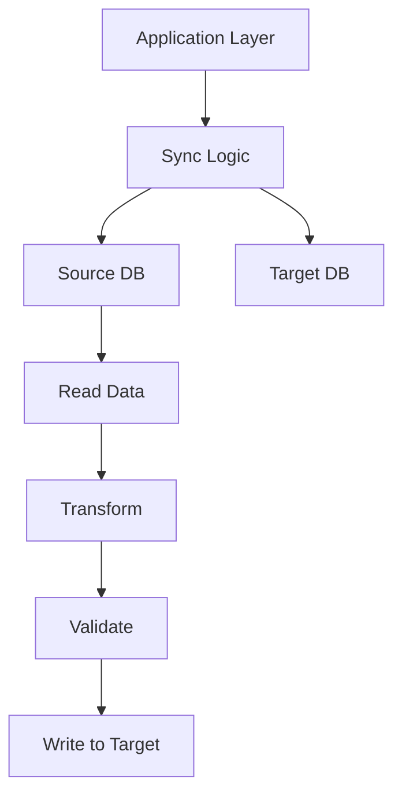
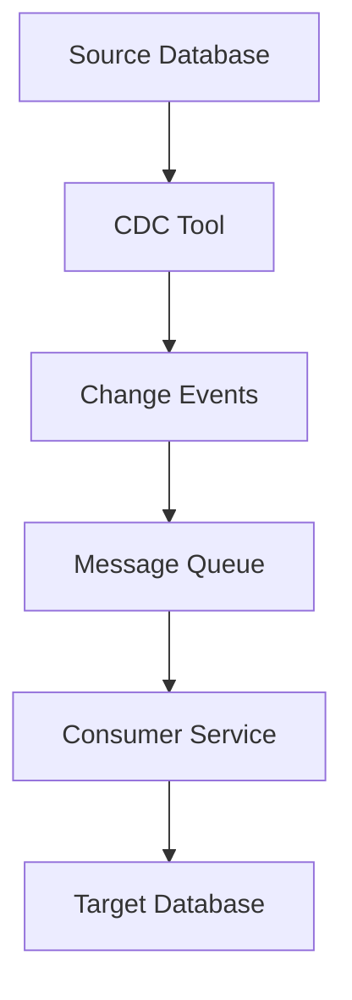
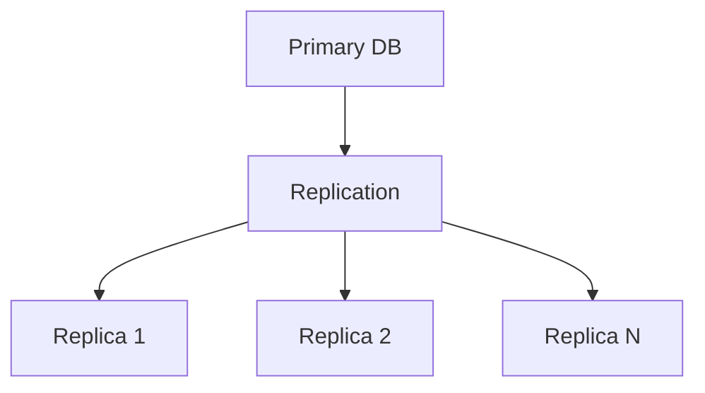
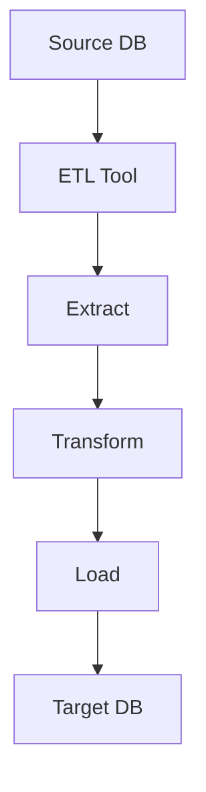
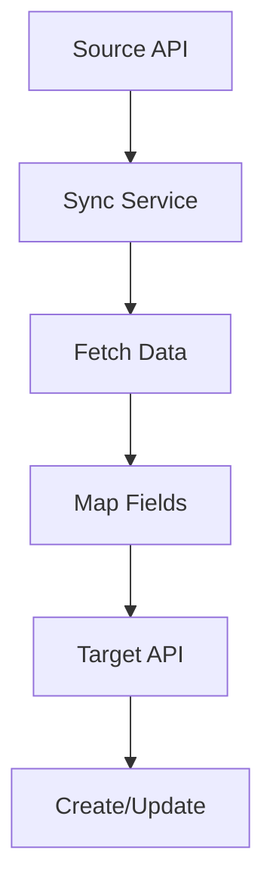
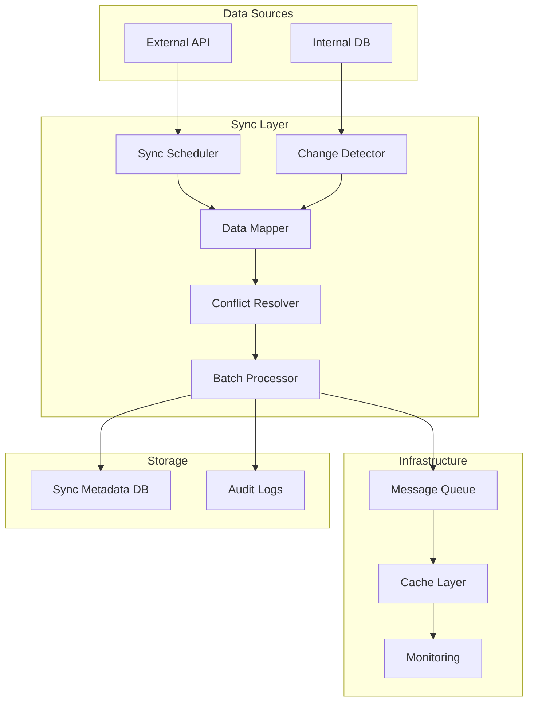

# Database Synchronization Solutions Guide

## Overview

Database synchronization is a critical component of modern distributed systems. This guide covers the best practices, patterns, and solutions for syncing data between databases, with specific focus on the license management system.

## Synchronization Patterns

### 1. **Application-Level Synchronization** (Current Implementation)

**Best For**: Complex business logic, data transformation, audit trails



**Pros:**
- ✅ Full control over business logic
- ✅ Data transformation capabilities
- ✅ Audit trails and error handling
- ✅ Custom conflict resolution

**Cons:**
- ❌ Performance overhead
- ❌ Code complexity
- ❌ Potential for bugs

**Implementation Example:**
```javascript
class DatabaseSynchronizer {
  async sync() {
    const sourceData = await this.sourceRepo.getAll();
    const targetData = await this.targetRepo.getAll();

    // Reconciliation logic
    const operations = this.reconcile(sourceData, targetData);

    // Execute operations
    for (const op of operations) {
      await this.executeOperation(op);
    }
  }
}
```

### 2. **Change Data Capture (CDC)**

**Best For**: Real-time sync, high-volume data, minimal latency



**Tools:**
- **Debezium** (Kafka + PostgreSQL)
- **AWS DMS** (Database Migration Service)
- **Oracle GoldenGate**
- **SQL Server CDC**

**Pros:**
- ✅ Real-time synchronization
- ✅ Low latency
- ✅ Handles schema changes
- ✅ Scalable for high-volume data

**Cons:**
- ❌ Complex setup
- ❌ Requires message queue infrastructure
- ❌ Learning curve

**Implementation:**
```sql
-- Enable CDC on PostgreSQL table
ALTER TABLE licenses REPLICA IDENTITY FULL;

-- Debezium configuration example
{
  "name": "license-connector",
  "config": {
    "connector.class": "io.debezium.connector.postgresql.PostgresConnector",
    "database.hostname": "localhost",
    "table.include.list": "public.licenses",
    "transforms": "unwrap",
    "transforms.unwrap.type": "io.debezium.transforms.ExtractNewRecordState"
  }
}
```

### 3. **Database Replication**

**Best For**: Read replicas, disaster recovery, geographic distribution



**Types:**
- **Logical Replication** (PostgreSQL)
- **Physical Replication** (PostgreSQL/MySQL)
- **Multi-Master Replication** (Complex)

**Pros:**
- ✅ Built-in database features
- ✅ Automatic synchronization
- ✅ High availability

**Cons:**
- ❌ Limited transformation capabilities
- ❌ Conflict resolution challenges
- ❌ Network dependency

**PostgreSQL Implementation:**
```sql
-- Enable logical replication
ALTER SYSTEM SET wal_level = logical;

-- Create publication
CREATE PUBLICATION license_sync
FOR TABLE licenses
WITH (publish = 'insert, update, delete');

-- Create subscription on target
CREATE SUBSCRIPTION license_sync
CONNECTION 'host=source_host dbname=source_db'
PUBLICATION license_sync;
```

### 4. **ETL/ELT Tools**

**Best For**: Batch processing, complex transformations, scheduled syncs



**Popular Tools:**
- **Apache Airflow** (Workflow orchestration)
- **Apache NiFi** (Data flow automation)
- **Talend** (ETL platform)
- **Pentaho** (Data integration)

**Pros:**
- ✅ Visual workflow design
- ✅ Complex transformations
- ✅ Scheduling and monitoring
- ✅ Error handling

**Cons:**
- ❌ Resource intensive for real-time sync
- ❌ Additional infrastructure requirements

### 5. **API-Based Synchronization**

**Best For**: Cross-system integration, microservices, external APIs



**Implementation:**
```javascript
class ApiSynchronizer {
  async sync() {
    const externalData = await this.externalApi.getLicenses();
    const internalData = await this.internalApi.getLicenses();

    const operations = this.calculateOperations(externalData, internalData);

    for (const op of operations) {
      await this.executeApiOperation(op);
    }
  }
}
```

## Conflict Resolution Strategies

### 1. **Last-Write-Wins (LWW)**
```javascript
const resolveConflict = (sourceRecord, targetRecord) => {
  return sourceRecord.updatedAt > targetRecord.updatedAt ? sourceRecord : targetRecord;
};
```

### 2. **Business Rules Based**
```javascript
const resolveConflict = (sourceRecord, targetRecord) => {
  // Business logic determines winner
  if (sourceRecord.status === 'active' && targetRecord.status === 'inactive') {
    return sourceRecord; // Active status takes precedence
  }
  // ... more business rules
};
```

### 3. **Manual Resolution**
```javascript
const resolveConflict = async (sourceRecord, targetRecord) => {
  // Create conflict record for manual review
  await this.conflictRepo.create({
    sourceData: sourceRecord,
    targetData: targetRecord,
    resolution: 'pending'
  });
};
```

## Monitoring and Observability

### Key Metrics to Track

```javascript
const syncMetrics = {
  // Performance
  syncDuration: Date.now() - startTime,
  recordsProcessed: operations.length,
  throughput: operations.length / duration,

  // Success Rates
  successRate: successfulOps / totalOps,
  errorRate: failedOps / totalOps,

  // Data Quality
  conflictsDetected: conflicts.length,
  dataDrift: driftPercentage,

  // Business Metrics
  licensesSynced: licenseOps.length,
  revenueImpact: revenueDelta
};
```

### Logging Strategy

```javascript
class SyncLogger {
  logSyncStart() {
    logger.info('Database sync started', {
      timestamp: new Date(),
      source: 'external_api',
      target: 'internal_db',
      correlationId: generateId()
    });
  }

  logOperation(operation) {
    logger.debug('Sync operation executed', {
      operation: operation.type,
      recordId: operation.id,
      fieldsChanged: operation.fields,
      duration: operation.duration
    });
  }

  logSyncComplete(metrics) {
    logger.info('Database sync completed', {
      ...metrics,
      status: 'success'
    });
  }
}
```

## Best Practices for License Management Sync

### 1. **Idempotent Operations**
```javascript
async syncLicense(externalLicense) {
  // Check if already synced
  const existing = await this.internalRepo.findByExternalId(externalLicense.id);

  if (existing && this.isUpToDate(existing, externalLicense)) {
    return { skipped: true, reason: 'already_synced' };
  }

  // Perform sync operation
  return await this.performSync(externalLicense);
}
```

### 2. **Atomic Transactions**
```javascript
async syncWithTransaction(operations) {
  const trx = await this.db.transaction();

  try {
    for (const op of operations) {
      await this.executeOperation(op, trx);
    }

    await trx.commit();
    return { success: true };
  } catch (error) {
    await trx.rollback();
    throw error;
  }
}
```

### 3. **Circuit Breaker Pattern**
```javascript
class SyncCircuitBreaker {
  constructor(failureThreshold = 5, recoveryTimeout = 60000) {
    this.failures = 0;
    this.lastFailureTime = null;
    this.state = 'closed'; // closed, open, half-open
  }

  async execute(operation) {
    if (this.state === 'open') {
      if (this.shouldAttemptReset()) {
        this.state = 'half-open';
      } else {
        throw new Error('Circuit breaker is open');
      }
    }

    try {
      const result = await operation();
      this.onSuccess();
      return result;
    } catch (error) {
      this.onFailure();
      throw error;
    }
  }
}
```

### 4. **Batch Processing with Chunking**
```javascript
async syncInBatches(data, batchSize = 100) {
  const batches = this.chunkArray(data, batchSize);

  for (let i = 0; i < batches.length; i++) {
    const batch = batches[i];

    logger.info(`Processing batch ${i + 1}/${batches.length}`, {
      batchSize: batch.length,
      progress: `${i + 1}/${batches.length}`
    });

    await this.processBatch(batch);

    // Rate limiting
    if (i < batches.length - 1) {
      await this.delay(100); // 100ms between batches
    }
  }
}
```

## Recommended Solution for License Management

Based on the license management requirements, **Application-Level Synchronization with CDC augmentation** is recommended:

### Why This Approach?

1. **Business Logic Complexity**: License management requires complex validation rules
2. **Data Transformation**: External API data needs mapping to internal schema
3. **Audit Requirements**: Complete audit trails of all changes
4. **Conflict Resolution**: Business rules determine how conflicts are resolved
5. **Real-time Needs**: Near real-time sync for operational data

### Implementation Architecture



### Technology Stack Recommendation

```javascript
// Core synchronization framework
const syncFramework = {
  scheduler: 'node-cron',           // Scheduled syncs
  queue: 'bull',                    // Job queuing
  cache: 'redis',                   // Performance optimization
  monitoring: 'prometheus',         // Metrics collection
  logging: 'winston',               // Structured logging
  validation: 'joi',                // Data validation
  database: 'knex',                 // Query building
};
```

### Sync Workflow Implementation

```javascript
class LicenseSyncService {
  constructor(
    externalApi,
    internalRepo,
    syncMetadataRepo,
    conflictResolver,
    batchProcessor
  ) {
    this.externalApi = externalApi;
    this.internalRepo = internalRepo;
    this.syncMetadataRepo = syncMetadataRepo;
    this.conflictResolver = conflictResolver;
    this.batchProcessor = batchProcessor;
  }

  async executeFullSync(options = {}) {
    const correlationId = generateCorrelationId();

    logger.info('Starting full license synchronization', {
      correlationId,
      options
    });

    try {
      // Phase 1: Data Collection
      const [externalData, internalData] = await Promise.all([
        this.collectExternalData(),
        this.collectInternalData()
      ]);

      // Phase 2: Change Detection
      const changes = await this.detectChanges(externalData, internalData);

      // Phase 3: Conflict Resolution
      const resolvedChanges = await this.conflictResolver.resolve(changes);

      // Phase 4: Batch Processing
      const results = await this.batchProcessor.process(resolvedChanges);

      // Phase 5: Metadata Update
      await this.updateSyncMetadata(results, correlationId);

      logger.info('License synchronization completed', {
        correlationId,
        results
      });

      return results;
    } catch (error) {
      logger.error('License synchronization failed', {
        correlationId,
        error: error.message
      });
      throw error;
    }
  }
}
```

## Performance Optimization Strategies

### 1. **Incremental Sync**
```javascript
async performIncrementalSync() {
  const lastSyncTime = await this.getLastSyncTime();
  const changes = await this.externalApi.getChangesSince(lastSyncTime);
  return this.processChanges(changes);
}
```

### 2. **Parallel Processing**
```javascript
async processInParallel(operations, concurrency = 5) {
  const chunks = this.chunkArray(operations, concurrency);

  for (const chunk of chunks) {
    await Promise.all(chunk.map(op => this.processOperation(op)));
  }
}
```

### 3. **Caching Strategy**
```javascript
class SyncCache {
  async getCachedData(key, ttl = 300) {
    const cached = await this.cache.get(key);
    if (cached) return cached;

    const data = await this.fetchData();
    await this.cache.set(key, data, ttl);
    return data;
  }
}
```

## Monitoring and Alerting

### Key Alerts to Implement

1. **Sync Failures**: Immediate alerts for sync failures
2. **Performance Degradation**: Response time increases
3. **Data Drift**: Significant discrepancies detected
4. **Queue Backlog**: Operations queuing up
5. **Conflict Spikes**: Unusual number of conflicts

### Dashboard Metrics

```javascript
const dashboardMetrics = {
  syncHealth: {
    lastSyncTime: new Date(),
    successRate: '99.5%',
    averageDuration: '45s',
    errorRate: '0.5%'
  },
  dataQuality: {
    totalRecords: 1250,
    syncedRecords: 1245,
    conflictsResolved: 5,
    dataCompleteness: '98%'
  },
  performance: {
    throughput: '150 records/min',
    latency: '2.3s',
    queueDepth: 0
  }
};
```

## Migration Strategy

### Phase 1: Assessment
- Analyze current data volumes and patterns
- Identify critical sync requirements
- Establish baseline performance metrics

### Phase 2: Pilot Implementation
- Implement sync for subset of data
- Test conflict resolution scenarios
- Validate performance characteristics

### Phase 3: Gradual Rollout
- Roll out to production incrementally
- Monitor closely for issues
- Implement rollback procedures

### Phase 4: Full Production
- Complete migration to new sync system
- Optimize based on production metrics
- Implement advanced monitoring

## Conclusion

For the license management system, **Application-Level Synchronization** provides the best balance of control, reliability, and maintainability. The approach allows for:

- Complex business logic implementation
- Comprehensive audit trails
- Flexible conflict resolution
- Performance optimization
- Easy maintenance and debugging

The key is to implement proper monitoring, error handling, and performance optimization to ensure the synchronization system scales with business needs.