# Email Service Architecture & Configuration Guide

## Overview

The ABC Dashboard implements a comprehensive email service architecture supporting multiple providers with automatic failover, comprehensive error handling, and advanced monitoring capabilities.


## Email Service Architecture

### Core Components


### Service Flow Architecture


## Email Service Comparison

| Feature              | MailHog       | Google Workspace |
| -------------------- | ------------- | ---------------- |
| **Environment**      | Development   | Production       |
| **Delivery Method**  | Local Storage | SMTP             |
| **Daily Limit**      | Unlimited     | 500 → 10K        |
| **Setup Complexity** | Low           | Medium           |
| **Cost**             | Free          | Free → $18/user  |
| **Analytics**        | Basic         | Basic            |
| **Deliverability**   | N/A           | Good             |
| **API Access**       | No            | No               |
| **Production Ready** | ❌            | ✅               |


## Service Configuration

### Environment Variables


### Service Selection Logic


## Setup Instructions

### 1. MailHog (Development)


### 2. Google Workspace (Production)

```mermaid
flowchart TD
    A[Enable 2FA] --> B[Generate App Password]
    B --> C[Configure Environment]
    C --> D[Test Connection]
    D --> E[Send Test Email]

    A --> A1[admin.google.com]
    A --> A2[Security → 2-Step Verification]

    B --> B1[myaccount.google.com/apppasswords]
    B --> B2[Select Mail → Other]
    B --> B3[Enter 'ABC Dashboard']
    B --> B4[Copy 16-char password]

    C --> C1[EMAIL_SERVICE=google-workspace]
    C --> C2[EMAIL_USER=user@domain.com]
    C --> C3[EMAIL_PASS=16-char-password]
    C --> C4[EMAIL_FROM=noreply@domain.com]

    D --> D1[npm run test:email-config]
    D --> D2[Validate SMTP connection]

    E --> E1[Create user via API]
    E --> E2[Check Gmail sent folder]

    style A fill:#fce4ec
    style E fill:#e8f5e8
```

## Error Handling & Recovery

### Error Classification


### Circuit Breaker Pattern


## Monitoring & Analytics

### Health Check Endpoints

```mermaid
graph LR
    A[Health Check] --> B[/api/v1/health]
    B --> C{Email Service Status}

    C -->|Healthy| D[✅ Service OK]
    C -->|Degraded| E[⚠️ Circuit Breaker Active]
    C -->|Unhealthy| F[❌ Service Down]

    D --> G[Return 200]
    E --> H[Return 200 with Warning]
    F --> I[Return 503]

    J[Metrics] --> K[Response Time]
    J --> L[Success Rate]
    J --> M[Error Rate]
    J --> N[Queue Depth]

    style A fill:#e1f5fe
    style D fill:#e8f5e8
    style E fill:#fff3e0
    style F fill:#ffebee
```

### Email Metrics Dashboard


## Performance & Scalability

### Service Performance Comparison

```mermaid
bar
    title Email Service Performance (messages/second)
    x-axis ["MailHog", "Google Workspace", "SendGrid"]
    y-axis Performance 0 --> 100
    bar [100, 50, 80]
```

### Scaling Strategies


## Configuration Examples

### Complete Environment Files

#### Development (.env)

```bash
NODE_ENV=development
MONGODB_URI=mongodb://localhost:27017/abc_dashboard
JWT_SECRET=dev-secret-key
CLIENT_URL=http://localhost:3000

# Email - MailHog
EMAIL_SERVICE=mailhog
EMAIL_FROM=noreply@localhost
EMAIL_FROM_NAME=ABC Dashboard (Dev)
EMAIL_HOST=localhost
EMAIL_PORT=1025
EMAIL_SECURE=false
```

#### Production - SendGrid (.env)

```bash
NODE_ENV=production
MONGODB_URI=mongodb://prod-server/abc_dashboard
JWT_SECRET=prod-secret-key
CLIENT_URL=https://yourdomain.com

# Email - SendGrid
EMAIL_SERVICE=sendgrid
EMAIL_FROM=noreply@yourdomain.com
EMAIL_FROM_NAME=ABC Dashboard
SENDGRID_API_KEY=SG.your-production-api-key
```

#### Production - Google Workspace (.env)

```bash
NODE_ENV=production
MONGODB_URI=mongodb://prod-server/abc_dashboard
JWT_SECRET=prod-secret-key
CLIENT_URL=https://yourdomain.com

# Email - Google Workspace
EMAIL_SERVICE=google-workspace
EMAIL_FROM=noreply@yourdomain.com
EMAIL_FROM_NAME=ABC Dashboard
EMAIL_HOST=smtp.gmail.com
EMAIL_PORT=587
EMAIL_SECURE=false
EMAIL_USER=admin@yourdomain.com
EMAIL_PASS=abcd-efgh-ijkl-mnop
```

## Testing & Validation

### Configuration Testing

```mermaid
flowchart TD
    A[Run Test] --> B[npm run test:email-config]
    B --> C{Service Type}

    C -->|mailhog| D[Validate Local Config]
    C -->|sendgrid| E[Validate API Key]
    C -->|google-workspace| F[Validate SMTP]

    D --> G[Check Port 1025]
    E --> H[Check SG. prefix]
    F --> I[Check App Password]

    G --> J[✅ Config Valid]
    H --> J
    I --> J

    J --> K[Display Setup Instructions]
    K --> L[Test Email Send]

    style A fill:#e1f5fe
    style J fill:#e8f5e8
    style L fill:#e8f5e8
```



### Integration Testing

```bash
# Test email configuration
npm run test:email-config

# Test user registration (triggers welcome email)
curl -X POST http://localhost:5000/api/v1/users \
  -H "Content-Type: application/json" \
  -d '{"username":"test","email":"test@example.com","displayName":"Test User","role":"staff"}'

# Test password reset (triggers reset email)
curl -X POST http://localhost:5000/api/v1/auth/forgot-password \
  -H "Content-Type: application/json" \
  -d '{"email":"test@example.com"}'
```

## Troubleshooting Guide

### Common Issues by Service


### Error Code Reference

| Service  | Error Code   | Meaning             | Solution                      |
| -------- | ------------ | ------------------- | ----------------------------- |
| SendGrid | 401          | Invalid API Key     | Regenerate API key            |
| SendGrid | 403          | Sender Not Verified | Verify sender email           |
| SendGrid | 429          | Rate Limited        | Implement exponential backoff |
| Google   | 535          | Auth Failed         | Check App Password            |
| Google   | 550          | Quota Exceeded      | Wait or upgrade               |
| General  | ECONNREFUSED | Connection Failed   | Check network/firewall        |

## Migration Between Services

### Service Migration Flow


### Zero-Downtime Migration

1. **Update Configuration**: Add new service credentials alongside existing ones
2. **Dual Sending**: Send emails to both services temporarily
3. **Gradual Cutover**: Switch traffic gradually using feature flags
4. **Monitor**: Watch for delivery issues and bounce rates
5. **Complete Migration**: Remove old service configuration

## Security Considerations

### Authentication Methods


### Best Practices

- 🔐 **Store credentials securely** (environment variables, secret managers)
- 🔄 **Rotate API keys regularly** (SendGrid, App Passwords)
- 📊 **Monitor for anomalies** (unusual sending patterns)
- 🚨 **Set up alerts** (high bounce rates, auth failures)
- 📝 **Log email activities** (GDPR compliance)
- 🔒 **Use HTTPS** for webhook endpoints

## Future Enhancements

### Planned Features

```mermaid
roadmap
    title Email Service Roadmap
    section Q1 2025
      Add email templates editor :active, ep1, 2025-01-01, 2025-03-31
      Implement webhook notifications :active, ep2, 2025-01-15, 2025-03-15
    section Q2 2025
      Add email analytics dashboard :planned, ep3, 2025-04-01, 2025-06-30
      Implement A/B testing for templates :planned, ep4, 2025-04-15, 2025-06-15
    section Q3 2025
      Add multi-provider failover :planned, ep5, 2025-07-01, 2025-09-30
      Implement email queuing system :planned, ep6, 2025-07-15, 2025-09-15
    section Q4 2025
      Add advanced spam filtering :planned, ep7, 2025-10-01, 2025-12-31
      Implement email archiving :planned, ep8, 2025-10-15, 2025-12-15
```

---

## Quick Reference

### Commands

```bash
# Test configuration
npm run test:email-config

# Start development server
npm run dev

# Run all tests
npm test

# Check health
curl http://localhost:5000/api/v1/health
```

### ENV

- `EMAIL_SERVICE`: `mailhog` | `sendgrid` | `google-workspace`
- `SENDGRID_API_KEY`: SendGrid API key (SG.xxxxx)
- `EMAIL_HOST`: SMTP host
- `EMAIL_PORT`: SMTP port
- `EMAIL_USER`: SMTP username
- `EMAIL_PASS`: SMTP password/App Password
- `EMAIL_FROM`: Sender email address

### Support Contacts

- **MailHog**: Community forums
- **SendGrid**: support.sendgrid.com
- **Google Workspace**: support.google.com/workspace

---
