# License Management System - Internal & External Integration

## Overview

The ABC Dashboard implements a comprehensive **dual-license management system** that seamlessly integrates internal license management with external license synchronization. This system provides complete license lifecycle management while maintaining data integrity and business continuity.

## Architecture Overview


## Internal License Management

### Core Domain Model


### Business Rules & Validation

The `License` entity enforces comprehensive business rules:

```javascript
validate() {
    // Required fields validation
    if (!this.key?.trim()) errors.push('License key is required');
    if (!this.product?.trim()) errors.push('Product is required');
    if (!this.plan?.trim()) errors.push('Plan is required');

    // Status and term validation
    const validStatuses = ['draft', 'active', 'expiring', 'expired', 'revoked', 'cancel', 'pending'];
    const validTerms = ['monthly', 'yearly'];

    // Seat management constraints
    if (this.seatsTotal < 1) errors.push('Total seats must be at least 1');
    if (this.seatsUsed < 0) errors.push('Used seats cannot be negative');
    if (this.seatsUsed > this.seatsTotal) errors.push('Used seats cannot exceed total seats');

    // Date validation
    if (!this.startsAt) errors.push('Start date is required');
    if (this.expiresAt && this.expiresAt <= this.startsAt) {
        errors.push('Expiry date must be after start date');
    }
}
```

### Database Schema


## External License Integration

### External API Data Structure


**Key Data Patterns Observed:**
- **Active licenses**: Have both `id` and `appid` (e.g., countid 4785, 4784, 4783)
- **Demo/Pending licenses**: May have null `id` and `appid` but valid `countid` (e.g., countid 4787)
- **Merchant IDs**: Vary from actual IDs ("496611785882") to placeholders ("DEMO", "NA", "n/a")
- **License types**: Either "demo" or "product" classification

### External License Repository

The external license repository handles data synchronization between external API and internal database:

```javascript
class ExternalLicenseRepository {
    async bulkUpsert(externalLicenses) {
        // Efficient bulk operations for large datasets
    }

    async syncToInternalLicenses(internalLicenseRepo) {
        // Intelligent data merging with matching strategies
    }

    async syncFromInternalLicenses(externalApiService, internalLicenseRepo) {
        // Bidirectional sync capability
    }
}
```

## Synchronization Flow

### Complete Sync Process


### Intelligent Matching Strategy


### Data Mapping Strategy


## API Endpoints

### Internal License Management


### External License Synchronization


## Business Processes

### License Creation Flow


### Sync Process Flow

```mermaid
stateDiagram-v2
    [*] --> FetchExternal
    FetchExternal --> ProcessBatches: Success
    FetchExternal --> Error: Failed

    ProcessBatches --> MatchLicenses: Batch processed
    ProcessBatches --> ProcessBatches: More batches

    MatchLicenses --> UpdateExisting: Match found
    MatchLicenses --> CreateNew: No match

    UpdateExisting --> SelectiveUpdate: Update safe fields
    CreateNew --> GenerateKey: Smart defaults

    SelectiveUpdate --> SyncTracking: Update metadata
    GenerateKey --> SyncTracking

    SyncTracking --> BidirectionalCheck: Internal updated

    BidirectionalCheck --> PushToExternal: Bidirectional enabled
    BidirectionalCheck --> Complete: Unidirectional only

    PushToExternal --> UpdateExternal: Push successful
    PushToExternal --> LogError: Push failed

    UpdateExternal --> Complete
    LogError --> Complete

    Complete --> [*]
    Error --> [*]
```



## Data Integrity & Safety

### Selective Field Updates

The system implements **selective field updates** to preserve internal business data:

```javascript
_createExternalUpdateData(externalLicense) {
    const updateData = {};

    // Always safe to update from external
    if (externalLicense.dba !== undefined && externalLicense.dba !== null) {
        updateData.dba = externalLicense.dba;
    }
    if (externalLicense.zip !== undefined && externalLicense.zip !== null) {
        updateData.zip = externalLicense.zip;
    }

    // Business-critical fields (only update if external provides)
    if (externalLicense.ActivateDate) {
        updateData.startsAt = parseDate(externalLicense.ActivateDate);
    }
    if (externalLicense.monthlyFee !== undefined) {
        updateData.lastPayment = externalLicense.monthlyFee;
    }

    // Preserve internal fields (product, plan, custom notes, etc.)
    // These are NEVER overwritten by external data

    return updateData;
}
```

### Conflict Resolution Strategy


## Monitoring & Metrics

### Sync Health Monitoring


### Dashboard Metrics Calculation

```javascript
getDashboardMetrics() {
    // Current period (selected date range or current month)
    const currentPeriodLicenses = filterByDateRange(allLicenses, startDate, endDate);

    // Previous period for trend calculation
    const previousPeriodLicenses = filterByDateRange(allLicenses, compareStart, compareEnd);

    return {
        totalActiveLicenses: calculateActiveCount(currentPeriodLicenses),
        newLicensesThisMonth: currentPeriodLicenses.length,
        licenseIncomeThisMonth: sumPayments(currentPeriodLicenses),
        smsIncomeThisMonth: calculateSmsRevenue(currentPeriodLicenses),

        // Trend calculations
        totalActiveLicensesTrend: calculateTrend(
            calculateActiveCount(currentPeriodLicenses),
            calculateActiveCount(previousPeriodLicenses)
        ),

        // Business health indicators
        inHouseLicenses: countInHouse(currentPeriodLicenses),
        agentHeavyLicenses: countAgentHeavy(currentPeriodLicenses),
        highRiskLicenses: countHighRisk(currentPeriodLicenses),

        // Predictive metrics
        estimatedNextMonthIncome: predictNextMonth(currentPeriodLicenses)
    };
}
```

## Error Handling & Recovery

### Circuit Breaker Pattern

```javascript
class ExternalLicenseApiService {
    async makeRequest(endpoint, options = {}) {
        if (this.isHealthy === false) {
            throw new Error('External API circuit breaker is open');
        }

        try {
            const response = await fetchWithTimeout(endpoint, {
                ...options,
                timeout: this.defaultTimeout
            });

            this.isHealthy = true;
            return response;
        } catch (error) {
            this.isHealthy = false;
            this.lastHealthCheck = new Date();
            throw error;
        }
    }
}
```

### Retry & Timeout Strategy

```javascript
// Exponential backoff with jitter
const retryWithBackoff = async (operation, maxRetries = 3) => {
    for (let attempt = 0; attempt < maxRetries; attempt++) {
        try {
            return await operation();
        } catch (error) {
            if (attempt === maxRetries - 1) throw error;

            const delay = Math.min(1000 * Math.pow(2, attempt), 30000);
            const jitter = Math.random() * 1000;
            await sleep(delay + jitter);
        }
    }
};
```

## Security Considerations

### Authorization Matrix


### Data Protection

- **PII Handling**: External email addresses stored securely
- **Audit Logging**: All operations tracked with actor identification
- **Access Control**: Field-level permissions for sensitive data
- **Encryption**: Sensitive data encrypted at rest and in transit

## Performance Optimizations

### Database Indexing Strategy

```sql
-- Primary performance indexes
CREATE INDEX idx_licenses_status ON licenses(status);
CREATE INDEX idx_licenses_product ON licenses(product);
CREATE INDEX idx_licenses_starts_at ON licenses(starts_at);
CREATE INDEX idx_licenses_expires_at ON licenses(expires_at);

-- External sync indexes
CREATE INDEX idx_licenses_appid ON licenses(appid);
CREATE INDEX idx_licenses_countid ON licenses(countid);
CREATE INDEX idx_licenses_mid ON licenses(mid);
CREATE INDEX idx_licenses_license_type ON licenses(license_type);
CREATE INDEX idx_licenses_last_external_sync ON licenses(last_external_sync);

-- Full-text search for DBA field
CREATE INDEX idx_licenses_search ON licenses USING GIN (to_tsvector('english', dba));
```

### Query Optimization

```javascript
// Efficient pagination with pre-computed stats
async findLicenses(options = {}) {
    const { page = 1, limit = 10, filters = {} } = options;

    // Parallel execution for performance
    const [licenses, stats] = await Promise.all([
        this.buildQuery(filters)
            .orderBy(sortColumn, sortOrder)
            .offset((page - 1) * limit)
            .limit(limit),
        this.getLicenseStatsWithFilters(filters)
    ]);

    return {
        licenses: licenses.map(this._toLicenseEntity.bind(this)),
        total: stats.total,
        page,
        totalPages: Math.ceil(stats.total / limit),
        stats
    };
}
```

## Synchronization Approaches

### Legacy Approach (External-Driven)


**Characteristics:**
- ✅ Simple and straightforward
- ✅ Fast for small datasets
- ❌ May miss internal licenses that don't have external matches
- ❌ Doesn't identify missing data gaps in existing licenses

### New Comprehensive Approach (Reconciliation-Based)


**Characteristics:**
- ✅ Identifies all data gaps comprehensively
- ✅ Handles both missing data and new licenses
- ✅ Provides detailed field-level analysis
- ✅ More thorough reconciliation
- ❌ Slightly slower for very large datasets
- ❌ More complex logic

### Choosing the Right Approach

| Use Case | Recommended Approach | Reason |
|----------|---------------------|---------|
| **Routine Sync** | Comprehensive (default) | Ensures no data gaps are missed |
| **Bulk Import** | Legacy | Faster for large new datasets |
| **Quick Updates** | Legacy | Simpler for targeted updates |
| **Data Audit** | Comprehensive | Provides complete gap analysis |
| **Migration** | Comprehensive | Ensures complete data reconciliation |

## API Usage Examples

### Comprehensive Sync (Recommended)
```bash
curl -X POST "http://localhost:5001/api/v1/external-licenses/sync?comprehensive=true" \
  -H "Authorization: Bearer YOUR_TOKEN"
```

### Legacy Sync
```bash
curl -X POST "http://localhost:5001/api/v1/external-licenses/sync?comprehensive=false" \
  -H "Authorization: Bearer YOUR_TOKEN"
```

### Bidirectional Sync with Comprehensive Analysis
```bash
curl -X POST "http://localhost:5001/api/v1/external-licenses/sync?comprehensive=true&bidirectional=true" \
  -H "Authorization: Bearer YOUR_TOKEN"
```

## Future Enhancements

### Advanced Features Roadmap

1. **License Assignment System**
   - User-to-license assignment tracking
   - Seat utilization management
   - Assignment workflows

2. **Automated Notifications**
   - License expiration alerts
   - Over-utilization warnings
   - Sync failure notifications

3. **Advanced Analytics**
   - Predictive license usage
   - Revenue forecasting
   - Churn analysis

4. **Multi-Tenant Support**
   - Organization-based license pools
   - Cross-organization license sharing
   - Tenant isolation

5. **Sync Intelligence**
   - Machine learning for conflict resolution
   - Automated sync scheduling
   - Conflict resolution workflows

This comprehensive license management system provides a robust foundation for managing software licenses across internal and external systems, ensuring data integrity, business continuity, and operational excellence through intelligent synchronization approaches.