# Infrastructure Layer

The Infrastructure Layer handles external concerns including HTTP communication, data persistence, external services, and cross-cutting concerns. It implements the interfaces defined by the Application and Domain layers.

## HTTP Layer Architecture

### Controllers Overview

Controllers handle HTTP requests and responses, acting as adapters between the web framework and use cases.

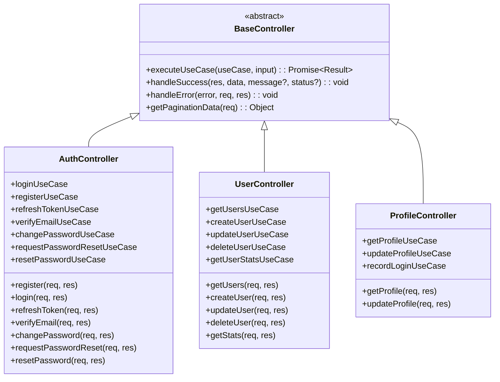

### Controller Pattern

Controllers follow a consistent pattern for handling requests:

```javascript
class AuthController extends BaseController {
  async login(req, res) {
    try {
      const { email, password } = req.body;

      // Input validation
      AuthValidator.validateLogin({ email, password });

      // Execute use case
      const result = await this.executeUseCase(
        this.loginUseCase,
        { email, password }
      );

      // Return success response
      this.handleSuccess(res, result, 'Login successful');
    } catch (error) {
      // Handle errors consistently
      this.handleError(error, req, res);
    }
  }
}
```

### Base Controller Features

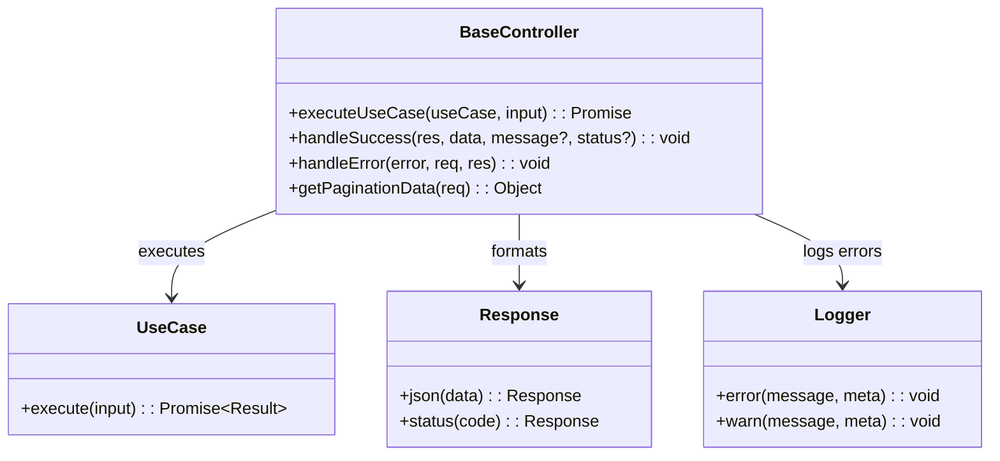

## Routing Architecture

### Route Organization

Routes are organized by feature and include middleware composition.

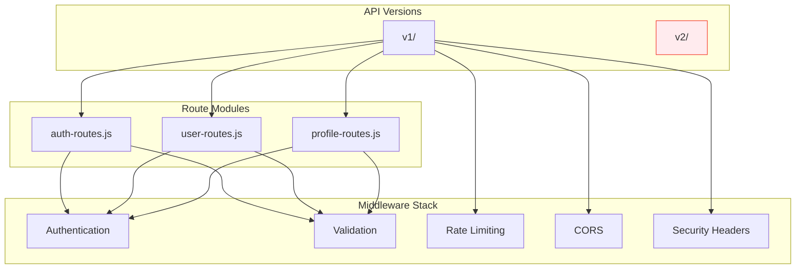

### Route Definitions

Routes combine HTTP methods, paths, middleware, and controller actions:

```javascript
export function createAuthRoutes(authController) {
  const router = express.Router();

  // POST /auth/register
  router.post(
    '/register',
    validateRequest(authSchemas.register),
    authController.register.bind(authController)
  );

  // POST /auth/login
  router.post(
    '/login',
    validateRequest(authSchemas.login),
    authController.login.bind(authController)
  );

  return router;
}
```

## Middleware Stack

### Security Middleware

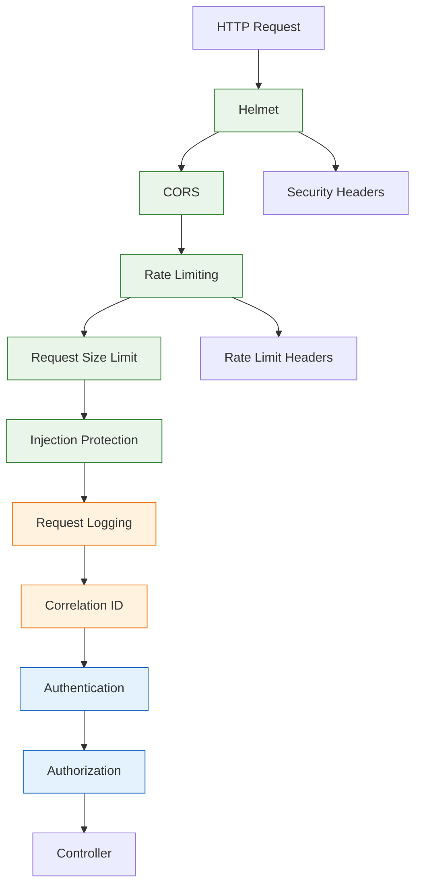

### Authentication Middleware

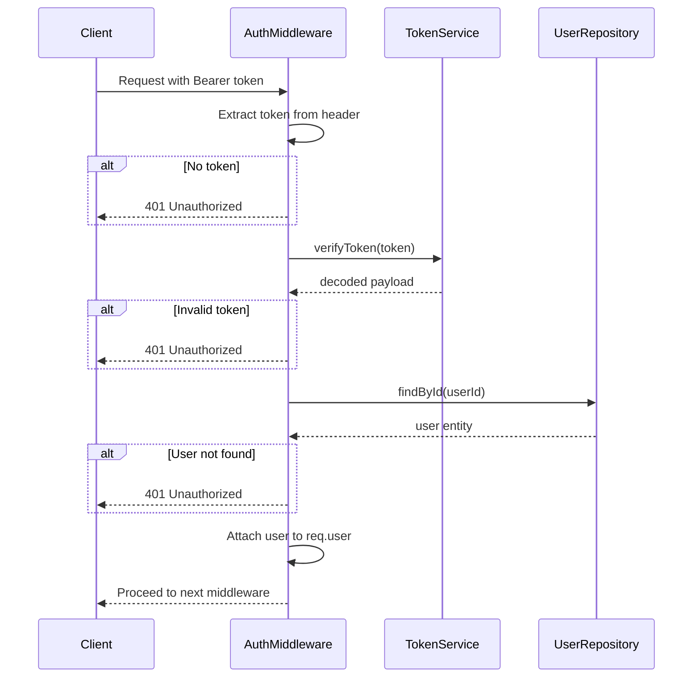

### Authorization Middleware

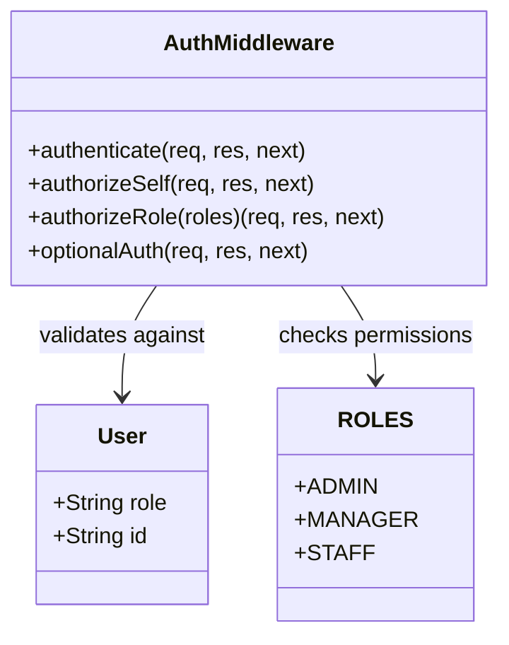

## Data Access Layer

### Repository Implementations

Infrastructure repositories implement domain interfaces using MongoDB/Mongoose.

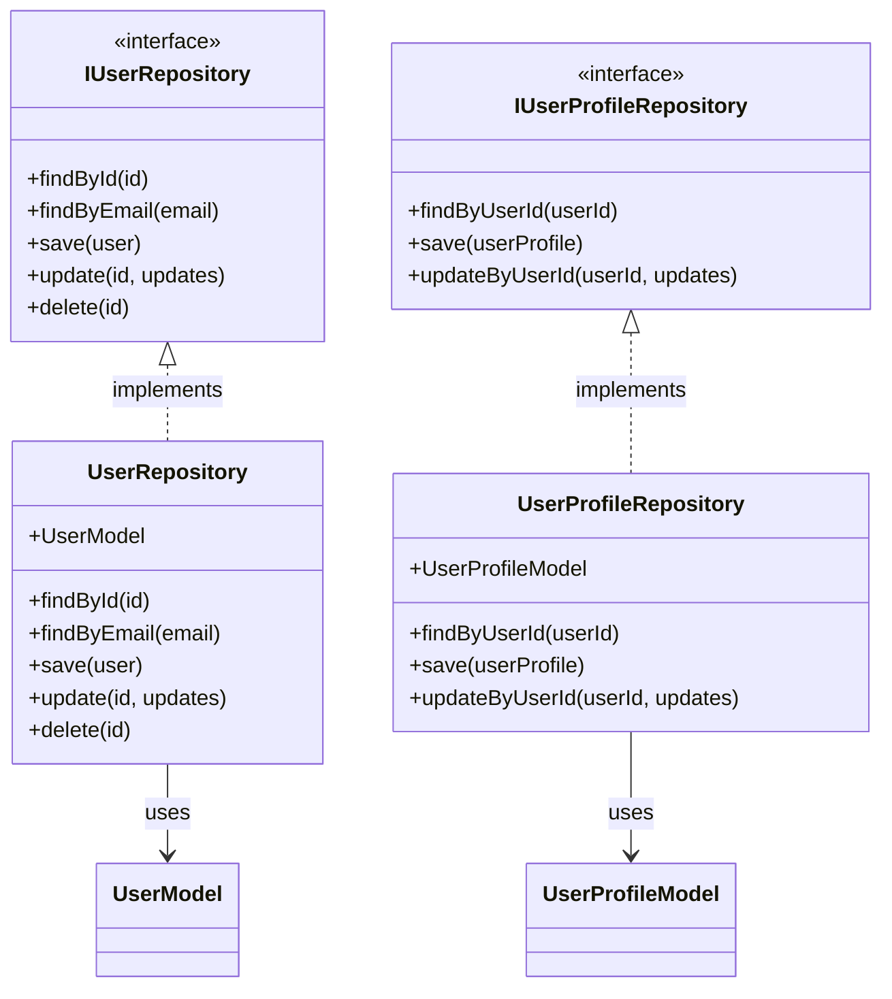

### MongoDB Models

Mongoose models define schema and provide query methods.

```javascript
// User Model
const userSchema = new mongoose.Schema({
  username: { type: String, required: true, unique: true },
  email: { type: String, required: true, unique: true },
  hashedPassword: { type: String, required: true },
  displayName: { type: String, required: true },
  role: {
    type: String,
    enum: Object.values(ROLES),
    default: ROLES.STAFF
  },
  // ... other fields
}, {
  timestamps: true,
  toJSON: { virtuals: true },
  toObject: { virtuals: true }
});

// Indexes for performance
userSchema.index({ email: 1 });
userSchema.index({ username: 1 });
userSchema.index({ role: 1 });
```

## External Services

### Service Implementations

Infrastructure provides concrete implementations of service interfaces.

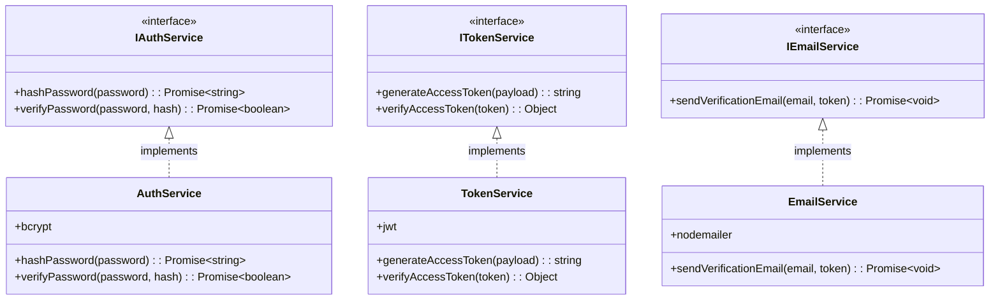

### Email Service Flow

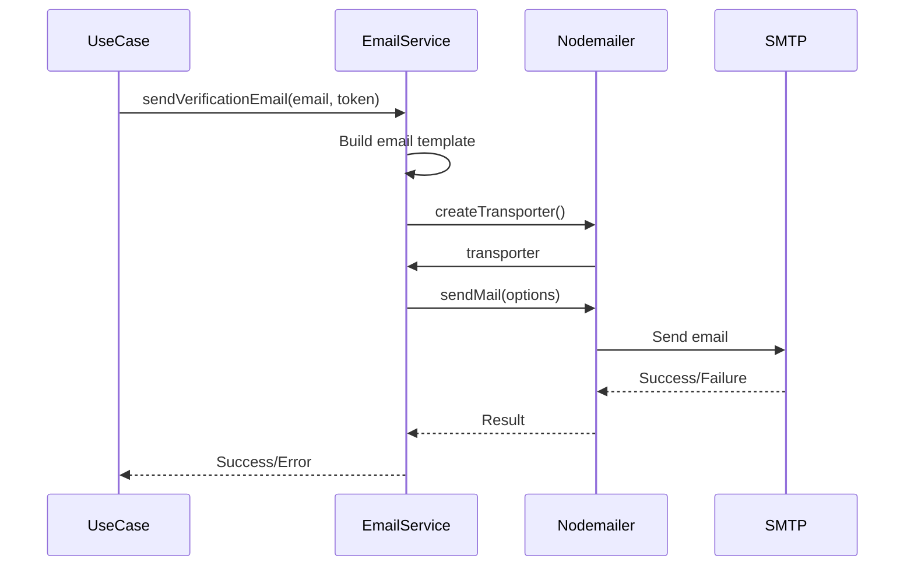

## Configuration Management

### Environment Configuration

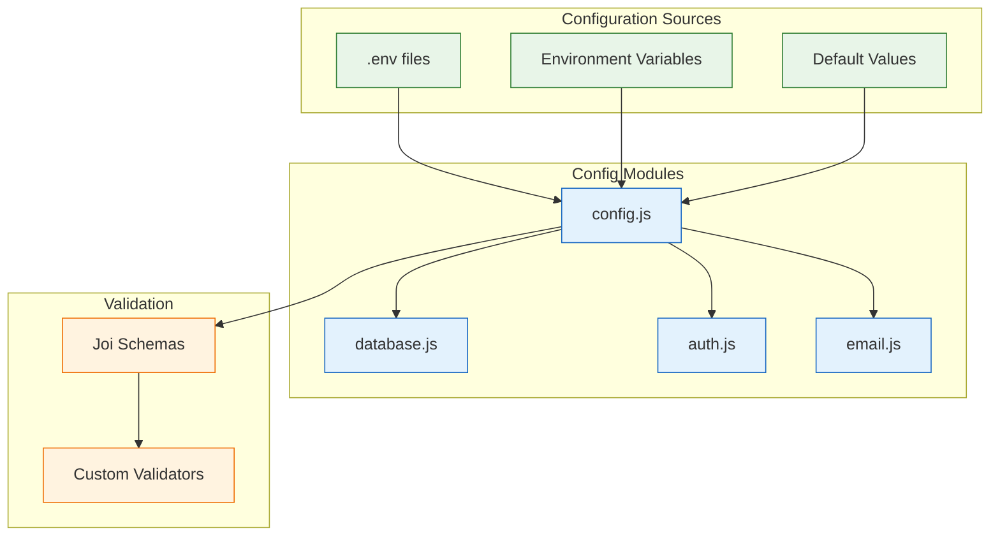

### Configuration Structure

```javascript
// config.js - Main configuration
export const config = {
  NODE_ENV: process.env.NODE_ENV || 'development',
  PORT: parseInt(process.env.PORT) || 3000,
  DATABASE_URL: process.env.DATABASE_URL,
  JWT_SECRET: process.env.JWT_SECRET,
  EMAIL_CONFIG: {
    host: process.env.EMAIL_HOST,
    port: process.env.EMAIL_PORT,
    secure: process.env.EMAIL_SECURE === 'true',
    auth: {
      user: process.env.EMAIL_USER,
      pass: process.env.EMAIL_PASS,
    },
  },
  // ... other configs
};
```

## Error Handling

### Global Error Handler

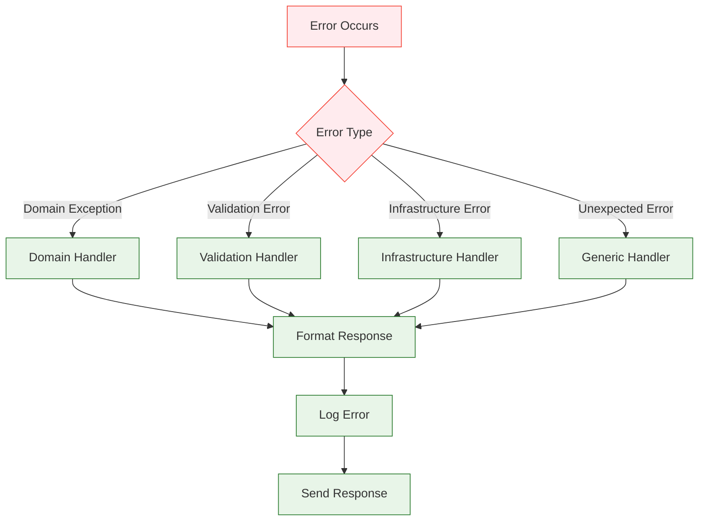

### Error Response Format

```javascript
// Success Response
{
  "success": true,
  "message": "Operation successful",
  "data": { /* result data */ },
  "correlationId": "req_123456"
}

// Error Response
{
  "success": false,
  "message": "Email already exists",
  "error": {
    "code": 409,
    "message": "Email already exists",
    "category": "VALIDATION",
    "details": {
      "email": "user@example.com"
    }
  },
  "correlationId": "req_123456"
}
```

## Monitoring and Logging

### Request Monitoring

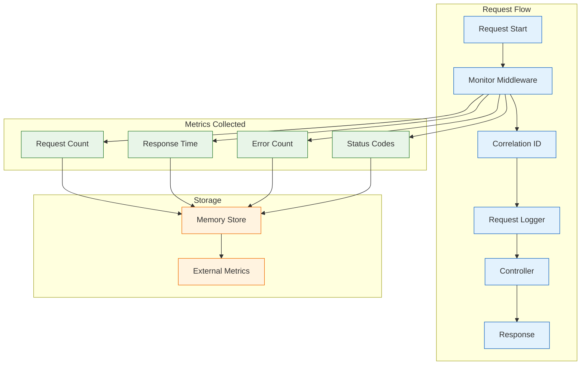

### Health Checks

```javascript
// Health check endpoint response
{
  "status": "healthy",
  "timestamp": "2024-01-01T00:00:00.000Z",
  "version": "1.0.0",
  "uptime": 3600,
  "memory": {
    "used": "150MB",
    "total": "512MB",
    "percentage": 29.3
  },
  "database": {
    "status": "connected",
    "responseTime": "5ms"
  },
  "services": {
    "email": "operational",
    "cache": "operational"
  }
}
```

## Testing Infrastructure

### Integration Testing

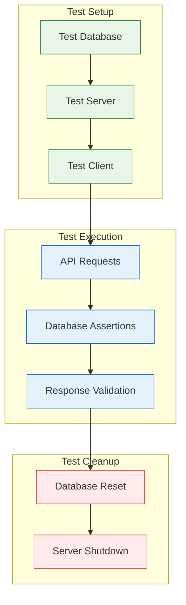

### Test Structure

```javascript
describe('Auth API Integration', () => {
  let server;
  let testUser;

  beforeAll(async () => {
    // Start test server with test database
    server = await startTestServer();
  });

  afterAll(async () => {
    // Clean up
    await stopTestServer(server);
  });

  beforeEach(async () => {
    // Reset database state
    await resetTestDatabase();
  });

  describe('POST /auth/register', () => {
    it('should register a new user', async () => {
      const response = await request(server)
        .post('/api/v1/auth/register')
        .send({
          email: 'test@example.com',
          password: 'password123',
          firstName: 'Test',
          lastName: 'User'
        });

      expect(response.status).toBe(201);
      expect(response.body.success).toBe(true);
      expect(response.body.data.user.email).toBe('test@example.com');
    });
  });
});
```
