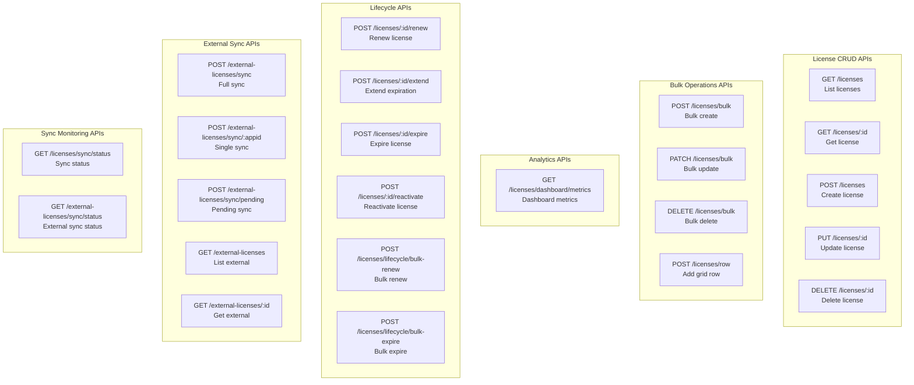
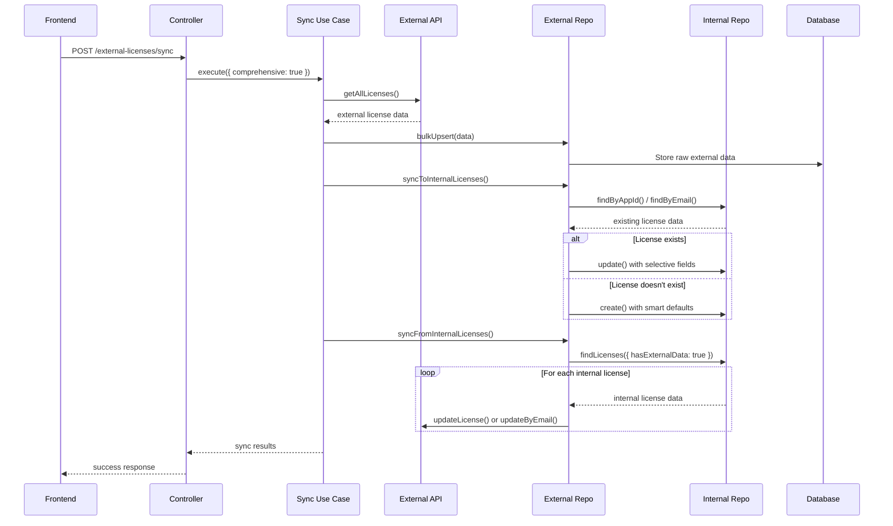

# License Management APIs

This section documents all API endpoints for license management, including request/response formats, authentication, and error handling.

## API Overview



## Authentication & Authorization

All endpoints require authentication via Bearer token:

```bash
Authorization: Bearer <your-jwt-token>
```

### Roles & Permissions

- **Admin**: Full CRUD, bulk operations, sync management
- **Manager**: Read/write licenses, limited bulk operations
- **Staff**: Read-only access to assigned licenses

## License CRUD APIs

### GET /licenses - List Licenses

Retrieves paginated list of licenses with filtering and sorting. After synchronization, returns unified view combining internal licenses with external sync data.

**Query Parameters:**
- `page` (integer, default: 1): Page number
- `limit` (integer, 1-100, default: 10): Items per page
- `search` (string): General search across DBA, key, product, plan
- `searchField` (string): Specific field to search (key, dba, product, plan)
- `status` (string): Filter by status (active, cancel, pending, expired)
- `dba` (string): Filter by DBA name
- `startsAtFrom` (date): Start date from
- `startsAtTo` (date): Start date to
- `expiresAtFrom` (date): Expiry date from
- `expiresAtTo` (date): Expiry date to
- `sortBy` (string): Sort field
- `sortOrder` (string): asc/desc

**Response:**
```json
{
  "success": true,
  "message": "Licenses retrieved successfully",
  "data": [
    {
      "id": "uuid",
      "key": "LICENSE-KEY-123",
      "product": "ABC Software",
      "plan": "Premium",
      "status": "active",
      "term": "monthly",
      "seatsTotal": 100,
      "seatsUsed": 75,
      "startsAt": "2024-01-01T00:00:00Z",
      "expiresAt": "2024-12-31T23:59:59Z",
      "dba": "Business Name LLC",
      "zip": "12345",
      "lastPayment": 299.99,
      "createdAt": "2024-01-01T10:00:00Z",
      "updatedAt": "2024-01-15T14:30:00Z"
    }
  ],
  "meta": {
    "pagination": {
      "page": 1,
      "limit": 10,
      "totalPages": 25,
      "total": 245
    },
    "stats": {
      "total": 245,
      "active": 180,
      "expired": 25,
      "pending": 15,
      "cancel": 25
    }
  }
}
```

**Cache Strategy:**
- Cache key: `licenses:{JSON.stringify(filters)}`
- TTL: 5 minutes
- Invalidation: On any license create/update/delete

### GET /licenses/:id - Get License by ID

Retrieves a single license by its UUID.

**Response:**
```json
{
  "success": true,
  "message": "License retrieved successfully",
  "data": {
    "license": {
      "id": "uuid",
      "key": "LICENSE-KEY-123",
      "product": "ABC Software",
      "plan": "Premium",
      "status": "active",
      "term": "monthly",
      "seatsTotal": 100,
      "seatsUsed": 75,
      "startsAt": "2024-01-01T00:00:00Z",
      "expiresAt": "2024-12-31T23:59:59Z",
      "dba": "Business Name LLC",
      "zip": "12345",
      "lastPayment": 299.99,
      "smsPurchased": 1000,
      "smsSent": 750,
      "smsBalance": 250,
      "agents": 5,
      "agentsName": "Agent 1, Agent 2",
      "agentsCost": 150.00,
      "notes": "Customer notes",

      // External sync fields (added after sync)
      "appid": "EXT-APP-123",
      "countid": 4785,
      "license_type": "product",
      "external_sync_status": "synced",
      "last_external_sync": "2024-01-15T10:30:00Z",

      "createdAt": "2024-01-01T10:00:00Z",
      "updatedAt": "2024-01-15T14:30:00Z"
    }
  }
}
```

**Cache Strategy:**
- Cache key: `license:{id}`
- TTL: 5 minutes
- Invalidation: On license update/delete

### POST /licenses - Create License

Creates a new license with validation and audit logging.

**Request Body:**
```json
{
  "dba": "Business Name LLC",
  "startDay": "2024-01-01",
  "product": "ABC Software",
  "plan": "Premium",
  "status": "active",
  "term": "monthly",
  "seatsTotal": 100,
  "lastPayment": 299.99,
  "zip": "12345"
}
```

**Response:**
```json
{
  "success": true,
  "message": "License created successfully",
  "data": {
    "license": {
      "id": "uuid",
      "key": "AUTO-GENERATED-KEY",
      "product": "ABC Software",
      "plan": "Premium",
      "status": "active",
      "term": "monthly",
      "seatsTotal": 100,
      "seatsUsed": 0,
      "startsAt": "2024-01-01T00:00:00Z",
      "expiresAt": "2024-12-31T23:59:59Z",
      "dba": "Business Name LLC",
      "zip": "12345",
      "lastPayment": 299.99,
      "createdAt": "2024-01-15T10:00:00Z",
      "updatedAt": "2024-01-15T10:00:00Z"
    }
  }
}
```

**Cache Invalidation:**
- Clears all license-related cache patterns

### PUT /licenses/:id - Update License

Updates an existing license with validation and audit logging.

**Request Body:**
```json
{
  "dba": "Updated Business Name LLC",
  "status": "active",
  "lastPayment": 349.99,
  "notes": "Updated customer notes"
}
```

**Response:**
```json
{
  "success": true,
  "message": "License updated successfully",
  "data": {
    "license": {
      "id": "uuid",
      "key": "LICENSE-KEY-123",
      "dba": "Updated Business Name LLC",
      "status": "active",
      "lastPayment": 349.99,
      "notes": "Updated customer notes",
      "updatedAt": "2024-01-15T11:00:00Z"
    }
  }
}
```

**Cache Invalidation:**
- Clears license-specific and list cache

### DELETE /licenses/:id - Delete License

Deletes a license with audit logging.

**Response:**
```json
{
  "success": true,
  "message": "License deleted successfully"
}
```

**Cache Invalidation:**
- Clears all license-related cache patterns

## Bulk Operations APIs

### POST /licenses/bulk - Bulk Create

Creates multiple licenses in a single request with full validation and audit logging.

**Features:**
- ✅ **Validation**: Duplicate key checking, required fields, business rules
- ✅ **Audit Logging**: Creates audit events for each successful creation
- ✅ **Error Handling**: Continues processing other licenses if one fails
- ✅ **Performance**: Batch size limit (1000), transaction safety
- ✅ **Atomic Operations**: Uses proper use cases for business logic

**Request Body:**
```json
{
  "licenses": [
    {
      "dba": "Business 1 LLC",
      "startDay": "2024-01-01",
      "product": "ABC Software",
      "plan": "Basic"
    },
    {
      "dba": "Business 2 LLC",
      "startDay": "2024-01-01",
      "product": "ABC Software",
      "plan": "Premium"
    }
  ]
}
```

**Success Response:**
```json
{
  "success": true,
  "message": "2 licenses created successfully",
  "data": [],
  "timestamp": "2024-01-23T07:00:00.000Z"
}
```

**Partial Failure Response:**
```json
{
  "success": true,
  "message": "1 of 2 licenses created successfully",
  "data": [],
  "timestamp": "2024-01-23T07:00:00.000Z"
}
```

**Validation Rules:**
- `key`: Required, unique, 1-255 characters
- `dba`: Required, 1-255 characters
- `product`: Required
- `plan`: Must be "Basic", "Premium", or "Enterprise"
- `status`: Must be valid license status
- `term`: Must be "monthly" or "yearly"
- `seatsTotal`: Must be positive integer
- Batch size limit: 1000 licenses

### PATCH /licenses/bulk - Bulk Update

Updates multiple licenses in a single transaction.

**Request Body:**
```json
{
  "updates": [
    {
      "id": "uuid-1",
      "updates": {
        "status": "active",
        "lastPayment": 199.99
      }
    },
    {
      "id": "uuid-2",
      "updates": {
        "status": "expired",
        "notes": "License expired"
      }
    }
  ]
}
```

**Response:**
```json
{
  "success": true,
  "data": [
    {
      "id": "uuid-1",
      "key": "LICENSE-KEY-1",
      "status": "active",
      "lastPayment": 199.99,
      "updatedAt": "2024-01-15T12:00:00Z"
    },
    {
      "id": "uuid-2",
      "key": "LICENSE-KEY-2",
      "status": "expired",
      "notes": "License expired",
      "updatedAt": "2024-01-15T12:00:00Z"
    }
  ]
}
```

## Analytics APIs

### GET /licenses/dashboard/metrics - Dashboard Metrics

Retrieves comprehensive dashboard metrics with trends and comparisons.

**Query Parameters:**
- `startsAtFrom` (date): Filter start date
- `startsAtTo` (date): Filter end date

**Response:**
```json
{
  "success": true,
  "message": "Dashboard metrics retrieved successfully",
  "data": {
    "totalActiveLicenses": {
      "value": 180,
      "trend": {
        "value": 12.5,
        "direction": "up",
        "label": "vs last month"
      }
    },
    "newLicensesThisMonth": {
      "value": 25,
      "trend": {
        "value": 8.3,
        "direction": "up",
        "label": "vs last month"
      }
    },
    "licenseIncomeThisMonth": {
      "value": 15750.00,
      "trend": {
        "value": 15.2,
        "direction": "up",
        "label": "vs last month"
      }
    },
    "smsIncomeThisMonth": {
      "value": 1250.00,
      "smsSent": 5000,
      "trend": {
        "value": 5.7,
        "direction": "up",
        "label": "usage vs last month"
      }
    },
    "inHouseLicenses": {
      "value": 120,
      "trend": {
        "value": 10.0,
        "direction": "up",
        "label": "vs last month"
      }
    },
    "agentHeavyLicenses": {
      "value": 60,
      "trend": {
        "value": 20.0,
        "direction": "up",
        "label": "vs last month"
      }
    },
    "highRiskLicenses": {
      "value": 5,
      "trend": {
        "value": 0,
        "direction": "neutral",
        "label": "auto-updated daily"
      }
    },
    "estimatedNextMonthIncome": {
      "value": 17250.00,
      "trend": {
        "value": 10,
        "direction": "up",
        "label": "projected"
      }
    },
    "metadata": {
      "currentPeriod": {
        "start": "2024-01-01T00:00:00.000Z",
        "end": "2024-01-31T23:59:59.999Z"
      },
      "previousPeriod": {
        "start": "2023-12-01T00:00:00.000Z",
        "end": "2023-12-31T23:59:59.999Z"
      },
      "totalLicensesAnalyzed": 245,
      "appliedFilters": false
    }
  }
}
```

**Cache Strategy:**
- Cache key: `licenses:stats`
- TTL: 15 minutes
- Invalidation: On license changes

## External Synchronization APIs

### POST /external-licenses/sync - Full Synchronization

Performs complete synchronization with external license API, including intelligent duplicate detection and consolidation when enabled.

**Query Parameters:**
- `force` (boolean): Force full sync
- `batchSize` (integer, 1-500): Batch size
- `dryRun` (boolean): Validation only
- `bidirectional` (boolean): Two-way sync
- `comprehensive` (boolean): Use comprehensive reconciliation
- `detectDuplicates` (boolean): Enable duplicate detection and consolidation

**Response:**
```json
{
  "success": true,
  "message": "Sync completed successfully",
  "data": {
    "success": true,
    "totalFetched": 245,
    "created": 15,
    "updated": 180,
    "failed": 2,
    "errors": [
      {
        "appid": "APP123",
        "error": "Validation failed: invalid email format"
      }
    ],
    "internalSynced": 195,
    "internalUpdated": 180,
    "internalCreated": 15,
    "duplicatesDetected": 8,
    "duplicatesConsolidated": 5,
    "duplicatesFlagged": 3,
    "duplicateAnalysis": {
      "externalDuplicates": 2,
      "internalDuplicates": 3,
      "crossSystemDuplicates": 3
    },
    "duration": 45000,
    "timestamp": "2024-01-15T10:30:00Z"
  }
}
```

**Flow Diagram:**


## Error Handling

All APIs follow consistent error response format:

```json
{
  "success": false,
  "message": "Error description",
  "error": {
    "code": "VALIDATION_ERROR",
    "details": {
      "field": "dba",
      "reason": "Dba is required"
    }
  }
}
```

### Common Error Codes

- `VALIDATION_ERROR`: Input validation failed
- `NOT_FOUND`: Resource not found
- `UNAUTHORIZED`: Authentication required
- `FORBIDDEN`: Insufficient permissions
- `INTERNAL_SERVER_ERROR`: Server error

## Rate Limiting

- **General API**: 1000 requests per hour per user
- **Sync Operations**: 10 sync operations per hour per user
- **Bulk Operations**: 50 bulk operations per hour per user

## Performance Characteristics

- **List APIs**: <200ms (cached), <2s (uncached)
- **CRUD APIs**: <500ms average
- **Bulk Operations**: <10s for 100 items
- **Sync Operations**: 30-120s depending on dataset size
- **Analytics APIs**: <1s (cached), <5s (uncached)

## Webhook Support

The system supports webhooks for real-time notifications:

- **License Created**: `license.created`
- **License Updated**: `license.updated`
- **License Deleted**: `license.deleted`
- **Sync Completed**: `sync.completed`
- **Sync Failed**: `sync.failed`