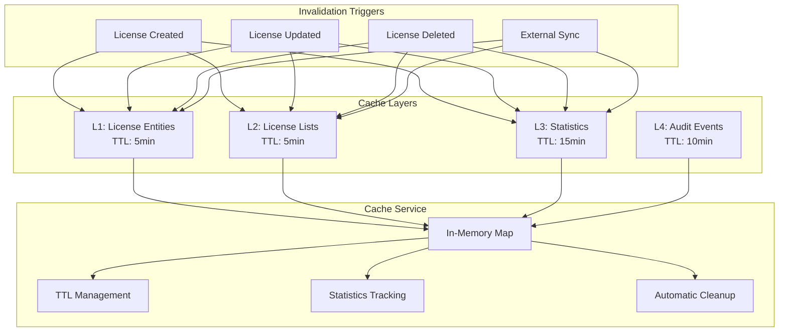
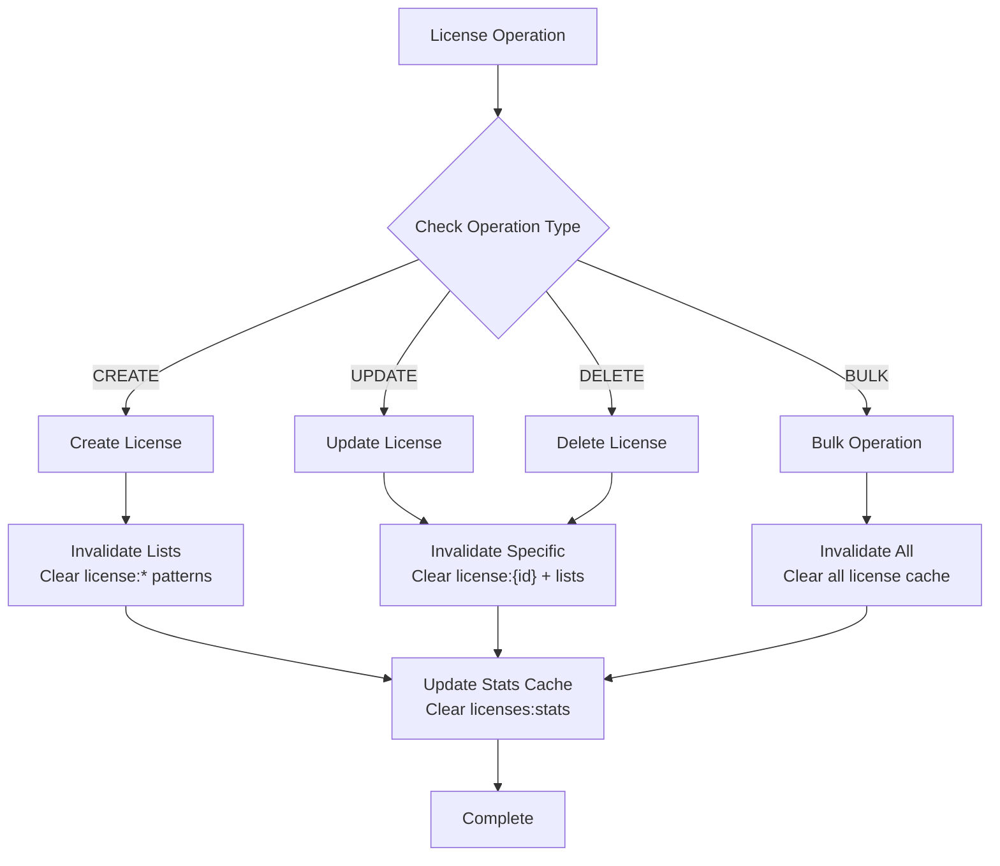
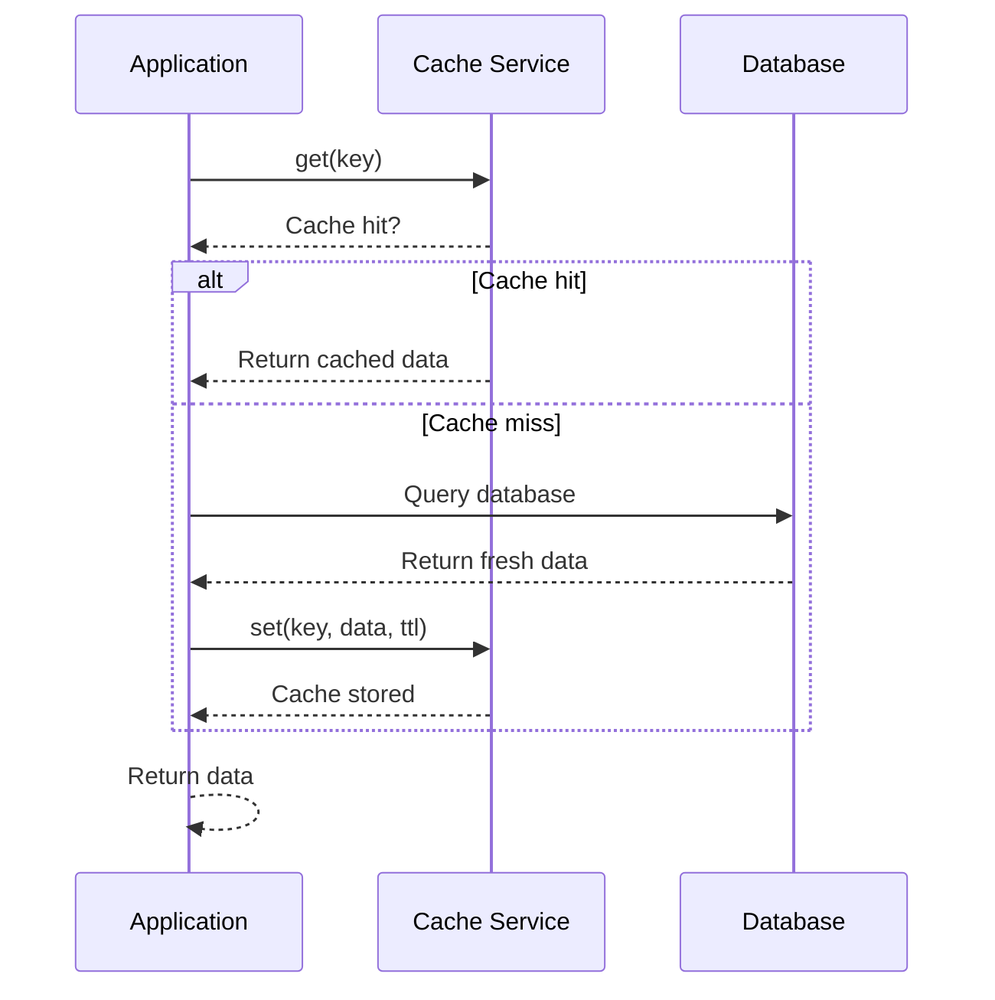
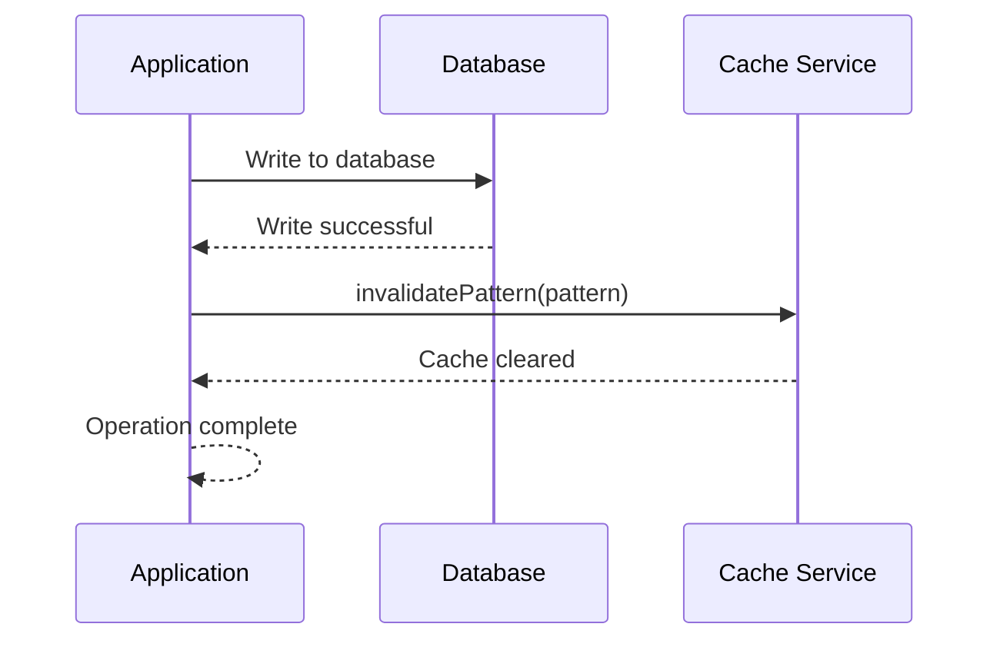
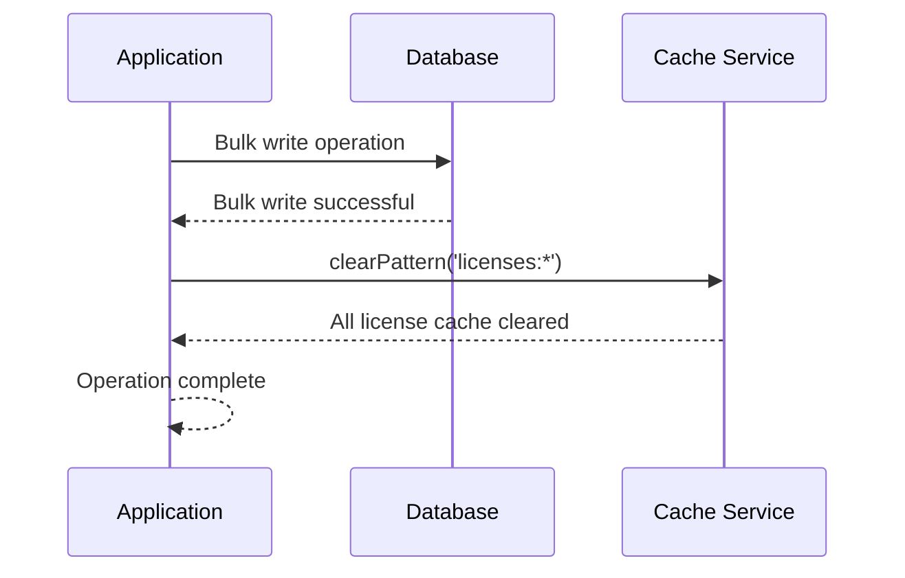

# Caching Implementation

This section documents the comprehensive caching strategy implemented in the license management system, including cache keys, TTL values, invalidation patterns, and performance characteristics.

## Cache Architecture



## Cache Service Implementation

The cache service provides an in-memory caching solution with TTL support that can be easily replaced with Redis in production environments.

### Core Features

- **TTL Support**: Time-based expiration with automatic cleanup
- **Pattern Matching**: Clear cache by patterns (e.g., `licenses:*`)
- **Statistics Tracking**: Hit rates, misses, and operation counts
- **Memory Bounded**: Configurable size limits and cleanup intervals
- **Thread Safe**: Concurrent access protection

### Configuration

```javascript
// Cache TTL values (in seconds)
export const CacheTTL = {
  SHORT: 60,    // 1 minute
  MEDIUM: 300,  // 5 minutes
  LONG: 900,    // 15 minutes
  HOUR: 3600,   // 1 hour
  DAY: 86400,   // 24 hours
};
```

## Cache Key Patterns

### License Cache Keys

```javascript
export const CacheKeys = {
  // Individual license
  license: (id) => `license:${id}`,

  // License lists with filters
  licenses: (filters) => `licenses:${JSON.stringify(filters)}`,

  // License statistics
  licenseStats: () => 'licenses:stats',

  // Expiring licenses
  expiringLicenses: (days) => `licenses:expiring:${days}`,

  // Assignment-related
  userAssignments: (userId) => `assignments:user:${userId}`,
  licenseAssignments: (licenseId) => `assignments:license:${licenseId}`,

  // Audit events
  auditTrail: (entityType, entityId) => `audit:${entityType}:${entityId}`,
};
```

### Key Examples

```javascript
// Individual license
license:123e4567-e89b-12d3-a456-426614174000

// License list with filters
licenses:{"page":1,"limit":10,"status":"active","sortBy":"createdAt"}

// License statistics
licenses:stats

// Expiring licenses (30 days)
licenses:expiring:30

// User assignments
assignments:user:123e4567-e89b-12d3-a456-426614174000

// Audit trail
audit:license:123e4567-e89b-12d3-a456-426614174000
```

## TTL Strategy

### By Data Type

| Data Type | TTL | Reason |
|-----------|-----|---------|
| Individual License | 5 minutes | Frequently accessed, moderate change frequency |
| License Lists | 5 minutes | Search results, pagination dependent |
| Dashboard Metrics | 15 minutes | Computed data, acceptable staleness |
| License Statistics | 15 minutes | Aggregated data, batch updates |
| Audit Events | 10 minutes | Historical data, append-only |
| Expiring Licenses | 15 minutes | Time-sensitive but computed |

### Dynamic TTL

```javascript
// Example: Shorter TTL for frequently changing data
const getLicenseTTL = (license) => {
  if (license.status === 'expiring') {
    return CacheTTL.SHORT; // 1 minute for expiring licenses
  }
  if (license.status === 'pending') {
    return CacheTTL.MEDIUM; // 5 minutes for pending
  }
  return CacheTTL.LONG; // 15 minutes for stable licenses
};
```

## Cache Invalidation Strategy

### Pattern-Based Invalidation

```javascript
export const CacheInvalidation = {
  // Invalidate user-related cache
  user: (userId) => {
    cacheService.delete(CacheKeys.user(userId));
    cacheService.clearPattern('users:*');
    cacheService.delete(CacheKeys.userStats());
    cacheService.clearPattern(`assignments:user:${userId}*`);
  },

  // Invalidate license-related cache
  license: (licenseId) => {
    cacheService.delete(CacheKeys.license(licenseId));
    cacheService.clearPattern('licenses:*');
    cacheService.delete(CacheKeys.licenseStats());
    cacheService.clearPattern(`assignments:license:${licenseId}*`);
  },

  // Invalidate all licenses cache
  allLicenses: () => {
    cacheService.clearPattern('license:*');
    cacheService.clearPattern('licenses:*');
    cacheService.delete(CacheKeys.licenseStats());
  },
};
```

### Invalidation Triggers



## Cache Operations Flow

### Read Operation (Cache-First)



### Write Operation (Write-Through)



### Bulk Operation (Cache Bypass)



## Performance Characteristics

### Cache Hit Rates

| Operation Type | Expected Hit Rate | Cache TTL |
|----------------|-------------------|-----------|
| License List (filtered) | 85-95% | 5 minutes |
| Individual License | 90-98% | 5 minutes |
| Dashboard Metrics | 95-99% | 15 minutes |
| License Statistics | 80-90% | 15 minutes |

### Memory Usage

- **Per License Entity**: ~2-5KB (depending on field count)
- **List Cache**: ~50-200KB per page (10-50 licenses)
- **Statistics Cache**: ~10-50KB
- **Total Memory**: Configurable, default 100MB limit

### Performance Benchmarks

```javascript
// Cache Service Benchmarks
const benchmarks = {
  get: {
    cached: '0.1-0.5ms',
    uncached: '50-200ms (DB query)',
    improvement: '100-400x faster'
  },
  set: {
    average: '0.05-0.2ms',
    bulkSet: '1-5ms for 100 items'
  },
  patternClear: {
    small: '0.5-2ms',
    large: '5-20ms (1000+ keys)'
  }
};
```

## Cache Monitoring

### Statistics Tracking

```javascript
// Cache statistics structure
const cacheStats = {
  hits: 15420,
  misses: 1280,
  sets: 2560,
  deletes: 340,
  size: 1250, // Current cache size
  hitRate: '92.3%', // (hits / (hits + misses)) * 100
  memoryUsage: '45.2MB', // Estimated memory usage
  uptime: '2h 15m', // Cache service uptime
  cleanupCount: 12, // Number of cleanup cycles
  expiredItemsRemoved: 450 // Items removed in cleanup
};
```

### Health Checks

```javascript
// Cache health check
const healthCheck = {
  status: 'healthy', // healthy | degraded | unhealthy
  responseTime: '0.15ms', // Average response time
  memoryUsage: '45.2MB',
  hitRate: '92.3%',
  errorRate: '0.01%', // Cache operation errors
  lastCleanup: '2024-01-15T10:30:00Z',
  recommendations: [] // Any optimization suggestions
};
```

## Cache Warming Strategies

### On Application Startup

```javascript
// Warm up frequently accessed data
async function warmCache() {
  // Warm up license statistics
  await cacheService.remember(
    CacheKeys.licenseStats(),
    () => licenseRepository.getLicenseStats(),
    CacheTTL.LONG
  );

  // Warm up expiring licenses
  await cacheService.remember(
    CacheKeys.expiringLicenses(30),
    () => licenseRepository.findExpiringLicenses(30),
    CacheTTL.MEDIUM
  );
}
```

### On Sync Completion

```javascript
// Warm cache after external sync
async function warmCacheAfterSync(syncResults) {
  // Refresh statistics cache
  await cacheService.set(
    CacheKeys.licenseStats(),
    await licenseRepository.getLicenseStats(),
    CacheTTL.LONG
  );

  // Refresh common filter caches
  const commonFilters = [
    { status: 'active' },
    { status: 'expiring' },
    { sortBy: 'createdAt', sortOrder: 'desc' }
  ];

  for (const filters of commonFilters) {
    await cacheService.remember(
      CacheKeys.licenses(filters),
      () => licenseRepository.findLicenses({ ...filters, limit: 50 }),
      CacheTTL.MEDIUM
    );
  }
}
```

## Error Handling & Resilience

### Cache Failures

```javascript
// Graceful degradation on cache failure
async function safeCacheGet(key, fallback) {
  try {
    const cached = cacheService.get(key);
    if (cached !== undefined) {
      return cached;
    }
  } catch (error) {
    logger.warn('Cache get failed, falling back to database', { key, error: error.message });
  }

  return await fallback();
}
```

### Memory Pressure Handling

```javascript
// Automatic cleanup under memory pressure
class MemoryPressureHandler {
  checkMemoryPressure() {
    const usage = process.memoryUsage();
    const heapUsedPercent = (usage.heapUsed / usage.heapTotal) * 100;

    if (heapUsedPercent > 85) {
      logger.warn('High memory usage detected, triggering cache cleanup', {
        heapUsedPercent: heapUsedPercent.toFixed(1) + '%',
        heapUsed: (usage.heapUsed / 1024 / 1024).toFixed(1) + 'MB',
        heapTotal: (usage.heapTotal / 1024 / 1024).toFixed(1) + 'MB'
      });

      // Aggressive cleanup
      cacheService.clearPattern('*'); // Clear all cache
      cacheService.cleanup(); // Force cleanup
    }
  }
}
```

## Redis Integration (Production)

The cache service is designed for easy Redis integration:

```javascript
// Redis cache implementation
class RedisCacheService {
  constructor(redisClient) {
    this.redis = redisClient;
  }

  async get(key) {
    try {
      const value = await this.redis.get(key);
      return value ? JSON.parse(value) : undefined;
    } catch (error) {
      logger.error('Redis get failed', { key, error: error.message });
      return undefined;
    }
  }

  async set(key, value, ttl = 300) {
    try {
      const serialized = JSON.stringify(value);
      if (ttl > 0) {
        await this.redis.setex(key, ttl, serialized);
      } else {
        await this.redis.set(key, serialized);
      }
    } catch (error) {
      logger.error('Redis set failed', { key, error: error.message });
    }
  }
}
```

## Configuration Options

```javascript
// Cache configuration
const cacheConfig = {
  // Core settings
  enabled: true,
  provider: 'memory', // 'memory' | 'redis'

  // Memory cache settings
  maxSize: 100 * 1024 * 1024, // 100MB
  cleanupInterval: 60 * 1000, // 1 minute
  defaultTTL: 300, // 5 minutes

  // Redis settings
  redis: {
    host: process.env.REDIS_HOST || 'localhost',
    port: process.env.REDIS_PORT || 6379,
    password: process.env.REDIS_PASSWORD,
    keyPrefix: 'license_cache:',
  },

  // Advanced settings
  compression: false, // Enable compression for large objects
  serialization: 'json', // json | msgpack
  encryption: false, // Encrypt sensitive cached data
};
```

## Troubleshooting

### Common Issues

1. **High Memory Usage**
   - Reduce TTL values
   - Enable compression
   - Implement selective caching

2. **Cache Stampede**
   - Use `remember()` method for automatic deduplication
   - Implement request coalescing

3. **Cache Inconsistency**
   - Ensure proper invalidation on all write operations
   - Use database transactions for consistency

4. **Cold Cache Performance**
   - Implement cache warming on startup
   - Use background warming for large datasets

### Monitoring Queries

```sql
-- Cache hit rate over time
SELECT
  DATE_TRUNC('hour', created_at) as hour,
  AVG(CASE WHEN cache_hit THEN 1 ELSE 0 END) * 100 as hit_rate,
  COUNT(*) as total_requests
FROM cache_metrics
WHERE created_at >= NOW() - INTERVAL '24 hours'
GROUP BY DATE_TRUNC('hour', created_at)
ORDER BY hour;

-- Top cache keys by access frequency
SELECT
  cache_key,
  COUNT(*) as access_count,
  AVG(response_time_ms) as avg_response_time
FROM cache_access_log
WHERE created_at >= NOW() - INTERVAL '1 hour'
GROUP BY cache_key
ORDER BY access_count DESC
LIMIT 20;
```