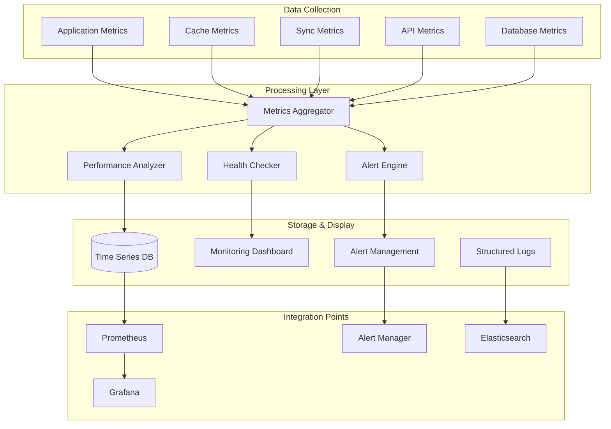
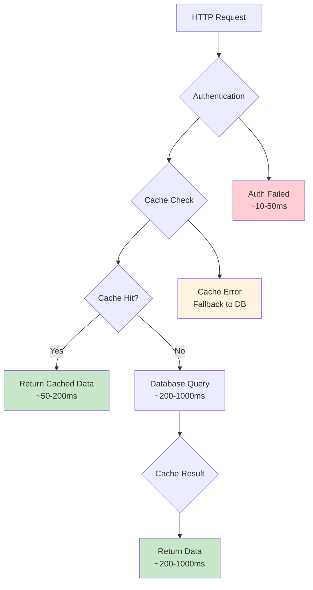
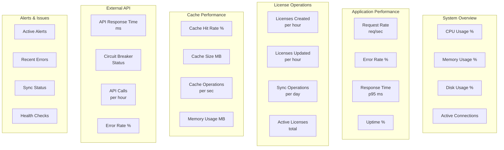
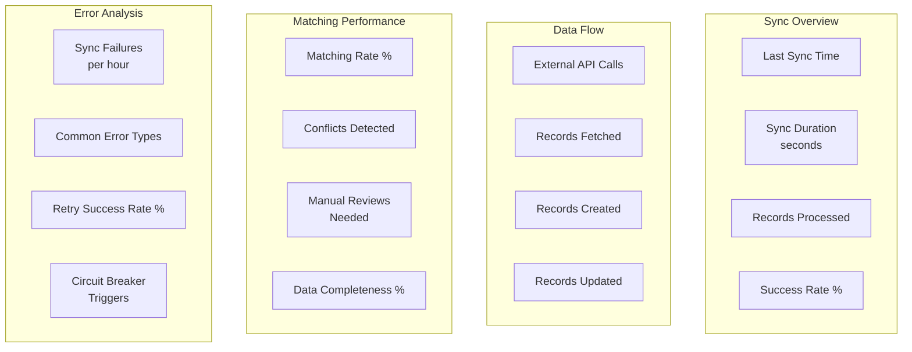
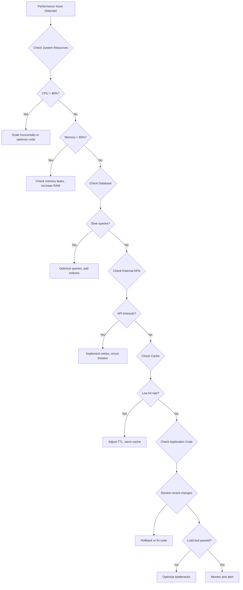

# Monitoring & Metrics System

This section documents the comprehensive monitoring system for the license management platform, including real-time metrics, health checks, alerting, and performance monitoring.

## Monitoring Architecture



## Metrics Categories

### Application Performance Metrics

```javascript
// Application metrics structure
const applicationMetrics = {
  // HTTP Request Metrics
  http: {
    requestCount: 'counter',           // Total requests
    requestDuration: 'histogram',      // Request duration in ms
    requestErrors: 'counter',          // Error responses
    activeConnections: 'gauge',        // Current connections
  },

  // Business Logic Metrics
  business: {
    licensesCreated: 'counter',        // License creation count
    licensesUpdated: 'counter',        // License update count
    licensesDeleted: 'counter',        // License deletion count
    syncOperations: 'counter',         // Sync operation count
    apiCalls: 'counter',              // External API calls
  },

  // System Resources
  system: {
    memoryUsage: 'gauge',             // Memory usage in MB
    cpuUsage: 'gauge',                // CPU usage percentage
    heapUsed: 'gauge',                // V8 heap usage
    eventLoopLag: 'gauge',            // Event loop lag in ms
  }
};
```

### Cache Performance Metrics

```javascript
// Cache metrics structure
const cacheMetrics = {
  // Cache Operations
  operations: {
    cacheGets: 'counter',             // Total get operations
    cacheSets: 'counter',             // Total set operations
    cacheDeletes: 'counter',          // Total delete operations
    cacheHits: 'counter',             // Successful cache hits
    cacheMisses: 'counter',           // Cache misses
  },

  // Cache Performance
  performance: {
    hitRate: 'gauge',                 // Cache hit rate percentage
    averageResponseTime: 'histogram', // Cache response time
    memoryUsage: 'gauge',             // Cache memory usage
    itemCount: 'gauge',               // Total cached items
  },

  // Cache Health
  health: {
    evictionCount: 'counter',         // Items evicted
    cleanupCount: 'counter',          // Cleanup operations
    errorCount: 'counter',            // Cache operation errors
  }
};
```

### Synchronization Metrics

```javascript
// Sync metrics structure
const syncMetrics = {
  // Sync Operations
  operations: {
    syncStarted: 'counter',           // Sync operations started
    syncCompleted: 'counter',         // Sync operations completed
    syncFailed: 'counter',            // Sync operations failed
    syncDuration: 'histogram',        // Sync duration in ms
  },

  // Data Processing
  data: {
    recordsFetched: 'counter',        // Records fetched from external API
    recordsProcessed: 'counter',      // Records processed
    recordsCreated: 'counter',        // New records created
    recordsUpdated: 'counter',        // Existing records updated
    recordsFailed: 'counter',         // Records that failed processing
  },

  // External API Metrics
  externalApi: {
    apiCalls: 'counter',              // External API calls made
    apiErrors: 'counter',             // External API errors
    apiResponseTime: 'histogram',     // External API response time
    circuitBreakerState: 'gauge',     // Circuit breaker state (0=closed, 1=open)
  },

  // Data Quality
  quality: {
    matchingRate: 'gauge',            // License matching rate percentage
    conflictCount: 'counter',         // Data conflicts detected
    dataCompleteness: 'gauge',        // Data completeness percentage
  }
};
```

## Health Checks

### System Health Endpoints

#### GET /health - Overall System Health

```json
{
  "status": "healthy",
  "timestamp": "2024-01-15T10:30:00Z",
  "version": "1.0.0",
  "uptime": "2d 4h 30m",
  "checks": {
    "database": {
      "status": "healthy",
      "responseTime": "45ms",
      "lastCheck": "2024-01-15T10:30:00Z"
    },
    "cache": {
      "status": "healthy",
      "hitRate": "94.2%",
      "memoryUsage": "45.2MB",
      "lastCheck": "2024-01-15T10:30:00Z"
    },
    "externalApi": {
      "status": "healthy",
      "responseTime": "1250ms",
      "lastCheck": "2024-01-15T10:29:30Z"
    },
    "sync": {
      "status": "healthy",
      "lastSync": "2024-01-15T10:00:00Z",
      "syncAge": "30 minutes",
      "lastCheck": "2024-01-15T10:30:00Z"
    }
  }
}
```

#### GET /health/detailed - Detailed Health Information

```json
{
  "status": "healthy",
  "timestamp": "2024-01-15T10:30:00Z",
  "system": {
    "cpu": {
      "usage": 15.2,
      "cores": 8,
      "loadAverage": [0.12, 0.08, 0.05]
    },
    "memory": {
      "total": "16GB",
      "used": "4.2GB",
      "free": "11.8GB",
      "usagePercent": 26.3
    },
    "disk": {
      "total": "100GB",
      "used": "45GB",
      "free": "55GB",
      "usagePercent": 45.0
    }
  },
  "application": {
    "activeConnections": 23,
    "totalRequests": 15420,
    "errorRate": 0.02,
    "averageResponseTime": 145
  },
  "database": {
    "connections": {
      "active": 5,
      "idle": 10,
      "total": 15
    },
    "queryLatency": {
      "p50": "12ms",
      "p95": "45ms",
      "p99": "120ms"
    }
  }
}
```

### Component-Specific Health Checks

#### Cache Health Check

```javascript
async function checkCacheHealth() {
  const startTime = Date.now();
  const testKey = `health_check_${Date.now()}`;

  try {
    // Test basic operations
    await cacheService.set(testKey, { test: true }, 60);
    const retrieved = await cacheService.get(testKey);
    await cacheService.delete(testKey);

    const responseTime = Date.now() - startTime;
    const isHealthy = retrieved && retrieved.test === true;

    return {
      status: isHealthy ? 'healthy' : 'unhealthy',
      responseTime: `${responseTime}ms`,
      hitRate: cacheService.getStats().hitRate,
      memoryUsage: cacheService.getStats().size,
      error: isHealthy ? null : 'Cache read/write test failed'
    };
  } catch (error) {
    return {
      status: 'unhealthy',
      responseTime: `${Date.now() - startTime}ms`,
      error: error.message
    };
  }
}
```

#### Database Health Check

```javascript
async function checkDatabaseHealth() {
  const startTime = Date.now();

  try {
    // Test basic connectivity
    await db.raw('SELECT 1 as health_check');

    // Test license table access
    const licenseCount = await db('licenses').count('id as count').first();

    // Test external licenses table access
    const externalCount = await db('external_licenses').count('id as count').first();

    const responseTime = Date.now() - startTime;

    return {
      status: 'healthy',
      responseTime: `${responseTime}ms`,
      licenseCount: licenseCount.count,
      externalLicenseCount: externalCount.count,
      connectionPool: {
        used: db.client.pool.used,
        available: db.client.pool.available,
        pending: db.client.pool.pending,
        size: db.client.pool.size
      }
    };
  } catch (error) {
    return {
      status: 'unhealthy',
      responseTime: `${Date.now() - startTime}ms`,
      error: error.message
    };
  }
}
```

#### External API Health Check

```javascript
async function checkExternalApiHealth() {
  const startTime = Date.now();

  try {
    // Test connectivity with a simple request
    const response = await externalLicenseApiService.testConnectivity();

    const responseTime = Date.now() - startTime;
    const isHealthy = response.success;

    return {
      status: isHealthy ? 'healthy' : 'degraded',
      responseTime: `${responseTime}ms`,
      lastCheck: new Date().toISOString(),
      error: isHealthy ? null : response.error,
      circuitBreakerState: externalLicenseApiService.isHealthy ? 'closed' : 'open'
    };
  } catch (error) {
    return {
      status: 'unhealthy',
      responseTime: `${Date.now() - startTime}ms`,
      error: error.message,
      circuitBreakerState: 'open'
    };
  }
}
```

## Alerting System

### Alert Categories

#### Critical Alerts (Immediate Response Required)

```javascript
const criticalAlerts = [
  {
    name: 'external_api_down',
    condition: 'external_api_health_status == "unhealthy" for 5 minutes',
    severity: 'critical',
    description: 'External license API is unreachable',
    channels: ['email', 'slack', 'sms']
  },
  {
    name: 'sync_failures_high',
    condition: 'sync_failure_rate > 0.1 for 10 minutes',
    severity: 'critical',
    description: 'Sync operations failing at high rate',
    channels: ['email', 'slack']
  },
  {
    name: 'database_connection_loss',
    condition: 'database_health_status == "unhealthy" for 2 minutes',
    severity: 'critical',
    description: 'Database connection lost',
    channels: ['email', 'slack', 'sms']
  }
];
```

#### Warning Alerts (Monitor and Respond if Needed)

```javascript
const warningAlerts = [
  {
    name: 'cache_hit_rate_low',
    condition: 'cache_hit_rate < 0.8 for 15 minutes',
    severity: 'warning',
    description: 'Cache hit rate below acceptable threshold',
    channels: ['email']
  },
  {
    name: 'sync_duration_high',
    condition: 'sync_duration_p95 > 300000 for 30 minutes',
    severity: 'warning',
    description: 'Sync operations taking longer than expected',
    channels: ['email']
  },
  {
    name: 'memory_usage_high',
    condition: 'memory_usage_percent > 85 for 5 minutes',
    severity: 'warning',
    description: 'High memory usage detected',
    channels: ['email']
  }
];
```

#### Info Alerts (For Awareness)

```javascript
const infoAlerts = [
  {
    name: 'sync_completed',
    condition: 'sync_operation_completed',
    severity: 'info',
    description: 'Sync operation completed successfully',
    channels: ['logs']
  },
  {
    name: 'license_created',
    condition: 'license_created_count > 10 in 1 hour',
    severity: 'info',
    description: 'High volume of license creations',
    channels: ['logs']
  }
];
```

### Alert Manager Configuration

```yaml
# alertmanager.yml
global:
  smtp_smarthost: 'smtp.gmail.com:587'
  smtp_from: 'alerts@abc-dashboard.com'

route:
  group_by: ['alertname']
  group_wait: 10s
  group_interval: 10s
  repeat_interval: 1h
  receiver: 'email'

receivers:
  - name: 'email'
    email_configs:
      - to: 'admin@abc-dashboard.com'
        send_resolved: true

  - name: 'slack'
    slack_configs:
      - api_url: 'https://hooks.slack.com/services/...'
        channel: '#alerts'
        send_resolved: true
```

## Performance Monitoring

### Response Time Monitoring



### Database Performance Tracking

```javascript
// Database query performance monitoring
const dbMetrics = {
  // Query execution time
  queryDuration: {
    select: 'histogram',
    insert: 'histogram',
    update: 'histogram',
    delete: 'histogram'
  },

  // Connection pool metrics
  connections: {
    active: 'gauge',
    idle: 'gauge',
    waiting: 'gauge',
    total: 'gauge'
  },

  // Slow query detection
  slowQueries: {
    count: 'counter',
    threshold: '1s', // Configurable
    examples: 'histogram' // Sample slow queries
  }
};
```

### External API Monitoring

```javascript
// External API performance tracking
const externalApiMetrics = {
  // Request metrics
  requests: {
    total: 'counter',
    success: 'counter',
    error: 'counter',
    timeout: 'counter'
  },

  // Response time percentiles
  responseTime: {
    p50: 'gauge',
    p95: 'gauge',
    p99: 'gauge'
  },

  // Rate limiting
  rateLimit: {
    remaining: 'gauge',
    resetTime: 'gauge',
    hits: 'counter'
  },

  // Circuit breaker status
  circuitBreaker: {
    state: 'gauge', // 0=closed, 1=open, 2=half-open
    failures: 'counter',
    successes: 'counter'
  }
};
```

## Dashboard Examples

### Main Monitoring Dashboard



### Sync Performance Dashboard



## Logging Strategy

### Structured Logging Format

```json
{
  "timestamp": "2024-01-15T10:30:15.123Z",
  "level": "info",
  "service": "license-service",
  "operation": "license_create",
  "correlationId": "abc-123-def-456",
  "userId": "user-789",
  "ipAddress": "192.168.1.100",
  "userAgent": "Mozilla/5.0...",
  "duration": 245,
  "status": "success",
  "metadata": {
    "licenseId": "license-101",
    "key": "ABC-001",
    "product": "Premium Suite"
  },
  "message": "License created successfully"
}
```

### Log Levels and Usage

- **ERROR**: System errors, failed operations, security issues
- **WARN**: Degraded performance, retry scenarios, configuration issues
- **INFO**: Normal operations, sync completions, user actions
- **DEBUG**: Detailed operation tracing, API calls, cache operations

### Log Aggregation Queries

```sql
-- Error rate by service
SELECT
  service,
  DATE_TRUNC('hour', timestamp) as hour,
  COUNT(*) as total_logs,
  COUNT(CASE WHEN level = 'error' THEN 1 END) as errors,
  ROUND(
    COUNT(CASE WHEN level = 'error' THEN 1 END)::decimal /
    COUNT(*)::decimal * 100, 2
  ) as error_rate
FROM application_logs
WHERE timestamp >= NOW() - INTERVAL '24 hours'
GROUP BY service, DATE_TRUNC('hour', timestamp)
ORDER BY hour, service;

-- Performance analysis
SELECT
  operation,
  COUNT(*) as operation_count,
  AVG(duration) as avg_duration,
  PERCENTILE_CONT(0.95) WITHIN GROUP (ORDER BY duration) as p95_duration,
  PERCENTILE_CONT(0.99) WITHIN GROUP (ORDER BY duration) as p99_duration
FROM application_logs
WHERE level = 'info' AND operation IS NOT NULL
  AND timestamp >= NOW() - INTERVAL '1 hour'
GROUP BY operation
ORDER BY operation_count DESC;

-- Sync operation analysis
SELECT
  operation,
  status,
  COUNT(*) as count,
  AVG(duration) as avg_duration,
  MAX(duration) as max_duration
FROM application_logs
WHERE operation LIKE 'sync_%'
  AND timestamp >= NOW() - INTERVAL '7 days'
GROUP BY operation, status
ORDER BY operation, status;
```

## Configuration Management

### Monitoring Configuration

```javascript
const monitoringConfig = {
  // Metrics collection
  metrics: {
    enabled: true,
    collectionInterval: 15000, // 15 seconds
    retentionPeriod: 30, // 30 days
    exporters: ['prometheus', 'cloudwatch']
  },

  // Health checks
  healthChecks: {
    enabled: true,
    interval: 30000, // 30 seconds
    timeout: 5000, // 5 seconds
    failureThreshold: 3
  },

  // Alerting
  alerting: {
    enabled: true,
    rules: './config/alert-rules.yml',
    evaluationInterval: 30000, // 30 seconds
    notificationChannels: ['email', 'slack']
  },

  // Logging
  logging: {
    level: 'info',
    format: 'json',
    destinations: ['console', 'elasticsearch'],
    retention: {
      days: 30,
      maxSize: '1GB'
    }
  }
};
```

### Environment-Specific Configuration

```javascript
// Development configuration
const devConfig = {
  ...monitoringConfig,
  metrics: {
    ...monitoringConfig.metrics,
    detailedMetrics: true
  },
  logging: {
    ...monitoringConfig.logging,
    level: 'debug'
  }
};

// Production configuration
const prodConfig = {
  ...monitoringConfig,
  metrics: {
    ...monitoringConfig.metrics,
    exporters: ['prometheus', 'datadog', 'cloudwatch']
  },
  alerting: {
    ...monitoringConfig.alerting,
    notificationChannels: ['email', 'slack', 'pagerduty']
  }
};
```

## Troubleshooting with Monitoring

### Common Monitoring Queries

```sql
-- Find slow requests
SELECT
  correlation_id,
  method,
  path,
  status_code,
  duration,
  timestamp
FROM http_requests
WHERE duration > 5000 -- 5 seconds
  AND timestamp >= NOW() - INTERVAL '1 hour'
ORDER BY duration DESC
LIMIT 20;

-- Cache performance analysis
SELECT
  DATE_TRUNC('hour', timestamp) as hour,
  AVG(hit_rate) as avg_hit_rate,
  AVG(memory_usage_mb) as avg_memory_mb,
  SUM(eviction_count) as total_evictions
FROM cache_metrics
WHERE timestamp >= NOW() - INTERVAL '24 hours'
GROUP BY DATE_TRUNC('hour', timestamp)
ORDER BY hour;

-- Sync failure analysis
SELECT
  operation_id,
  error_type,
  error_message,
  COUNT(*) as frequency,
  MIN(timestamp) as first_occurrence,
  MAX(timestamp) as last_occurrence
FROM sync_operations
WHERE status = 'failed'
  AND timestamp >= NOW() - INTERVAL '7 days'
GROUP BY operation_id, error_type, error_message
ORDER BY frequency DESC;
```

### Performance Investigation Workflow



This comprehensive monitoring system ensures the license management platform operates reliably, with full visibility into performance, errors, and system health.