# External Synchronization System

This section documents the comprehensive external license synchronization system, including sync strategies, reconciliation approaches, error handling, and performance optimization.

## Synchronization Architecture

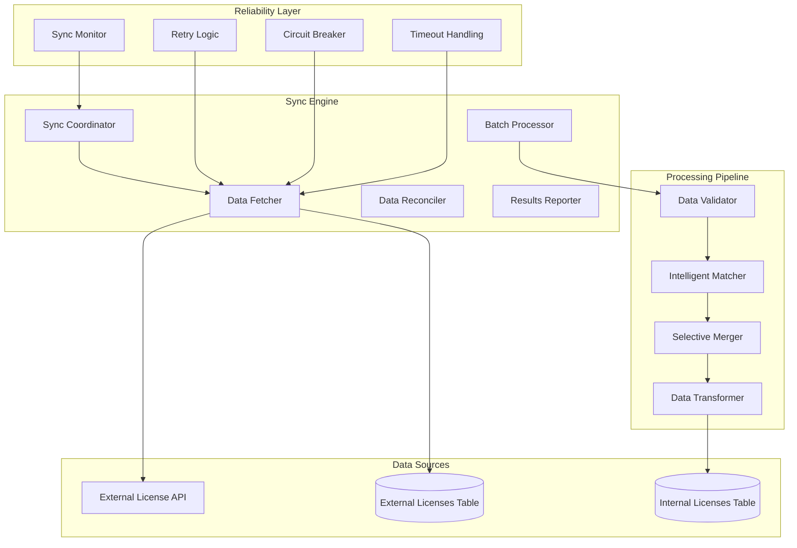

## Sync Strategies

### Comprehensive Reconciliation (Recommended)

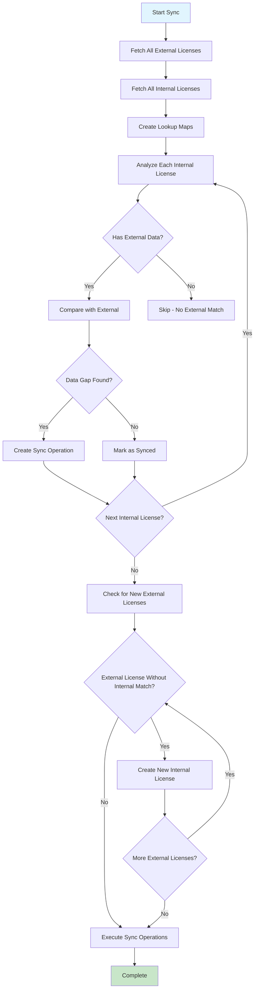

**Characteristics:**
- ✅ Identifies all data gaps comprehensively
- ✅ Handles both missing data and new licenses
- ✅ Provides detailed field-level analysis
- ✅ More thorough reconciliation
- ❌ Slightly slower for very large datasets
- ❌ More complex logic

### Legacy External-Driven Approach

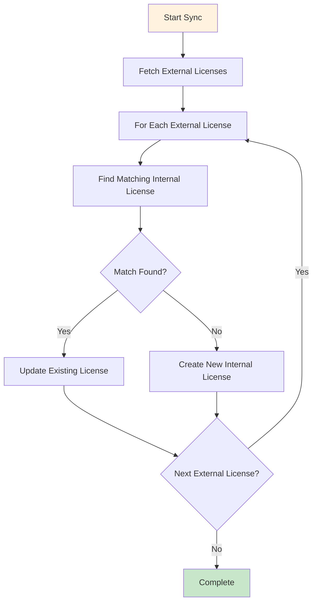

**Characteristics:**
- ✅ Simple and straightforward
- ✅ Fast for small datasets
- ❌ May miss internal licenses that don't have external matches
- ❌ Doesn't identify missing data gaps in existing licenses

## Sync Process Flow

### Complete Sync Workflow with Integrated Duplicate Detection

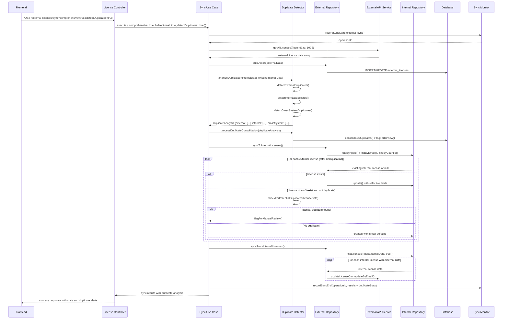

## Intelligent Matching Strategy

### Multi-Criteria License Matching

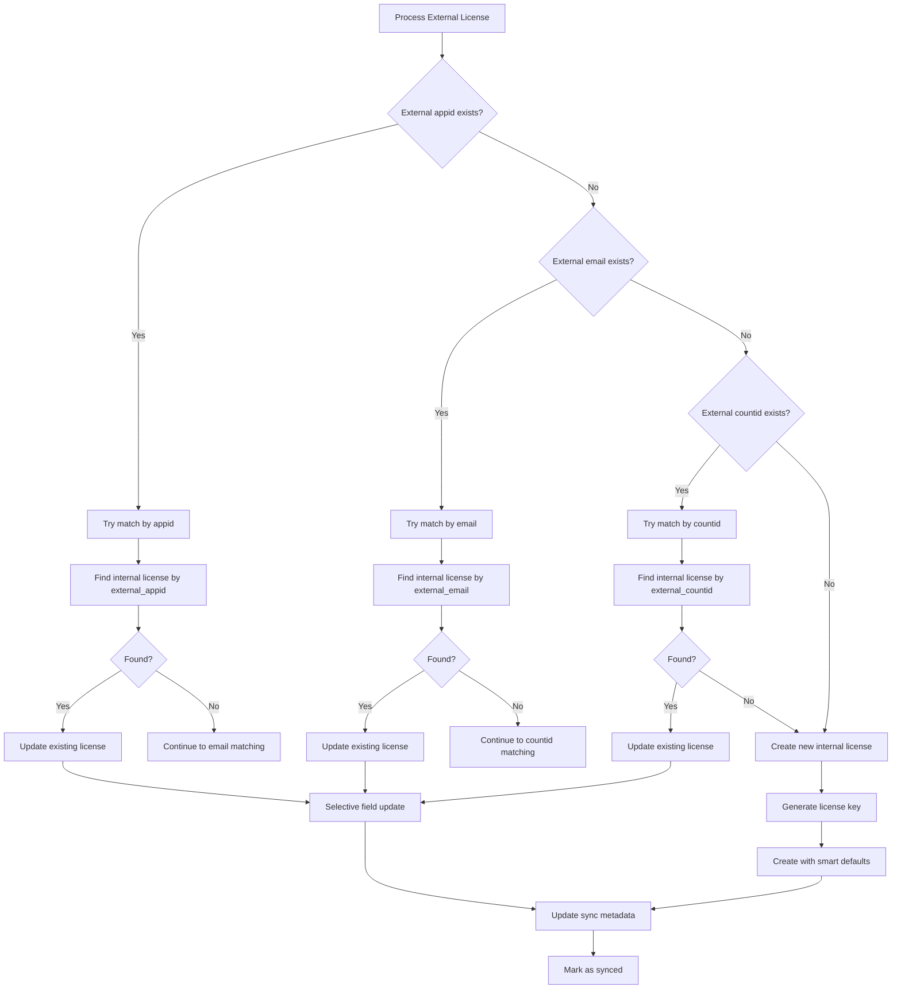

### Matching Priority Order

1. **App ID Match** (highest confidence)
   - Direct 1:1 mapping between external and internal systems
   - Most reliable identifier

2. **Email Match** (medium confidence)
   - Matches on license contact email
   - May have duplicates but usually accurate

3. **Count ID Match** (lower confidence)
   - External system's internal identifier
   - Used as fallback when other identifiers missing

4. **No Match Found** (creation)
   - Generates new internal license
   - Smart defaults based on external data

## Duplicate Detection and Smart Consolidation

### Types of Duplicates

The system handles three categories of duplicates that can occur during synchronization:

#### 1. External System Duplicates
Multiple external records representing the same business entity:

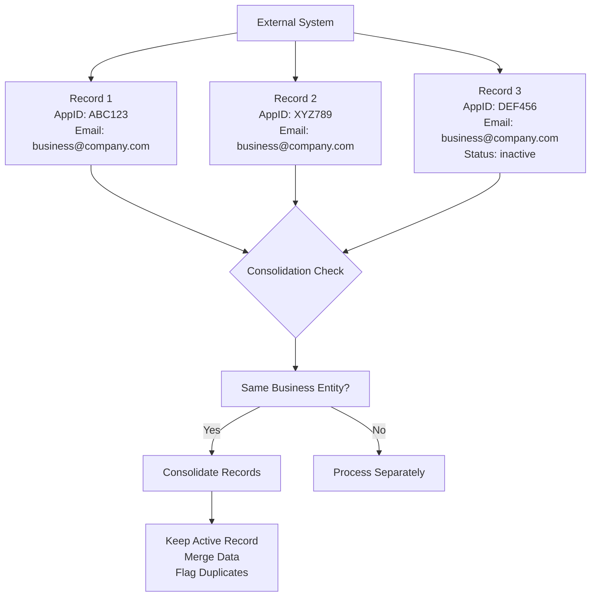

**Detection Strategy:**
- Group external records by email domain + DBA name
- Check for temporal overlaps (same business, different time periods)
- Identify records with similar contact information

#### 2. Internal System Duplicates
Multiple internal licenses for the same business:

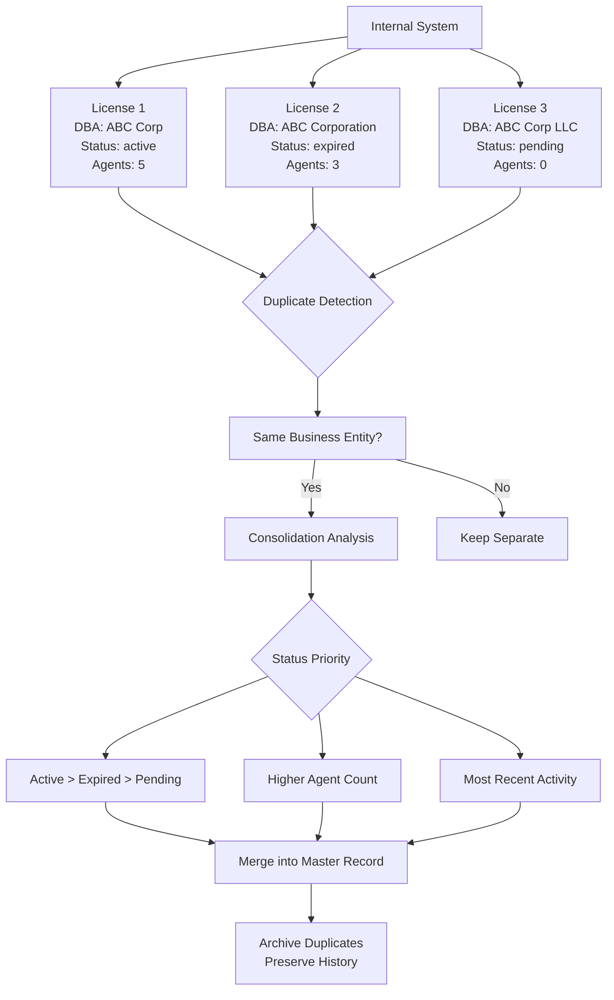

**Detection Strategy:**
- Fuzzy matching on DBA names (accounting for variations)
- Email domain matching
- Address/ZIP code matching
- Phone number matching

#### 3. Cross-System Duplicates
Records in both systems representing the same entity but not linked:

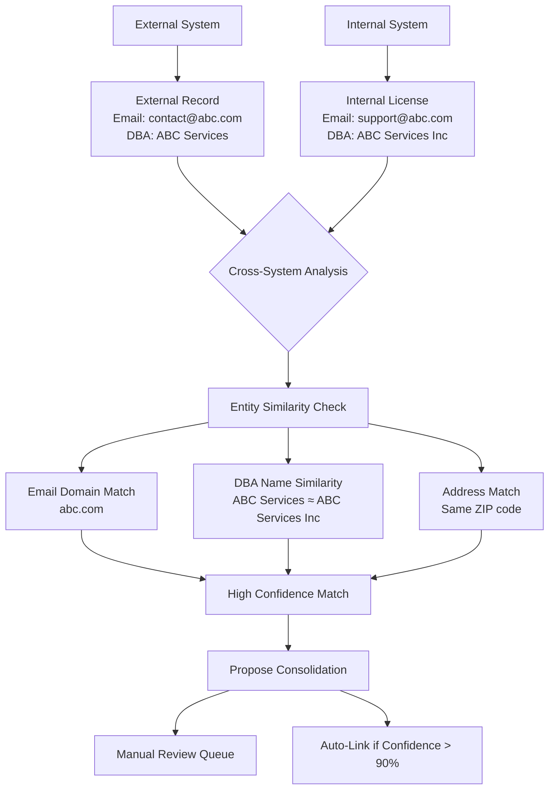

### Smart Duplicate Prevention

#### Pre-Sync Duplicate Analysis

```javascript
async function analyzeDuplicatesBeforeSync(externalData, internalData) {
  const duplicates = {
    external: [],
    internal: [],
    crossSystem: []
  };

  // 1. Analyze external duplicates
  duplicates.external = await detectExternalDuplicates(externalData);

  // 2. Analyze internal duplicates
  duplicates.internal = await detectInternalDuplicates(internalData);

  // 3. Analyze cross-system duplicates
  duplicates.crossSystem = await detectCrossSystemDuplicates(externalData, internalData);

  return {
    duplicates,
    recommendations: generateConsolidationRecommendations(duplicates),
    riskAssessment: assessConsolidationRisks(duplicates)
  };
}
```

#### Intelligent Consolidation Rules

```javascript
const consolidationRules = {
  // Status-based priority
  statusPriority: {
    'active': 100,
    'expiring': 80,
    'expired': 60,
    'pending': 40,
    'cancel': 20,
    'draft': 10
  },

  // Data freshness (newer data gets priority)
  freshnessWeight: (record) => {
    const age = Date.now() - new Date(record.updatedAt).getTime();
    return Math.max(0, 100 - (age / (1000 * 60 * 60 * 24))); // Decay over days
  },

  // Completeness score
  completenessScore: (record) => {
    const fields = ['dba', 'email', 'zip', 'phone', 'address'];
    const filledFields = fields.filter(field => record[field]).length;
    return (filledFields / fields.length) * 100;
  },

  // Activity-based priority
  activityScore: (record) => {
    let score = 0;
    if (record.lastActive) score += 20;
    if (record.smsSent > 0) score += 15;
    if (record.agents > 0) score += 15;
    if (record.lastPayment) score += 25;
    return score;
  }
};
```

### Duplicate Resolution Workflow

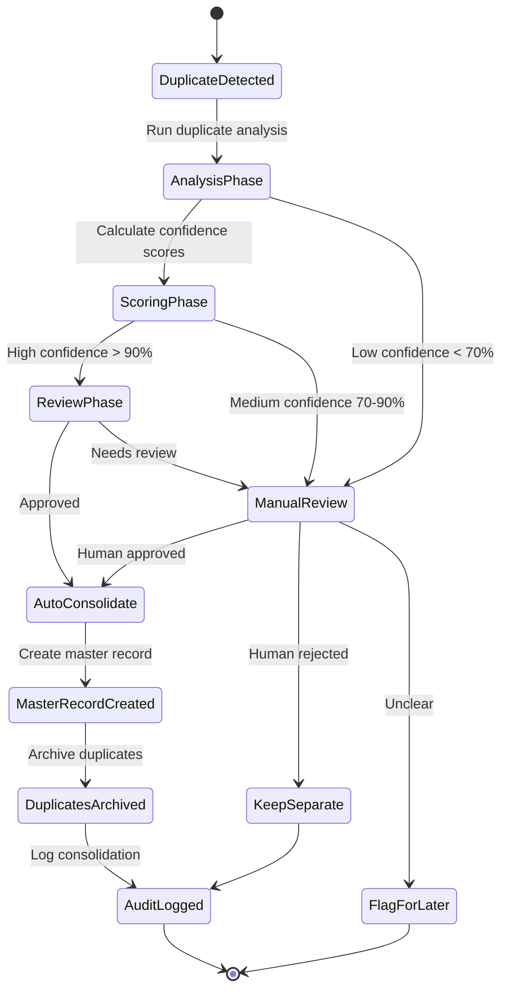

### Duplicate Prevention Strategies

#### 1. Proactive Duplicate Detection

```javascript
class DuplicatePreventionService {
  // Check for potential duplicates before creating new licenses
  async checkForDuplicatesBeforeCreation(licenseData, context) {
    const potentialDuplicates = await this.findPotentialDuplicates(licenseData);

    if (potentialDuplicates.length > 0) {
      // Log warning and return suggestions
      logger.warn('Potential duplicates detected', {
        newLicense: licenseData,
        potentialDuplicates: potentialDuplicates.map(d => d.id),
        confidence: potentialDuplicates.map(d => d.confidenceScore)
      });

      return {
        hasDuplicates: true,
        suggestions: potentialDuplicates,
        recommendation: this.generateRecommendation(potentialDuplicates, licenseData)
      };
    }

    return { hasDuplicates: false };
  }

  // Enhanced matching for license creation
  async findPotentialDuplicates(licenseData) {
    const candidates = [];

    // Exact matches
    if (licenseData.key) {
      const exactKey = await this.repository.findByKey(licenseData.key);
      if (exactKey) candidates.push({ ...exactKey, confidenceScore: 100, matchReason: 'exact_key' });
    }

    // Fuzzy DBA matching
    if (licenseData.dba) {
      const dbaMatches = await this.findBySimilarDba(licenseData.dba);
      candidates.push(...dbaMatches.map(match => ({
        ...match,
        confidenceScore: match.similarityScore,
        matchReason: 'fuzzy_dba'
      })));
    }

    // Email domain matching
    if (licenseData.email) {
      const domainMatches = await this.findByEmailDomain(licenseData.email);
      candidates.push(...domainMatches.map(match => ({
        ...match,
        confidenceScore: 75,
        matchReason: 'email_domain'
      })));
    }

    return candidates.filter(c => c.confidenceScore > 60);
  }
}
```

#### 2. Real-time Duplicate Alerts

```javascript
class DuplicateAlertService {
  // Alert on potential duplicates during sync
  async alertOnSyncDuplicates(syncResults) {
    const alerts = [];

    // Check for multiple external records matching same internal license
    const internalLicenseMatches = new Map();
    syncResults.updates.forEach(update => {
      if (!internalLicenseMatches.has(update.internalLicenseId)) {
        internalLicenseMatches.set(update.internalLicenseId, []);
      }
      internalLicenseMatches.get(update.internalLicenseId).push(update.externalLicenseId);
    });

    internalLicenseMatches.forEach((externalIds, internalId) => {
      if (externalIds.length > 1) {
        alerts.push({
          type: 'multiple_external_match',
          severity: 'warning',
          internalLicenseId,
          externalLicenseIds: externalIds,
          message: `Internal license ${internalId} matched by ${externalIds.length} external records`
        });
      }
    });

    // Check for external records not matched but similar to existing
    const unmatchedExternals = syncResults.unmatchedExternals || [];
    for (const external of unmatchedExternals) {
      const similarInternals = await this.findSimilarInternalLicenses(external);
      if (similarInternals.length > 0) {
        alerts.push({
          type: 'potential_cross_system_duplicate',
          severity: 'info',
          externalLicense: external,
          similarInternals,
          message: `External record similar to ${similarInternals.length} internal licenses`
        });
      }
    }

    return alerts;
  }
}
```

#### 3. Duplicate Consolidation API

```javascript
// API endpoint for manual duplicate consolidation
POST /api/v1/licenses/duplicates/consolidate
{
  "masterLicenseId": "uuid-of-master-license",
  "duplicateLicenseIds": ["uuid1", "uuid2"],
  "consolidationStrategy": "merge_keep_newer",
  "notes": "Consolidating duplicate records after manual review"
}

// API endpoint for duplicate detection
GET /api/v1/licenses/duplicates/check
Query params: ?dba=ABC Corp&email=contact@abc.com&threshold=80

Response:
{
  "potentialDuplicates": [
    {
      "licenseId": "uuid",
      "confidenceScore": 85,
      "matchReasons": ["fuzzy_dba", "email_domain"],
      "recommendation": "consolidate"
    }
  ]
}
```

### Performance Considerations

#### Optimized Duplicate Detection

```javascript
class OptimizedDuplicateDetector {
  // Use database indexes for fast duplicate checking
  async fastDuplicateCheck(licenseData) {
    // Parallel queries for different match types
    const [exactKey, emailDomain, dbaSimilarity] = await Promise.all([
      this.checkExactKey(licenseData.key),
      this.checkEmailDomain(licenseData.email),
      this.checkDbaSimilarity(licenseData.dba)
    ]);

    return {
      exactMatches: exactKey,
      domainMatches: emailDomain,
      similarDba: dbaSimilarity,
      hasDuplicates: exactKey.length > 0 || emailDomain.length > 0 || dbaSimilarity.length > 0
    };
  }

  // Cached duplicate patterns
  async getDuplicatePatterns() {
    const cacheKey = 'duplicate_patterns';
    let patterns = await cacheService.get(cacheKey);

    if (!patterns) {
      patterns = await this.buildDuplicatePatterns();
      await cacheService.set(cacheKey, patterns, CacheTTL.HOUR);
    }

    return patterns;
  }

  // Batch duplicate processing for sync operations
  async processBatchDuplicates(batch) {
    const duplicates = [];
    const uniqueRecords = new Map();

    for (const record of batch) {
      const key = this.generateUniquenessKey(record);

      if (uniqueRecords.has(key)) {
        duplicates.push({
          original: uniqueRecords.get(key),
          duplicate: record,
          reason: 'same_uniqueness_key'
        });
      } else {
        uniqueRecords.set(key, record);
      }
    }

    return { duplicates, uniqueRecords: Array.from(uniqueRecords.values()) };
  }
}
```

### Monitoring and Metrics

#### Duplicate Detection Metrics

```javascript
const duplicateMetrics = {
  // Detection rates
  detectionRate: 'counter',              // Duplicates detected per sync
  falsePositiveRate: 'gauge',            // Incorrect duplicate detections
  consolidationRate: 'counter',          // Successful consolidations

  // Performance metrics
  detectionTime: 'histogram',            // Time to detect duplicates
  consolidationTime: 'histogram',        // Time to consolidate

  // Quality metrics
  duplicateAccuracy: 'gauge',            // Accuracy of duplicate detection
  consolidationSuccessRate: 'gauge',     // Successful consolidation rate

  // Operational metrics
  manualReviewsQueued: 'counter',        // Duplicates requiring manual review
  autoConsolidations: 'counter',         // Automatic consolidations performed
  duplicateAlertsSent: 'counter'         // Alerts sent for review
};
```

This comprehensive duplicate detection and smart consolidation system significantly improves the license management sync process by:

- **Preventing Data Pollution**: Avoiding creation of duplicate records
- **Maintaining Data Integrity**: Ensuring single source of truth for each business entity
- **Reducing Manual Effort**: Automating consolidation where confidence is high
- **Enabling Better Analytics**: Providing clean, deduplicated data for reporting
- **Supporting Compliance**: Maintaining audit trails of all consolidation activities

## Post-Sync License List Retrieval

After synchronization completes, the internal license list (GET /licenses) returns a **unified view** of all licenses, combining original internal data with synchronized external data.

### Data Flow After Sync

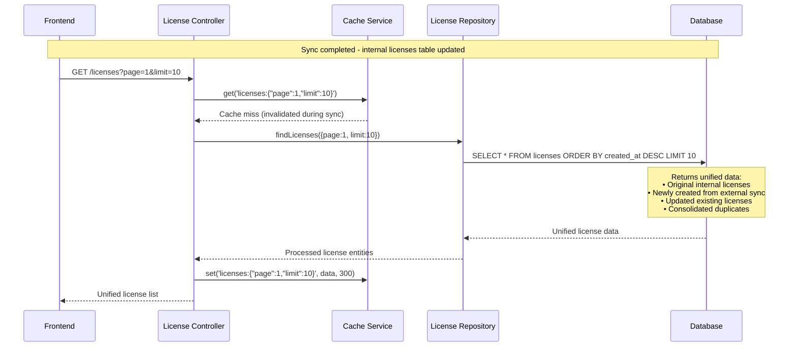

### Unified License Data Structure

Each license in the response contains **both internal and external fields**:

```json
{
  "success": true,
  "data": [
    {
      // Internal Business Fields (preserved/updated during sync)
      "id": "uuid-internal-123",
      "key": "ABC-001",
      "product": "ABC Software",
      "plan": "Premium",
      "status": "active",
      "term": "monthly",
      "seatsTotal": 100,
      "seatsUsed": 75,
      "startsAt": "2024-01-01T00:00:00Z",
      "expiresAt": "2024-12-31T23:59:59Z",
      "dba": "Business Name LLC",
      "zip": "12345",
      "lastPayment": 299.99,
      "smsPurchased": 1000,
      "smsSent": 750,
      "smsBalance": 250,
      "agents": 5,
      "agentsName": "Agent 1, Agent 2",
      "agentsCost": 150.00,
      "notes": "Customer notes",

      // External Sync Fields (added during sync)
      "appid": "EXT-APP-123",
      "countid": 4785,
      "mid": "MERCHANT-001",
      "license_type": "product",
      "package_data": {"plan": "premium", "features": ["sms", "agents"]},
      "sendbat_workspace": "workspace-001",
      "coming_expired": "2024-12-31",
      "external_sync_status": "synced",
      "last_external_sync": "2024-01-15T10:30:00Z",

      // Audit Fields
      "createdAt": "2024-01-01T10:00:00Z",
      "updatedAt": "2024-01-15T10:30:00Z",
      "createdBy": "user-123",
      "updatedBy": "sync-service"
    }
  ],
  "meta": {
    "pagination": {
      "page": 1,
      "limit": 10,
      "totalPages": 28,
      "total": 275  // Increased due to sync additions
    },
    "stats": {
      "total": 275,    // Original 250 + 25 new from sync
      "active": 200,   // Updated counts
      "expired": 25,
      "pending": 20,   // 15 original + 5 from sync
      "cancel": 30
    }
  }
}
```

### Data Sources in Unified List

| Data Source | Description | Count Example |
|-------------|-------------|---------------|
| **Original Internal** | Licenses created manually in dashboard | 200 |
| **Sync-Created** | New licenses created from external data | 25 |
| **Sync-Updated** | Existing licenses updated with external data | 45 |
| **Consolidated** | Duplicates merged during sync | 5 |

### Cache Behavior After Sync

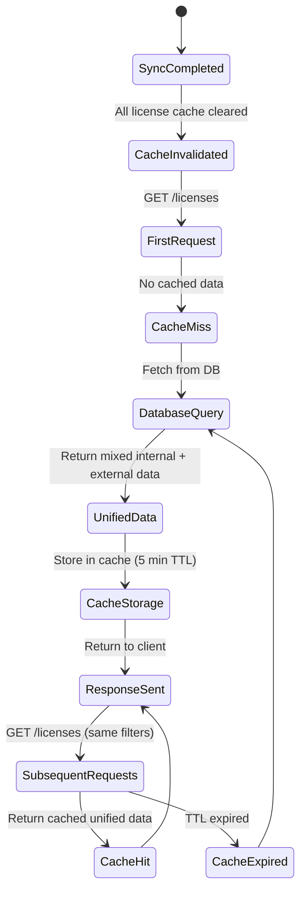

### Filtering and Search After Sync

The unified license list supports all original filtering, now enhanced with **external sync fields**:

```javascript
// Filter examples that now work with synced data
GET /licenses?status=active&hasExternalData=true
GET /licenses?search=EXT-APP-123  // Search external appid
GET /licenses?appid=EXT-APP-123   // Direct external field filter
GET /licenses?external_sync_status=synced
GET /licenses?last_external_sync=2024-01-15
```

### Business Impact

**Before Sync:**
- 250 internal licenses
- Manual data entry only
- No external system integration

**After Sync:**
- 275 total licenses (250 + 25 new)
- Unified view of internal + external data
- Real-time external data synchronization
- Enhanced search and filtering capabilities
- Duplicate prevention and consolidation

### Monitoring Sync Impact

The license list now includes sync metadata for monitoring:

```json
{
  "meta": {
    "syncInfo": {
      "lastSyncCompleted": "2024-01-15T10:30:00Z",
      "syncDuration": 45000,
      "recordsAdded": 25,
      "recordsUpdated": 45,
      "duplicatesHandled": 8,
      "externalSource": "API v2.1"
    },
    "dataQuality": {
      "completenessScore": 95,
      "externalDataCoverage": 78,
      "duplicateFree": true
    }
  }
}
```

This unified approach ensures that after synchronization, users see a **single, comprehensive view** of all license data, regardless of whether it originated internally or was synchronized from external systems.

## Data Mapping & Transformation

### Field Mapping Strategy

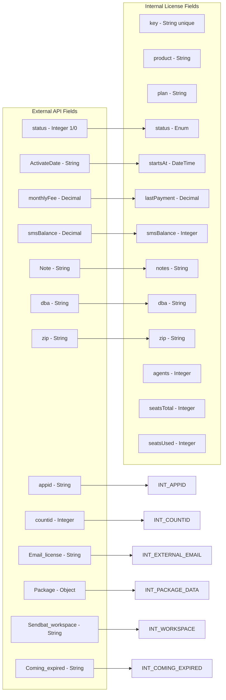

### Selective Field Updates

The system implements **selective field updates** to preserve internal business data:

```javascript
_createExternalUpdateData(externalLicense) {
  const updateData = {};

  // Always safe to update from external (business contact info)
  if (externalLicense.dba !== undefined && externalLicense.dba !== null) {
    updateData.dba = externalLicense.dba;
  }
  if (externalLicense.zip !== undefined && externalLicense.zip !== null) {
    updateData.zip = externalLicense.zip;
  }

  // Business-critical fields (only update if external provides meaningful data)
  if (externalLicense.ActivateDate) {
    updateData.startsAt = parseDate(externalLicense.ActivateDate);
  }
  if (externalLicense.monthlyFee !== undefined) {
    updateData.lastPayment = externalLicense.monthlyFee;
  }

  // Preserve internal fields (product, plan, custom notes, etc.)
  // These are NEVER overwritten by external data

  return updateData;
}
```

### Conflict Resolution Strategy

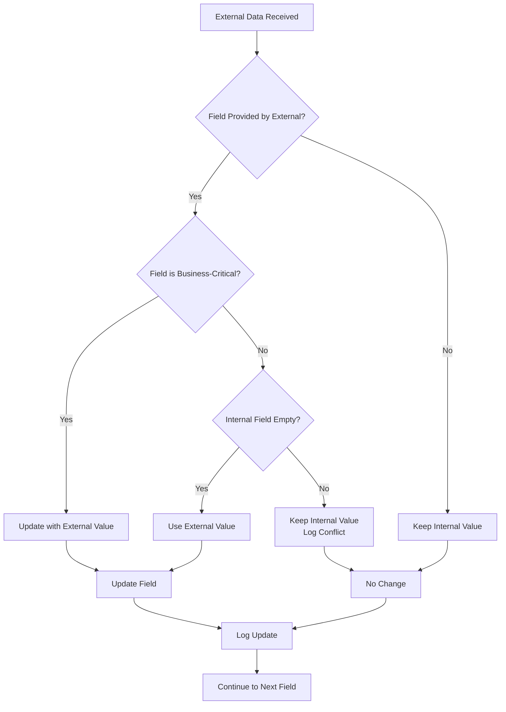

## Performance Optimization

### Batch Processing

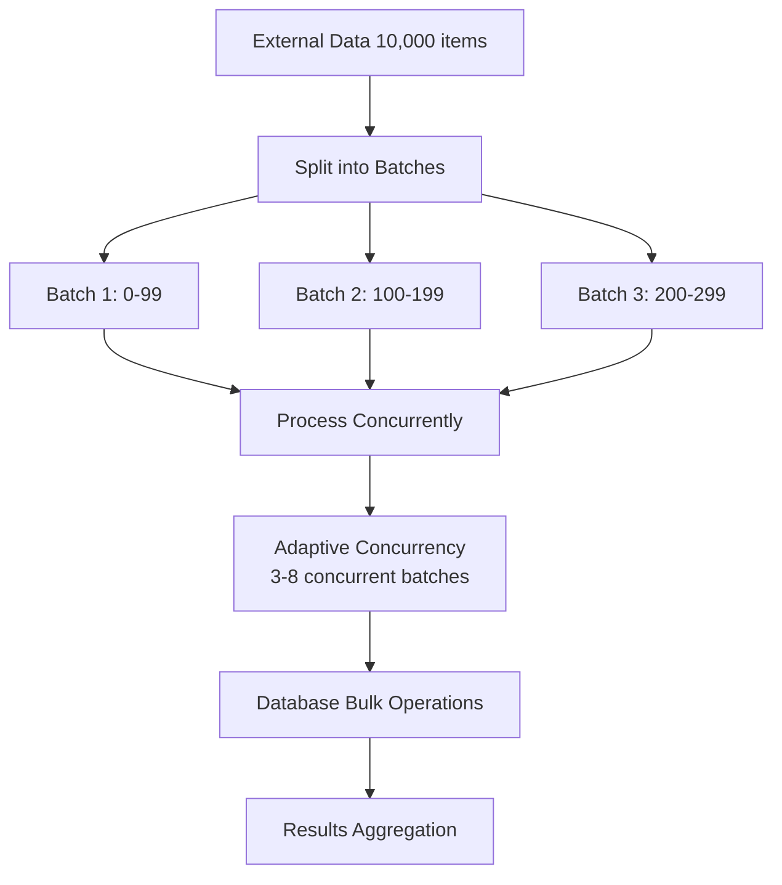

### Adaptive Concurrency

```javascript
_calculateAdaptiveConcurrency(totalBatches, batchSize) {
  const baseConcurrency = licenseSyncConfig.sync.concurrencyLimit; // Default: 5

  // For small datasets, use lower concurrency to avoid overhead
  if (totalBatches <= 3) {
    return Math.min(baseConcurrency, 2);
  }

  // For large datasets, gradually increase concurrency but cap it
  if (totalBatches > 50) {
    return Math.min(baseConcurrency, 8); // Allow higher concurrency for large datasets
  }

  // For medium datasets, use base concurrency
  return baseConcurrency;
}
```

### Memory-Efficient Processing

```javascript
// Process in streaming fashion to handle large datasets
async function processLargeDataset(dataStream) {
  const batchSize = 100;
  const results = [];

  for await (const batch of createBatchStream(dataStream, batchSize)) {
    const batchResults = await processBatch(batch);

    // Process results immediately to free memory
    await handleBatchResults(batchResults);
    results.push(batchResults);

    // Force garbage collection hint (if available)
    if (global.gc) {
      global.gc();
    }
  }

  return results;
}
```

## Error Handling & Recovery

### Circuit Breaker Pattern

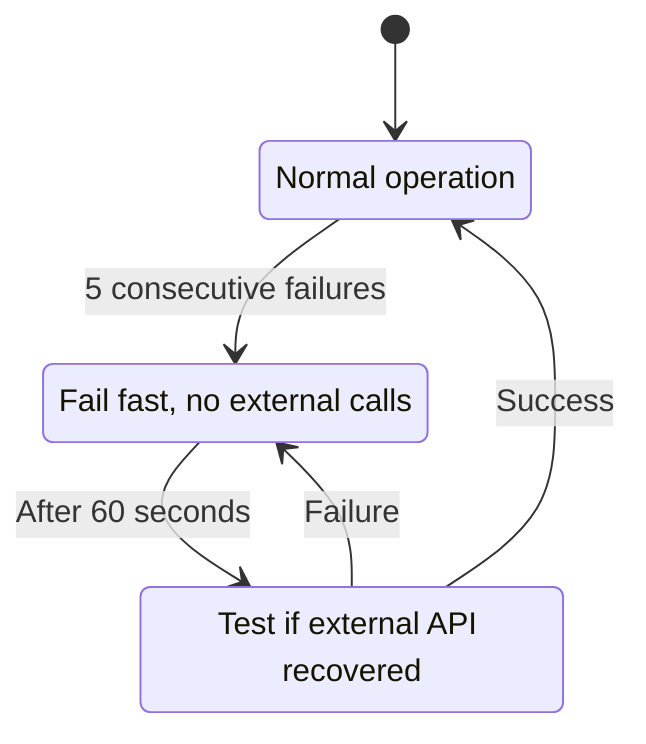

### Retry & Timeout Strategy

```javascript
// Exponential backoff with jitter
const retryWithBackoff = async (operation, maxRetries = 3) => {
  for (let attempt = 0; attempt < maxRetries; attempt++) {
    try {
      return await operation();
    } catch (error) {
      if (attempt === maxRetries - 1) throw error;

      const delay = Math.min(1000 * Math.pow(2, attempt), 30000);
      const jitter = Math.random() * 1000;
      await sleep(delay + jitter);
    }
  }
};
```

### Error Classification & Handling

```javascript
classifySyncError(error) {
  // Network errors (retryable)
  if (error.code === 'ECONNRESET' || error.code === 'ETIMEDOUT') {
    return { type: 'network', retryable: true, severity: 'medium' };
  }

  // Authentication errors (non-retryable)
  if (error.status === 401 || error.status === 403) {
    return { type: 'auth', retryable: false, severity: 'high' };
  }

  // Rate limit errors (retryable with backoff)
  if (error.status === 429) {
    return { type: 'rate_limit', retryable: true, severity: 'medium' };
  }

  // Data validation errors (non-retryable)
  if (error.message.includes('validation')) {
    return { type: 'validation', retryable: false, severity: 'low' };
  }

  // Unknown errors (retryable once)
  return { type: 'unknown', retryable: true, severity: 'medium' };
}
```

## Monitoring & Metrics

### Sync Health Dashboard

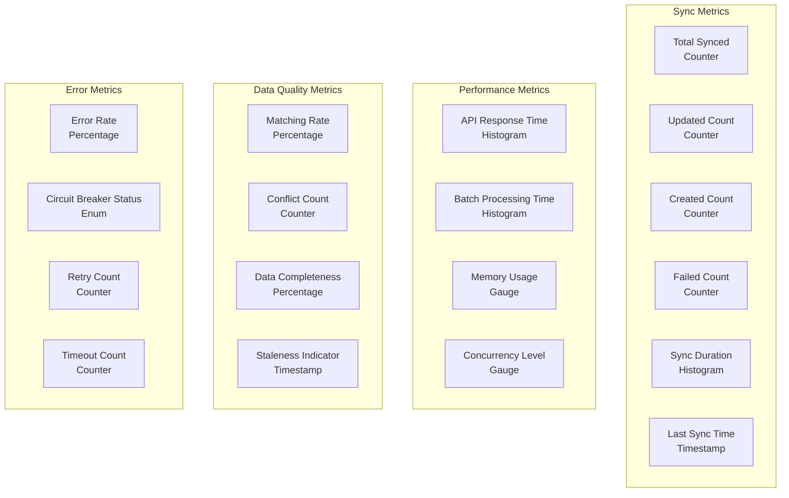

### Sync Status API Response

```json
{
  "success": true,
  "data": {
    "lastSync": {
      "timestamp": "2024-01-15T10:30:00Z",
      "duration": 45230,
      "status": "success",
      "totalFetched": 1234,
      "created": 45,
      "updated": 1189,
      "failed": 0
    },
    "health": {
      "externalApi": "healthy",
      "lastHealthCheck": "2024-01-15T10:45:00Z",
      "circuitBreaker": "closed",
      "averageResponseTime": 1250
    },
    "statistics": {
      "totalExternalLicenses": 1234,
      "totalInternalLicenses": 1250,
      "matchingRate": "98.7%",
      "lastSyncAge": "15 minutes ago"
    }
  }
}
```

## Configuration Options

### Sync Configuration Structure

```javascript
const licenseSyncConfig = {
  // External API settings
  external: {
    baseUrl: process.env.EXTERNAL_LICENSE_API_URL,
    apiKey: process.env.EXTERNAL_LICENSE_API_KEY,
    timeout: 30000, // 30 seconds
    userAgent: 'ABC-Dashboard/1.0',
    retryAttempts: 3,
    retryDelay: 1000,
  },

  // Sync behavior
  sync: {
    batchSize: 100,
    concurrencyLimit: 5,
    enableComprehensiveSync: true,
    enableBidirectionalSync: false,
    maxRetries: 3,
    timeout: 300000, // 5 minutes
  },

  // Features
  features: {
    enableComprehensiveSync: true,
    enableBidirectionalSync: false,
    enableDryRunMode: true,
    enablePartialSync: true,
  },

  // Monitoring
  monitoring: {
    enableDetailedLogging: false,
    enableMetricsCollection: true,
    enableHealthChecks: true,
    alertThresholds: {
      maxSyncDuration: 600000, // 10 minutes
      maxErrorRate: 0.05, // 5%
      minMatchingRate: 0.95, // 95%
    },
  },
};
```

## Troubleshooting Guide

### Common Sync Issues

#### 1. External API Authentication Failures

**Symptoms:**
- HTTP 401/403 errors
- "Unauthorized" or "Invalid API key" messages

**Solutions:**
- Verify API key in environment variables
- Check API key expiration
- Confirm API key has correct permissions

#### 2. Network Timeouts

**Symptoms:**
- Sync operations hang
- "ETIMEDOUT" or "ECONNRESET" errors
- Circuit breaker opens

**Solutions:**
- Increase timeout values in configuration
- Check network connectivity
- Implement retry with exponential backoff

#### 3. Data Matching Issues

**Symptoms:**
- Low matching rates (<90%)
- Many licenses created instead of updated
- Duplicate licenses created

**Solutions:**
- Review matching logic priority
- Check data quality in external system
- Implement manual matching overrides

#### 4. Performance Issues

**Symptoms:**
- Sync takes too long (>10 minutes)
- High memory usage
- Database connection pool exhausted

**Solutions:**
- Reduce batch sizes
- Increase concurrency limits
- Optimize database queries
- Implement streaming processing

### Debug Commands

```bash
# Test external API connectivity
curl -H "x-api-key: YOUR_API_KEY" "https://external-api.com/api/v1/licenses?page=1&limit=1"

# Check sync status
curl -H "Authorization: Bearer YOUR_TOKEN" "http://localhost:5001/api/v1/external-licenses/sync/status"

# Run sync with dry-run mode
curl -X POST -H "Authorization: Bearer YOUR_TOKEN" "http://localhost:5001/api/v1/external-licenses/sync?dryRun=true"

# Check system health
curl -H "Authorization: Bearer YOUR_TOKEN" "http://localhost:5001/api/v1/health"
```

### Monitoring Queries

```sql
-- Recent sync performance
SELECT
  operation_id,
  operation_type,
  status,
  duration_ms,
  total_processed,
  created_count,
  updated_count,
  failed_count,
  created_at
FROM sync_operations
WHERE operation_type = 'external_sync'
ORDER BY created_at DESC
LIMIT 10;

-- Error patterns
SELECT
  error_type,
  error_message,
  COUNT(*) as frequency,
  MAX(created_at) as last_occurrence
FROM sync_errors
WHERE created_at >= NOW() - INTERVAL '24 hours'
GROUP BY error_type, error_message
ORDER BY frequency DESC;

-- Data quality metrics
SELECT
  COUNT(*) as total_licenses,
  COUNT(CASE WHEN appid IS NOT NULL THEN 1 END) as with_appid,
  COUNT(CASE WHEN external_email IS NOT NULL THEN 1 END) as with_email,
  COUNT(CASE WHEN countid IS NOT NULL THEN 1 END) as with_countid,
  ROUND(
    COUNT(CASE WHEN appid IS NOT NULL OR external_email IS NOT NULL OR countid IS NOT NULL THEN 1 END)::decimal
    / COUNT(*)::decimal * 100, 2
  ) as matching_potential_percent
FROM licenses;
```