# ABC Dashboard - Deployment Guide

## 🚀 Quick Deployment Options

### Option 1: OpenLiteSpeed (Recommended)

**Single-command deployment to OpenLiteSpeed:**

```bash
# Prerequisites: Node.js 20+, Docker, OpenLiteSpeed installed

# 1. Configure environment
cp .env.example .env
nano .env  # Edit with production values

# 2. Configure frontend
cd frontend && cp .env.example .env && cd ..

# 3. Deploy everything automatically
./deploy/deploy.sh
```

### Option 2: Docker Only

**Run with Docker Compose:**

```bash
# Build and run services
docker-compose up -d

# Or for development (from project root)
docker-compose -f deploy/docker/docker-compose.dev.yml up -d
```

## 🏗️ System Architecture

```mermaid
graph TB
    subgraph "Client Layer"
        User[👤 User] --> Browser[🌐 Browser]
    end

    subgraph "OpenLiteSpeed Server"
        OLS[🚀 OpenLiteSpeed<br/>Port 80/443<br/>Direct Static Serving]

        OLS --> StaticFiles[📄 Static Files<br/>HTML/JS/CSS<br/>Direct from disk]
        OLS --> APIProxy[📡 API Proxy<br/>/api/* → Backend]
        OLS --> DocsProxy[📚 API Docs Proxy<br/>/api-docs/* → Backend]
    end

    subgraph "Docker Services"
        Backend[⚙️ Backend API<br/>Node.js/Express<br/>Port 5000] --> MongoDB[(🗄️ MongoDB<br/>Database)]
        Backend --> Redis[(🔄 Redis<br/>Cache)]
        Backend --> Email[📧 Email Service<br/>SMTP/Gmail]
    end

    Browser --> OLS
    APIProxy --> Backend
    DocsProxy --> Backend

    style OLS fill:#e1f5fe
    style Backend fill:#f3e5f5
    style StaticFiles fill:#e8f5e8
    style MongoDB fill:#fff3e0
    style Redis fill:#fce4ec
```



## 📁 File Structure

```txt
abc-dashboard/
├── docker-compose.yml             Main Docker deployment
├── deploy/
│   ├── README.md                  This deployment guide
│   ├── deploy.sh                  OpenLiteSpeed deployment script
│   └── docker/                    Docker configurations
│       └── docker-compose.dev.yml
├── .env                           Environment variables
├── .env.example                   Environment template
└── infrastructure/                Infrastructure configs
    └── nginx/                     Nginx configs (legacy)
```

## ⚙️ Environment Configuration

### Required Variables

```bash
# Essential
NODE_ENV=production
JWT_SECRET=your-super-secret-jwt-key-change-this-in-production

# Database
MONGODB_URI=mongodb://mongodb:27017/abc_dashboard
REDIS_URL=redis://redis:6379

# Email (see .env.example for detailed setup)
EMAIL_FROM=noreply@yourapp.com
EMAIL_FROM_NAME=ABC Dashboard
EMAIL_HOST=smtp.gmail.com
EMAIL_PORT=587
EMAIL_SECURE=false
EMAIL_USER=your-gmail@gmail.com
EMAIL_PASS=your-gmail-app-password
EMAIL_SERVICE=gmail
```

### Email Setup

**Development (MailHog):**

```bash
# Install MailHog locally
brew install mailhog  # macOS
mailhog              # Start server
# Access: http://localhost:8025
```

**Production (Gmail):**

1. Enable 2FA on Gmail account
2. Generate App Password: <https://support.google.com/accounts/answer/185833>
3. Use App Password (not main password) in EMAIL_PASS

## 🔄 Deployment Flow

```mermaid
graph TD
    A[👨‍💻 Developer] --> B[Configure Environment]
    B --> C[Build Frontend Locally]
    C --> D[Build Backend Image]
    D --> E[Configure OpenLiteSpeed]
    E --> F[Copy Static Files]
    F --> G[Start Services]
    G --> H[Health Checks]
    H --> I[✅ Deployment Complete]

    style E fill:#c8e6c9
    style F fill:#fff3e0
```



## 🐳 Docker Services

| Service | Image | Port | Purpose |
|---------|-------|------|---------|
| **MongoDB** | `mongo:6` | 27017 | Database |
| **Redis** | `redis:7-alpine` | 6379 | Cache |
| **Backend** | Custom build | 5000 | API Server |
| **OpenLiteSpeed** | N/A | 80/443 | Web Server |

## 🔄 Handling Existing Deployments

### What happens if `/var/www/abc-dashboard/` already exists?

The deployment script handles existing installations automatically:

**Automatic Behavior:**
- ✅ **Detects existing directory** and warns about overwrites
- 🛑 **Automatically stops** any running Docker services
- 🔄 **Overwrites files** without user interaction
- 🚀 **Continues deployment** seamlessly

### Re-deployment Process:

```bash
# Simply run the deployment script again
./deploy/deploy.sh

# The script will:
# 1. Detect existing installation
# 2. Stop running services automatically
# 3. Overwrite files and redeploy
# 4. Restart all services
```

**No manual intervention required!** The script handles everything automatically. 🎯

## 🔧 Management Commands

```bash
# View all services
docker-compose ps

# View logs
docker-compose logs -f
docker-compose logs -f backend

# Restart services
docker-compose restart

# Stop deployment
docker-compose down

# OpenLiteSpeed commands
systemctl status lsws
systemctl restart lsws
```

## 📊 Monitoring & Health Checks

- **API Health**: `http://your-server/api/v1/health`
- **Container Status**: `docker-compose ps`
- **Logs**: `docker-compose logs -f`
- **OpenLiteSpeed**: `systemctl status lsws`

## 🛠️ Troubleshooting

### Common Issues

**Port 80/443 already in use:**

```bash
sudo netstat -tulpn | grep :80
sudo systemctl stop apache2
```

**MongoDB connection failed:**

```bash
docker-compose logs mongodb
# Check MONGODB_URI in .env
```

**Frontend not loading:**

```bash
# Check if frontend was built
ls -la frontend/out/
# Rebuild if missing
cd frontend && npm run build
```

**Email not working:**

```bash
# Test email script
cd backend && npm run test:email
# Check email credentials in .env
```

## 🔒 Security Notes

- Use strong JWT secrets in production
- Configure SSL certificates for HTTPS
- Use Gmail App Passwords (not main password)
- Regularly update Docker images
- Monitor logs for security issues

## 📚 Additional Resources

- [Backend API Documentation](./backend/README.md)
- [Frontend Development](./frontend/README.md)
- [OpenLiteSpeed Documentation](https://openlitespeed.org/)
