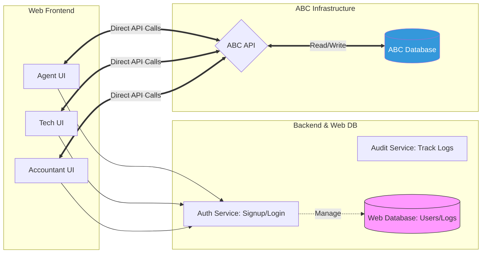

## 📌 Project Overview: License & SMS Management System

  * **Stakeholder:** Joseph Nguyen
  * **Priority:** **High** (ASAP)
  * **Resource Allocation:** 40% of bandwidth (Parallel with ABC Order project).
  * **Core Architecture:** **API-Centric.** Web DB only handles Auth and Logs; all business data (Licenses/SMS) resides in the **ABC Database** accessed via API.

-----

## 🛠 Role-Based Feature Matrix

| Role | Key Responsibilities | Technical Requirements |
| :--- | :--- | :--- |
| **Agent** | • View assigned licenses (Read-only) • Monitor SMS balance • Charge cards & Fill SMS • View SMS payment history | **Top Priority.** Use existing API endpoints. |
| **Tech** | • Submit new licenses • Reset License ID • Adjust coming-expired/activate dates | **Audit Required:** Must log `createdBy`, `updatedBy`, `timestamp`. |
| **Accountant**| • View/Add licenses • Deactivate/Activate licenses • Add SMS balance • Adjust packages/dates | **Data Integrity:** Prevent data overwriting/conflicts during sync. |

-----

## 📊 System Architecture (Mermaid)

-----

## 📋 Actionable Checklist

### Phase 1: Authentication & Infrastructure (Web DB)

  - [ ] **Database Schema:** Design `Users` table (with Role column) and `AuditLogs` table.
  - [ ] **Multi-Role Signup:** Implement separate signup flows for Agent, Tech, and Accountant.
  - [ ] **RBAC Login:** Secure login/logout with Role-Based Access Control.
  - [ ] **Logging Middleware:** Implement automatic tracking for `createdBy`, `updatedBy`, `createdDate`, and `updatedDate`.

### Phase 2: Agent Module (Priority \#1)

  - [ ] **License Dashboard:** Fetch and display licenses linked to the logged-in Agent (Read-only).
  - [ ] **SMS Management:**
      - [ ] Real-time SMS balance monitoring.
      - [ ] Integration with `add_sms_payment` API for card charging.
  - [ ] **Payment History:** Integrate `get_sms_payments` API to display transaction logs.

### Phase 3: Tech & Accountant Modules

  - [ ] **License Management (Tech):** Create forms for License Submission, ID Reset, and Date adjustments.
  - [ ] **Accounting Tools:**
      - [ ] License Activation/Deactivation toggles.
      - [ ] Package adjustment and SMS balance manual top-up.
  - [ ] **Conflict Resolution:** Ensure the "Sync" logic handles API data correctly to avoid overwriting newer data with old Web states.