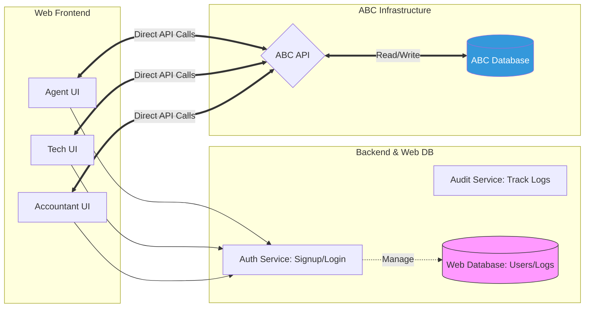

## 📌 Project Overview: License & SMS Management System

  * **Stakeholder:** Joseph Nguyen
  * **Priority:** **High** (ASAP)
  * **Resource Allocation:** 40% of bandwidth (Parallel with ABC Order project).
  * **Core Architecture:** **API-Centric.** Web DB only handles Auth and Logs; all business data (Licenses/SMS) resides in the **ABC Database** accessed via API.

-----

## 🛠 Role-Based Feature Matrix

| Role | Key Responsibilities | Technical Requirements |
| :--- | :--- | :--- |
| **Agent** | • View assigned licenses (Read-only) • Monitor SMS balance • Charge cards & Fill SMS • View SMS payment history | **Top Priority.** Use existing API endpoints. |
| **Tech** | • Submit new licenses • Reset License ID • Adjust coming-expired/activate dates | **Audit Required:** Must log `createdBy`, `updatedBy`, `timestamp`. |
| **Accountant**| • View/Add licenses • Deactivate/Activate licenses • Add SMS balance • Adjust packages/dates | **Data Integrity:** Prevent data overwriting/conflicts during sync. |

-----

## 📊 System Architecture (Mermaid)

-----

## 📋 Actionable Checklist

### Phase 1: Authentication & Infrastructure (Web DB)

  - [x] **Database Schema:** `Users` role-based auth schema and audit support are implemented in backend.
  - [x] **Multi-Role Signup:** Single signup flow supports role assignment (Agent/Tech/Accountant).
  - [x] **RBAC Login:** Login/logout and role-based permission enforcement are implemented.
  - [x] **Logging Middleware:** Audit metadata (`createdBy`, `updatedBy`, `timestamp`) is implemented for license mutation flows.

### Phase 2: Agent Module (Priority \#1)

  - [x] **License Dashboard:** Agent-scoped license visibility is enforced server-side and exposed in unified license UI.
  - [x] **SMS Management:**
      - [x] SMS balance/payment operations are wired through external API-backed routes.
      - [x] Integration with `add_sms_payment` API is implemented with RBAC + assignment checks.
  - [x] **Payment History:** `sms-payments` integration is implemented with scoped access checks.

### Phase 3: Tech & Accountant Modules

  - [x] **License Management (Tech):** Tech capabilities for submission/reset/date updates are implemented via RBAC and external routes.
  - [x] **Accounting Tools:**
      - [x] Accountant status/package/date/SMS actions are implemented with backend permission checks.
      - [x] SMS top-up integration exists and now returns mapped `4xx` for invalid external targets.
  - [ ] **Conflict Resolution:** Partial. Conflict-safe behavior exists in code paths but needs full concurrent-session E2E verification.