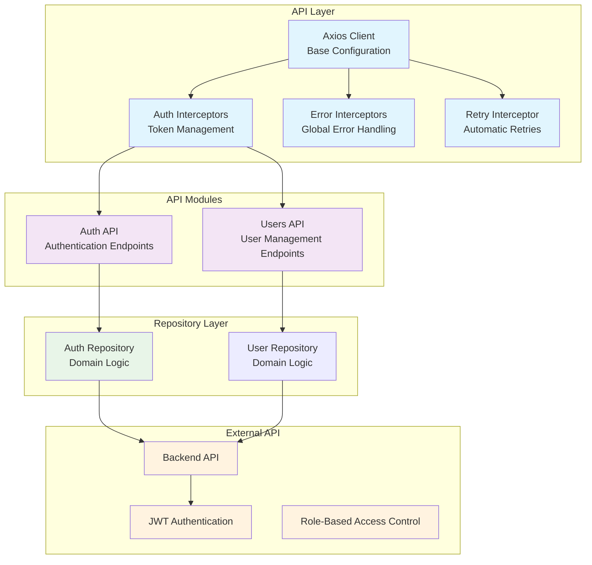

# API Integration Patterns

## Overview

The ABC Dashboard frontend implements robust API integration with Axios, featuring automatic token management, error handling, retry logic, and comprehensive response processing. This document details the API integration patterns and best practices.

## 🏗️ API Architecture



## 🔌 Axios Client Configuration

### Base Client Setup

```typescript
import axios, { AxiosInstance, AxiosRequestConfig, AxiosResponse } from 'axios';

class ApiClient {
  private client: AxiosInstance;

  constructor(baseURL: string) {
    this.client = axios.create({
      baseURL,
      timeout: 10000, // 10 seconds
      headers: {
        'Content-Type': 'application/json',
        'Accept': 'application/json',
      },
    });

    this.setupInterceptors();
  }

  private setupInterceptors(): void {
    // Request interceptor
    this.client.interceptors.request.use(
      this.handleRequest.bind(this),
      this.handleRequestError.bind(this)
    );

    // Response interceptor
    this.client.interceptors.response.use(
      this.handleResponse.bind(this),
      this.handleResponseError.bind(this)
    );
  }

  private handleRequest(config: AxiosRequestConfig): AxiosRequestConfig {
    // Add correlation ID for tracing
    config.headers['X-Correlation-ID'] = generateCorrelationId();

    // Add request timestamp
    config.metadata = {
      startTime: Date.now(),
      ...config.metadata,
    };

    return config;
  }

  private handleRequestError(error: any): Promise<any> {
    logger.error('Request error:', error);
    return Promise.reject(error);
  }

  private handleResponse(response: AxiosResponse): AxiosResponse {
    // Log response time
    const duration = Date.now() - (response.config.metadata?.startTime || 0);
    logger.debug(`API Response: ${response.config.method?.toUpperCase()} ${response.config.url}`, {
      status: response.status,
      duration: `${duration}ms`,
      correlationId: response.config.headers['X-Correlation-ID'],
    });

    return response;
  }

  private async handleResponseError(error: any): Promise<any> {
    const config = error.config;
    const correlationId = config?.headers?.['X-Correlation-ID'];

    logger.error('API Error:', {
      url: config?.url,
      method: config?.method,
      status: error.response?.status,
      message: error.message,
      correlationId,
    });

    // Handle different error types
    if (error.code === 'ECONNABORTED') {
      return this.handleTimeoutError(error, config);
    }

    if (!error.response) {
      return this.handleNetworkError(error);
    }

    return this.handleHttpError(error);
  }

  // HTTP methods
  get<T = any>(url: string, config?: AxiosRequestConfig): Promise<AxiosResponse<T>> {
    return this.client.get(url, config);
  }

  post<T = any>(url: string, data?: any, config?: AxiosRequestConfig): Promise<AxiosResponse<T>> {
    return this.client.post(url, data, config);
  }

  put<T = any>(url: string, data?: any, config?: AxiosRequestConfig): Promise<AxiosResponse<T>> {
    return this.client.put(url, data, config);
  }

  patch<T = any>(url: string, data?: any, config?: AxiosRequestConfig): Promise<AxiosResponse<T>> {
    return this.client.patch(url, data, config);
  }

  delete<T = any>(url: string, config?: AxiosRequestConfig): Promise<AxiosResponse<T>> {
    return this.client.delete(url, config);
  }
}

export const apiClient = new ApiClient(process.env.NEXT_PUBLIC_API_URL || '');
```

## 🔐 Authentication Interceptors

### Request Interceptor

```typescript
class AuthRequestInterceptor {
  intercept(config: AxiosRequestConfig): AxiosRequestConfig {
    // Get access token from cookies or store
    const token = this.getAccessToken();

    if (token && this.shouldAddAuthHeader(config)) {
      config.headers.Authorization = `Bearer ${token}`;
    }

    return config;
  }

  private getAccessToken(): string | null {
    // Try cookies first (server-side safe)
    if (typeof document !== 'undefined') {
      return CookieService.getCookie('accessToken');
    }

    // Fallback to store (client-side)
    return AuthStore.getState().tokens?.accessToken || null;
  }

  private shouldAddAuthHeader(config: AxiosRequestConfig): boolean {
    // Skip auth header for auth endpoints
    const skipAuthUrls = ['/auth/login', '/auth/register', '/auth/refresh'];
    return !skipAuthUrls.some(url => config.url?.includes(url));
  }
}
```

### Response Interceptor

```typescript
class AuthResponseInterceptor {
  intercept(response: AxiosResponse): AxiosResponse {
    return response;
  }

  async interceptError(error: any): Promise<any> {
    const originalRequest = error.config;

    // Handle 401 Unauthorized
    if (error.response?.status === 401 && !originalRequest._retry) {
      originalRequest._retry = true;

      try {
        // Try to refresh token
        const newTokens = await authRepository.refreshToken();

        // Update stored tokens
        AuthStore.getState().setTokens(newTokens);

        // Retry original request with new token
        originalRequest.headers.Authorization = `Bearer ${newTokens.accessToken}`;
        return apiClient.client(originalRequest);
      } catch (refreshError) {
        // Refresh failed, logout user
        AuthStore.getState().logout();
        throw error;
      }
    }

    throw error;
  }
}
```

## 🔄 Retry Logic

### Retry Interceptor

```typescript
interface RetryConfig {
  maxRetries: number;
  retryDelay: number;
  retryCondition: (error: any) => boolean;
}

class RetryInterceptor {
  private config: RetryConfig;

  constructor(config: Partial<RetryConfig> = {}) {
    this.config = {
      maxRetries: 3,
      retryDelay: 1000,
      retryCondition: this.defaultRetryCondition,
      ...config,
    };
  }

  async interceptError(error: any): Promise<any> {
    const config = error.config;

    if (!config || !this.shouldRetry(error)) {
      throw error;
    }

    config._retryCount = (config._retryCount || 0) + 1;

    if (config._retryCount >= this.config.maxRetries) {
      throw error;
    }

    // Exponential backoff
    const delay = this.config.retryDelay * Math.pow(2, config._retryCount - 1);

    logger.warn(`Retrying request (${config._retryCount}/${this.config.maxRetries})`, {
      url: config.url,
      delay: `${delay}ms`,
    });

    await this.delay(delay);
    return apiClient.client(config);
  }

  private shouldRetry(error: any): boolean {
    return this.config.retryCondition(error);
  }

  private defaultRetryCondition(error: any): boolean {
    // Retry on network errors
    if (!error.response) return true;

    // Retry on 5xx server errors
    if (error.response.status >= 500) return true;

    // Retry on 429 (Too Many Requests)
    if (error.response.status === 429) return true;

    return false;
  }

  private delay(ms: number): Promise<void> {
    return new Promise(resolve => setTimeout(resolve, ms));
  }
}
```

## 📡 API Modules

### Auth API Module

```typescript
export interface LoginRequest {
  email: string;
  password: string;
}

export interface RegisterRequest {
  name: string;
  email: string;
  password: string;
}

export interface AuthResponse {
  user: User;
  accessToken: string;
  refreshToken: string;
  expiresAt: string;
}

class AuthApi {
  async login(data: LoginRequest): Promise<AuthResponse> {
    const response = await apiClient.post<AuthResponse>('/auth/login', data);
    return response.data;
  }

  async register(data: RegisterRequest): Promise<AuthResponse> {
    const response = await apiClient.post<AuthResponse>('/auth/register', data);
    return response.data;
  }

  async logout(): Promise<void> {
    await apiClient.post('/auth/logout');
  }

  async refreshToken(): Promise<{ accessToken: string; refreshToken: string }> {
    const response = await apiClient.post('/auth/refresh');
    return response.data;
  }

  async getProfile(): Promise<User> {
    const response = await apiClient.get<User>('/auth/profile');
    return response.data;
  }

  async updateProfile(data: UpdateProfileData): Promise<User> {
    const response = await apiClient.put<User>('/auth/profile', data);
    return response.data;
  }

  async changePassword(data: ChangePasswordData): Promise<void> {
    await apiClient.post('/auth/change-password', data);
  }

  async verifyEmail(token: string): Promise<void> {
    await apiClient.post('/auth/verify-email', { token });
  }

  async requestPasswordReset(email: string): Promise<void> {
    await apiClient.post('/auth/forgot-password', { email });
  }

  async resetPassword(data: ResetPasswordData): Promise<void> {
    await apiClient.post('/auth/reset-password', data);
  }
}

export const authApi = new AuthApi();
```

### Users API Module

```typescript
export interface UserQueryParams {
  page?: number;
  limit?: number;
  search?: string;
  role?: UserRole;
  isActive?: boolean;
  sortBy?: string;
  sortOrder?: 'asc' | 'desc';
}

export interface UsersResponse {
  users: User[];
  total: number;
  page: number;
  limit: number;
  totalPages: number;
}

export interface CreateUserRequest {
  name: string;
  email: string;
  role: UserRole;
  password: string;
}

export interface UpdateUserRequest {
  name?: string;
  email?: string;
  role?: UserRole;
  isActive?: boolean;
}

class UsersApi {
  async getUsers(params?: UserQueryParams): Promise<UsersResponse> {
    const queryString = this.buildQueryString(params);
    const response = await apiClient.get<UsersResponse>(`/users${queryString}`);
    return response.data;
  }

  async getUserById(id: string): Promise<User> {
    const response = await apiClient.get<User>(`/users/${id}`);
    return response.data;
  }

  async createUser(data: CreateUserRequest): Promise<User> {
    const response = await apiClient.post<User>('/users', data);
    return response.data;
  }

  async updateUser(id: string, data: UpdateUserRequest): Promise<User> {
    const response = await apiClient.put<User>(`/users/${id}`, data);
    return response.data;
  }

  async deleteUser(id: string): Promise<void> {
    await apiClient.delete(`/users/${id}`);
  }

  async searchUsers(query: string): Promise<User[]> {
    const response = await apiClient.get<User[]>(`/users/search?q=${encodeURIComponent(query)}`);
    return response.data;
  }

  async getUserStats(): Promise<UserStats> {
    const response = await apiClient.get<UserStats>('/users/stats');
    return response.data;
  }

  private buildQueryString(params?: UserQueryParams): string {
    if (!params) return '';

    const searchParams = new URLSearchParams();

    Object.entries(params).forEach(([key, value]) => {
      if (value !== undefined && value !== null) {
        searchParams.append(key, String(value));
      }
    });

    const queryString = searchParams.toString();
    return queryString ? `?${queryString}` : '';
  }
}

export const usersApi = new UsersApi();
```

## 🏭 Repository Implementation

### Auth Repository

```typescript
export class AuthRepository implements IAuthRepository {
  async login(email: string, password: string): Promise<AuthResult> {
    try {
      const response = await authApi.login({ email, password });

      const user = UserMapper.toDomain(response.user);
      const tokens = new AuthTokens(
        response.accessToken,
        response.refreshToken,
        new Date(response.expiresAt)
      );

      return AuthResult.authenticated(user, tokens);
    } catch (error) {
      if (error.response?.status === 401) {
        throw new Error('Invalid email or password');
      }
      if (error.response?.status === 429) {
        throw new Error('Too many login attempts. Please try again later.');
      }
      throw new Error('Login failed. Please try again.');
    }
  }

  async register(userData: RegisterData): Promise<AuthResult> {
    try {
      const response = await authApi.register(userData);

      const user = UserMapper.toDomain(response.user);
      const tokens = new AuthTokens(
        response.accessToken,
        response.refreshToken,
        new Date(response.expiresAt)
      );

      return AuthResult.authenticated(user, tokens);
    } catch (error) {
      if (error.response?.data?.message?.includes('email already exists')) {
        throw new Error('An account with this email already exists');
      }
      throw new Error('Registration failed. Please try again.');
    }
  }

  async logout(): Promise<void> {
    try {
      await authApi.logout();
    } catch (error) {
      // Logout should not fail the operation
      logger.warn('Logout API call failed, but proceeding with local logout', error);
    }
  }

  async refreshToken(): Promise<AuthTokens> {
    try {
      const response = await authApi.refreshToken();

      return new AuthTokens(
        response.accessToken,
        response.refreshToken,
        // Calculate expiry from token or use default
        new Date(Date.now() + 15 * 60 * 1000) // 15 minutes
      );
    } catch (error) {
      throw new Error('Session refresh failed');
    }
  }

  async getProfile(): Promise<User> {
    try {
      const response = await authApi.getProfile();
      return UserMapper.toDomain(response);
    } catch (error) {
      throw new Error('Failed to load profile');
    }
  }

  async updateProfile(userData: UpdateProfileData): Promise<User> {
    try {
      const response = await authApi.updateProfile(userData);
      return UserMapper.toDomain(response);
    } catch (error) {
      if (error.response?.status === 409) {
        throw new Error('Email address is already in use');
      }
      throw new Error('Failed to update profile');
    }
  }

  async changePassword(data: ChangePasswordData): Promise<void> {
    try {
      await authApi.changePassword(data);
    } catch (error) {
      if (error.response?.status === 400) {
        throw new Error('Current password is incorrect');
      }
      throw new Error('Failed to change password');
    }
  }

  async verifyEmail(token: string): Promise<void> {
    try {
      await authApi.verifyEmail(token);
    } catch (error) {
      if (error.response?.status === 400) {
        throw new Error('Invalid or expired verification token');
      }
      throw new Error('Email verification failed');
    }
  }
}
```

## ❌ Error Handling

### Global Error Handler

```typescript
export class ApiError extends Error {
  constructor(
    message: string,
    public status: number,
    public code?: string,
    public details?: any
  ) {
    super(message);
    this.name = 'ApiError';
  }
}

export const handleApiError = (error: any): ApiError => {
  // Network error
  if (!error.response) {
    return new ApiError(
      'Network error. Please check your connection and try again.',
      0,
      'NETWORK_ERROR'
    );
  }

  const { status, data } = error.response;

  // Authentication errors
  if (status === 401) {
    return new ApiError(
      'Session expired. Please sign in again.',
      status,
      'UNAUTHORIZED'
    );
  }

  // Forbidden errors
  if (status === 403) {
    return new ApiError(
      'You do not have permission to perform this action.',
      status,
      'FORBIDDEN'
    );
  }

  // Validation errors
  if (status === 400 && data?.errors) {
    const validationErrors = Object.values(data.errors).flat().join(', ');
    return new ApiError(
      `Validation failed: ${validationErrors}`,
      status,
      'VALIDATION_ERROR',
      data.errors
    );
  }

  // Rate limiting
  if (status === 429) {
    return new ApiError(
      'Too many requests. Please wait a moment and try again.',
      status,
      'RATE_LIMITED'
    );
  }

  // Server errors
  if (status >= 500) {
    return new ApiError(
      'Server error. Please try again later.',
      status,
      'SERVER_ERROR'
    );
  }

  // Default error
  return new ApiError(
    data?.message || 'An unexpected error occurred.',
    status,
    'UNKNOWN_ERROR'
  );
};
```

### Error Boundary for API Errors

```typescript
export class ApiErrorBoundary extends React.Component {
  state = { hasError: false, error: null };

  static getDerivedStateFromError(error: Error) {
    return { hasError: true, error };
  }

  componentDidCatch(error: Error, errorInfo: React.ErrorInfo) {
    // Log API errors
    if (error instanceof ApiError) {
      logger.error('API Error Boundary caught error:', {
        message: error.message,
        status: error.status,
        code: error.code,
        stack: error.stack,
      });
    }
  }

  render() {
    if (this.state.hasError) {
      const error = this.state.error as ApiError;

      if (error instanceof ApiError) {
        return <ApiErrorFallback error={error} onRetry={this.handleRetry} />;
      }

      return <GenericErrorFallback onRetry={this.handleRetry} />;
    }

    return this.props.children;
  }

  handleRetry = () => {
    this.setState({ hasError: false, error: null });
  };
}
```

## 📊 Response Processing

### Data Mapping

```typescript
class UserMapper {
  static toDomain(apiUser: any): User {
    return new User(
      apiUser.id,
      apiUser.name,
      apiUser.email,
      apiUser.role,
      apiUser.isActive ?? false,
      apiUser.username,
      apiUser.avatar,
      apiUser.firstName,
      apiUser.lastName,
      apiUser.displayName,
      apiUser.bio,
      apiUser.phone,
      apiUser.lastLogin ? new Date(apiUser.lastLogin) : undefined,
      apiUser.updatedAt ? new Date(apiUser.updatedAt) : undefined,
      apiUser.isFirstLogin ?? true,
      apiUser.langKey || 'en',
      apiUser.emailVerified ?? false,
      apiUser.lastActivity ? new Date(apiUser.lastActivity) : undefined,
      apiUser.createdAt ? new Date(apiUser.createdAt) : undefined,
      apiUser.createdBy,
      apiUser.lastModifiedBy
    );
  }

  static toApi(domainUser: User): any {
    return {
      id: domainUser.id,
      name: domainUser.name,
      email: domainUser.email,
      role: domainUser.role,
      isActive: domainUser.isActive,
      username: domainUser.username,
      avatar: domainUser.avatar,
      firstName: domainUser.firstName,
      lastName: domainUser.lastName,
      displayName: domainUser.displayName,
      bio: domainUser.bio,
      phone: domainUser.phone,
      lastLogin: domainUser.lastLogin?.toISOString(),
      updatedAt: domainUser.updatedAt?.toISOString(),
      isFirstLogin: domainUser.isFirstLogin,
      langKey: domainUser.langKey,
      emailVerified: domainUser.emailVerified,
      lastActivity: domainUser.lastActivity?.toISOString(),
      createdAt: domainUser.createdAt?.toISOString(),
      createdBy: domainUser.createdBy,
      lastModifiedBy: domainUser.lastModifiedBy,
    };
  }
}
```

## 🧪 Testing API Integration

### Unit Tests

```typescript
import { authApi } from '@/infrastructure/api/auth';
import { apiClient } from '@/infrastructure/api/client';

jest.mock('@/infrastructure/api/client');

describe('AuthApi', () => {
  beforeEach(() => {
    jest.clearAllMocks();
  });

  describe('login', () => {
    it('should call login endpoint with correct data', async () => {
      const mockResponse = {
        user: { id: '1', name: 'John Doe', email: 'john@example.com' },
        accessToken: 'access-token',
        refreshToken: 'refresh-token',
        expiresAt: '2024-01-01T00:00:00Z',
      };

      (apiClient.post as jest.Mock).mockResolvedValue({
        data: mockResponse,
      });

      const result = await authApi.login({
        email: 'john@example.com',
        password: 'password',
      });

      expect(apiClient.post).toHaveBeenCalledWith('/auth/login', {
        email: 'john@example.com',
        password: 'password',
      });
      expect(result).toEqual(mockResponse);
    });

    it('should handle login errors', async () => {
      const mockError = {
        response: { status: 401 },
      };

      (apiClient.post as jest.Mock).mockRejectedValue(mockError);

      await expect(authApi.login({
        email: 'wrong@example.com',
        password: 'wrong',
      })).rejects.toEqual(mockError);
    });
  });
});
```

### Integration Tests

```typescript
import { renderHook, waitFor } from '@testing-library/react';
import { useUsers } from '@/presentation/hooks/use-users';

describe('useUsers Integration', () => {
  it('should fetch users successfully', async () => {
    // Mock API response
    mockServer.get('/users').reply(200, {
      users: [mockUser],
      total: 1,
      page: 1,
      limit: 10,
      totalPages: 1,
    });

    const { result } = renderHook(() => useUsers());

    // Initial state
    expect(result.current.loading).toBe(false);
    expect(result.current.users).toEqual([]);

    // Fetch users
    await act(async () => {
      await result.current.fetchUsers();
    });

    // Check final state
    expect(result.current.loading).toBe(false);
    expect(result.current.users).toEqual([mockUser]);
    expect(result.current.error).toBeNull();
  });
});
```

## 🚀 Performance Optimization

### Request Caching

```typescript
class ApiCache {
  private cache = new Map<string, { data: any; timestamp: number }>();
  private readonly ttl: number;

  constructor(ttlMs: number = 5 * 60 * 1000) { // 5 minutes default
    this.ttl = ttlMs;
  }

  get(key: string): any | null {
    const cached = this.cache.get(key);

    if (!cached) return null;

    if (Date.now() - cached.timestamp > this.ttl) {
      this.cache.delete(key);
      return null;
    }

    return cached.data;
  }

  set(key: string, data: any): void {
    this.cache.set(key, {
      data,
      timestamp: Date.now(),
    });
  }

  clear(): void {
    this.cache.clear();
  }

  invalidate(pattern: string): void {
    for (const key of this.cache.keys()) {
      if (key.includes(pattern)) {
        this.cache.delete(key);
      }
    }
  }
}
```

### Request Deduplication

```typescript
class RequestDeduper {
  private pendingRequests = new Map<string, Promise<any>>();

  async dedupe<T>(key: string, requestFn: () => Promise<T>): Promise<T> {
    if (this.pendingRequests.has(key)) {
      return this.pendingRequests.get(key)!;
    }

    const promise = requestFn().finally(() => {
      this.pendingRequests.delete(key);
    });

    this.pendingRequests.set(key, promise);
    return promise;
  }
}
```

This API integration architecture provides robust, scalable, and maintainable communication between the frontend and backend systems.
