# Architecture Overview

## Overview

The ABC Dashboard frontend is a modern React application built with Next.js 16, following Clean Architecture principles. This document provides a comprehensive overview of the system architecture, design patterns, and key components.

## 🏛️ Clean Architecture Overview

The application follows Clean Architecture principles with clear separation of concerns across four main layers:

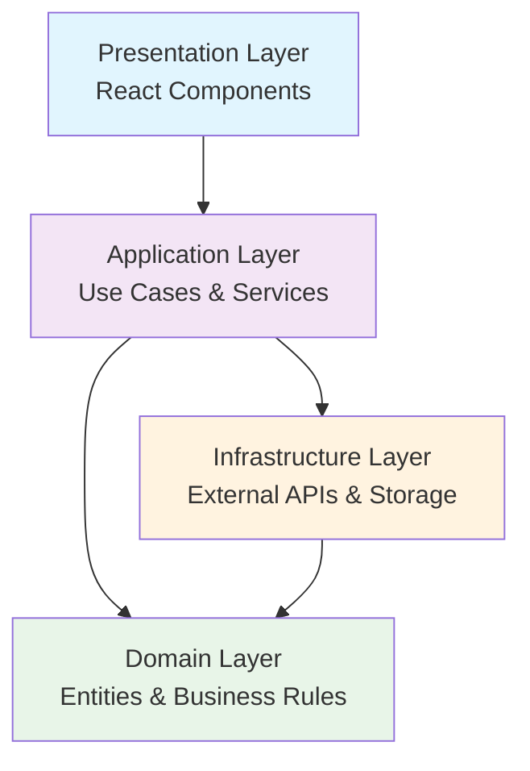

## 📁 Project Structure

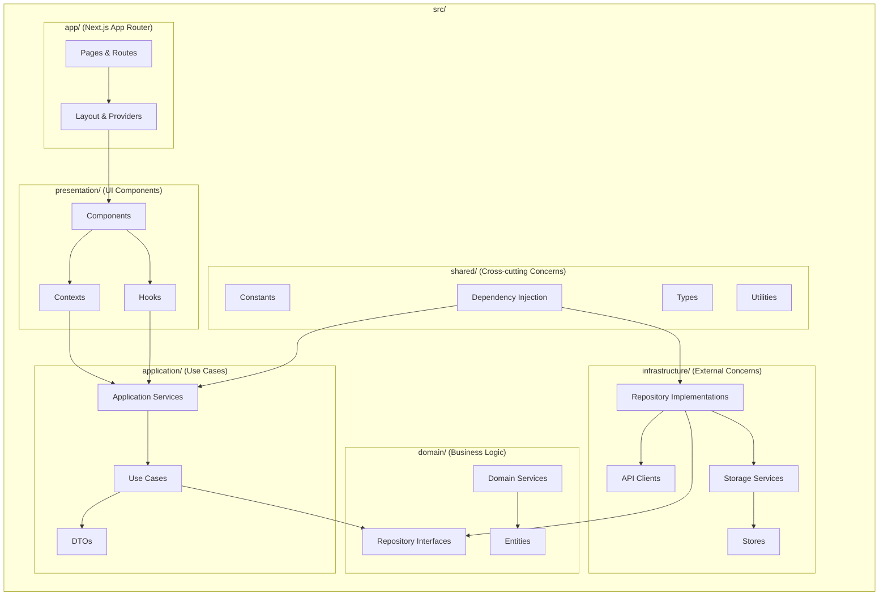

## 🔄 Data Flow Architecture

### Request Flow
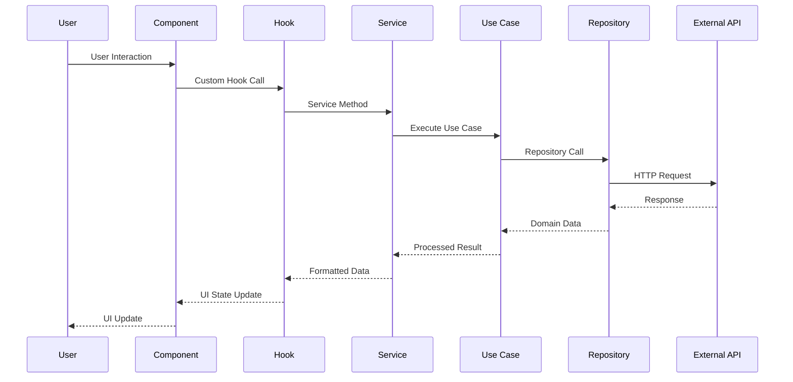

### Authentication Flow
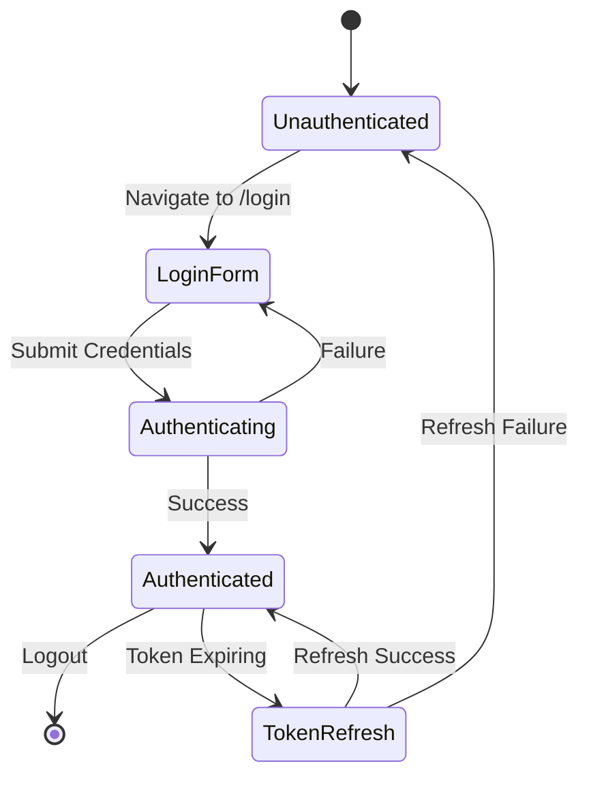

## 🧩 Component Architecture

The UI follows Atomic Design principles with hierarchical component organization:

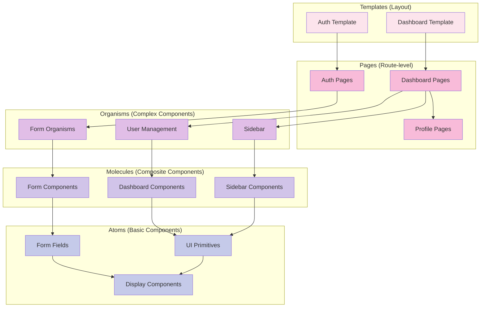

## 📊 State Management Architecture

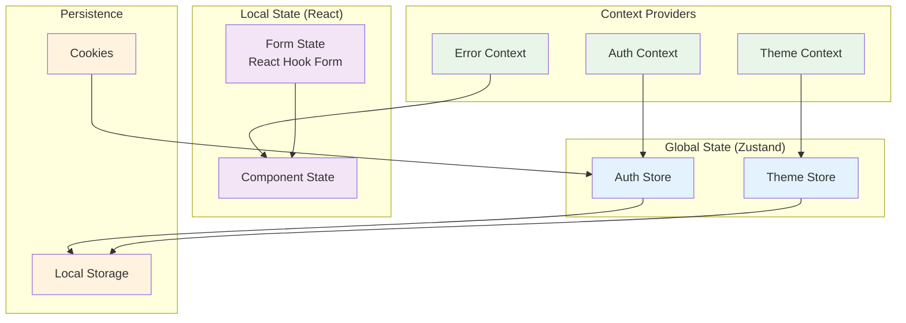

## 🔌 API Integration Architecture

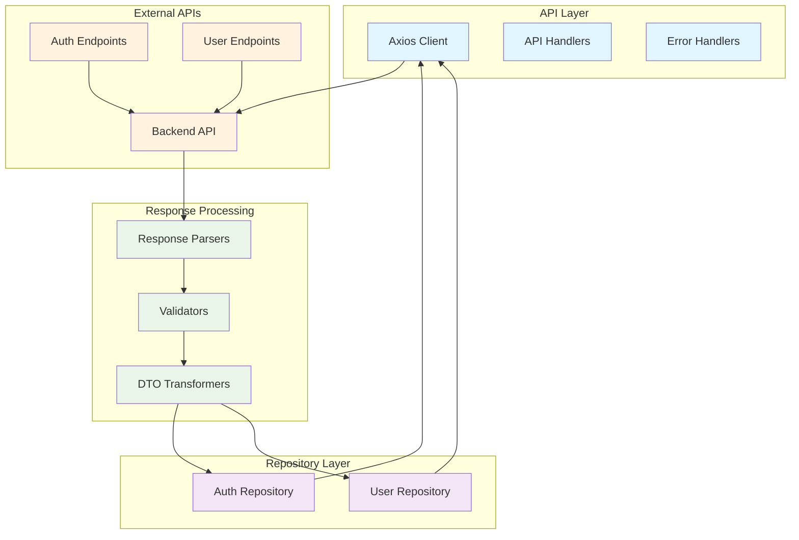

## 🔐 Security Architecture

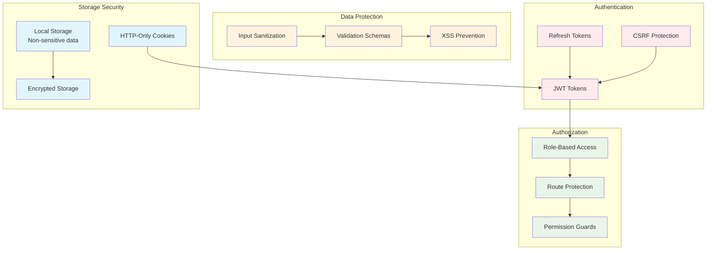

## 🚀 Performance Optimization

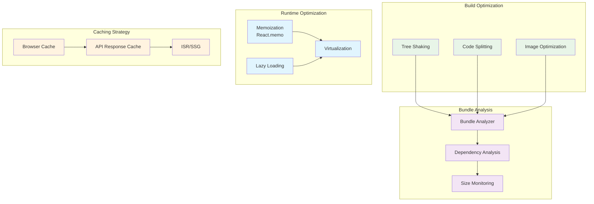

## 📋 Key Design Patterns

### Repository Pattern
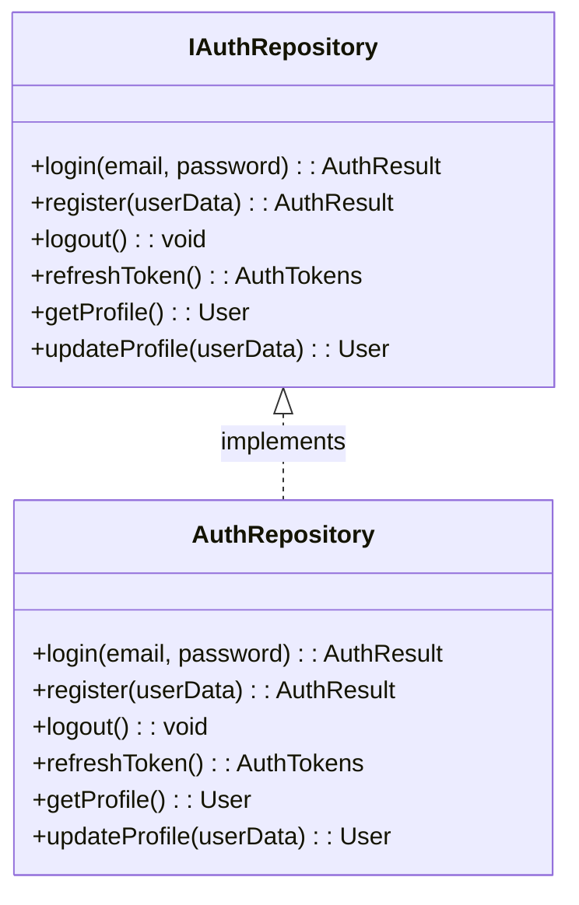

### Use Case Pattern
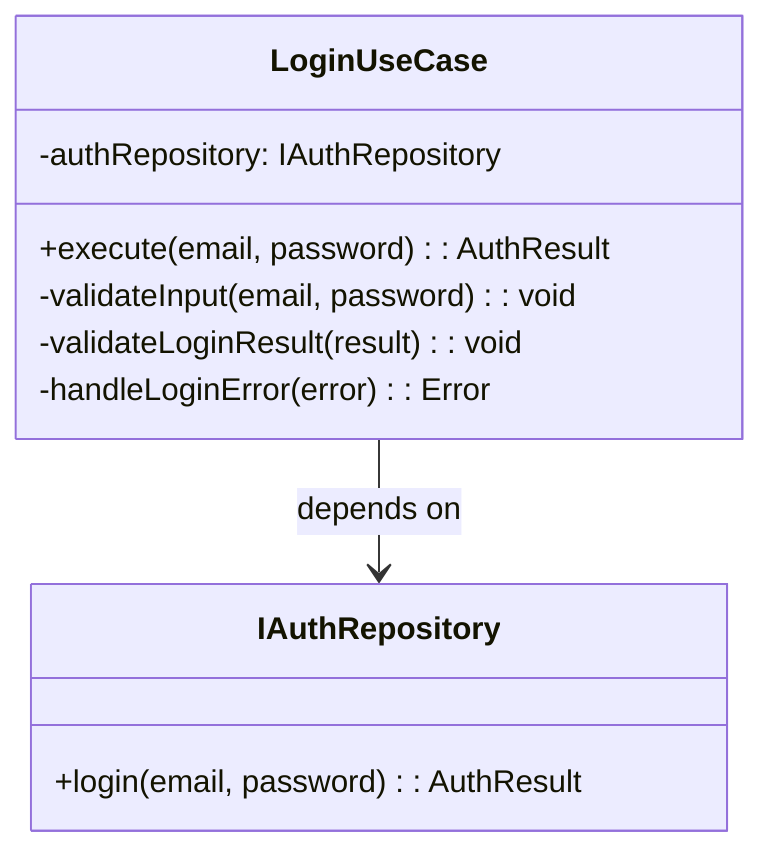

### Dependency Injection
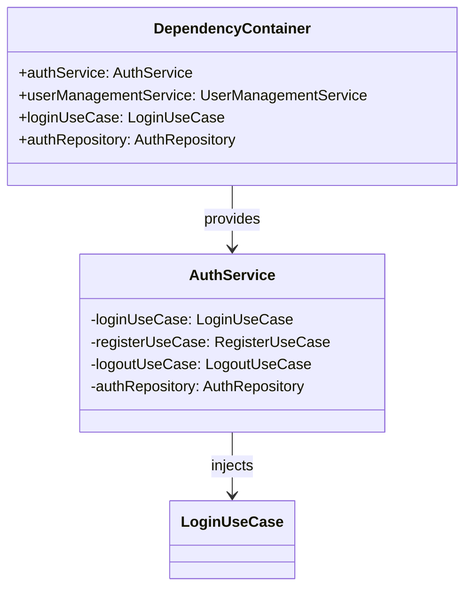

## 🔄 Development Workflow

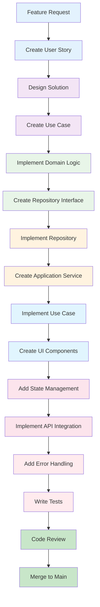

## 📊 Technology Stack Overview

| Category | Technology | Purpose |
|----------|------------|---------|
| **Framework** | Next.js 16 | React framework with App Router |
| **Language** | TypeScript 5 | Type-safe JavaScript |
| **UI Library** | React 19 | Component library |
| **Styling** | Tailwind CSS v4 | Utility-first CSS |
| **Components** | Shadcn-UI + Radix UI | Accessible component library |
| **State Management** | Zustand | Global state management |
| **Forms** | React Hook Form + Zod | Form handling and validation |
| **HTTP Client** | Axios | API communication |
| **Icons** | Lucide React | Icon library |
| **Charts** | Recharts | Data visualization |
| **Notifications** | Sonner | Toast notifications |

This architecture provides a scalable, maintainable, and testable foundation for the ABC Dashboard application.
