# Clean Architecture Implementation Guide

## Overview

This guide explains how the ABC Dashboard frontend implements Clean Architecture principles, providing a clear separation of concerns and making the codebase more maintainable, testable, and scalable.

## 🏛️ Clean Architecture Principles

### Core Principles

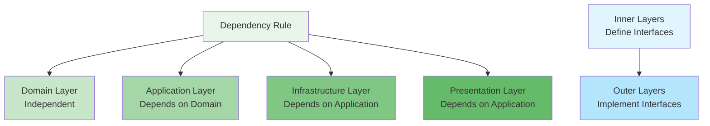

### Dependency Inversion

The architecture follows dependency inversion where:
- **Inner layers define interfaces/contracts**
- **Outer layers implement these interfaces**
- **Dependencies point inward**

## 📁 Layer Structure

### Domain Layer (`src/domain/`)

The domain layer contains business logic that is independent of any external frameworks or technologies.

#### Entities (`domain/entities/`)

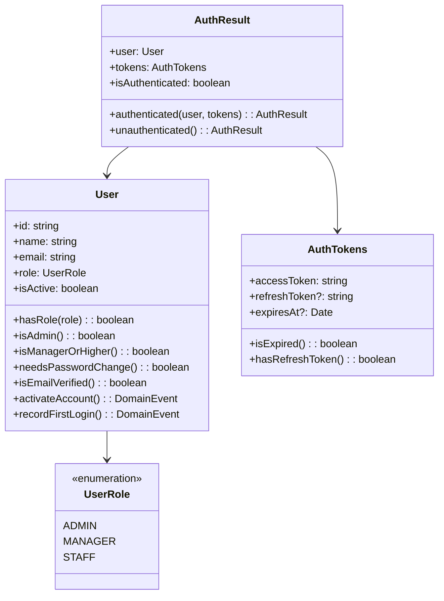

**Key Characteristics:**
- Pure business logic with no external dependencies
- Domain events for important state changes
- Rich domain models with business rules
- Value objects and entities

#### Repository Interfaces (`domain/repositories/`)

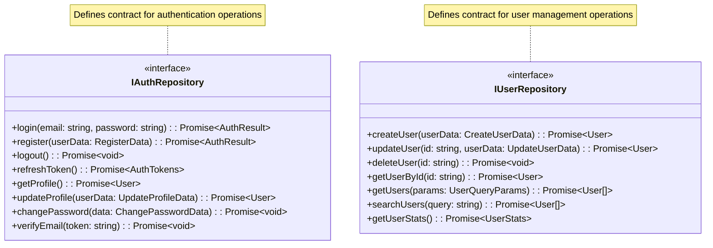

**Purpose:**
- Define data access contracts
- Enable dependency inversion
- Make domain layer testable in isolation

#### Domain Services (`domain/services/`)

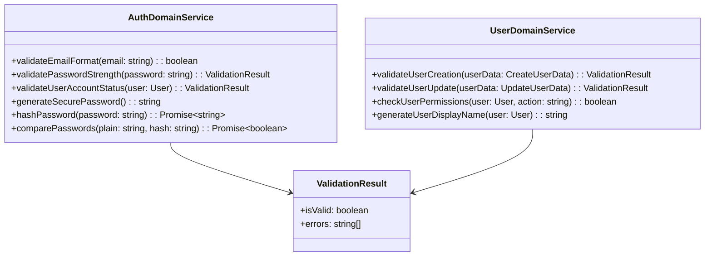

**Responsibilities:**
- Complex business rules that don't belong in entities
- Cross-entity business logic
- Domain-specific validations

### Application Layer (`src/application/`)

The application layer orchestrates domain objects to fulfill application-specific use cases.

#### Use Cases (`application/use-cases/`)

```mermaid
graph TD
    subgraph "Auth Use Cases"
        A1[LoginUseCase]
        A2[RegisterUseCase]
        A3[LogoutUseCase]
        A4[UpdateProfileUseCase]
        A5[GetProfileUseCase]
    end

    subgraph "User Management Use Cases"
        U1[CreateUserUseCase]
        U2[UpdateUserUseCase]
        U3[DeleteUserUseCase]
        U4[GetUsersUseCase]
        U5[SearchUsersUseCase]
    end

    subgraph "Dependencies"
        D1[IAuthRepository]
        D2[IUserRepository]
        D3[AuthDomainService]
        D4[UserDomainService]
    end

    A1 --> D1
    A2 --> D1
    A3 --> D1
    A4 --> D1
    A5 --> D1

    U1 --> D2
    U2 --> D2
    U3 --> D2
    U4 --> D2
    U5 --> D2
    U6 --> D2

    A1 --> D3
    A2 --> D3
    U1 --> D4
    U2 --> D4

    style A1 fill:#e1f5fe
    style A2 fill:#e1f5fe
    style A3 fill:#e1f5fe
    style A4 fill:#e1f5fe
    style A5 fill:#e1f5fe
    style U1 fill:#f3e5f5
    style U2 fill:#f3e5f5
    style U3 fill:#f3e5f5
    style U4 fill:#f3e5f5
    style U5 fill:#f3e5f5
    style U6 fill:#f3e5f5
    style D1 fill:#fff3e0
    style D2 fill:#fff3e0
    style D3 fill:#e8f5e8
    style D4 fill:#e8f5e8
```

**Use Case Structure:**

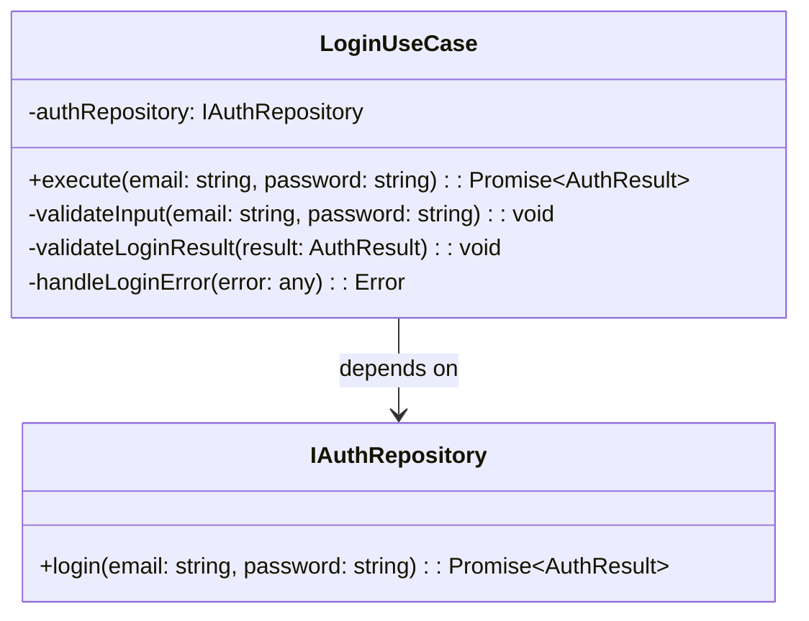

**Key Characteristics:**
- Single responsibility principle
- Application-specific business rules
- Orchestrate domain objects
- Return domain objects or DTOs

#### Application Services (`application/services/`)

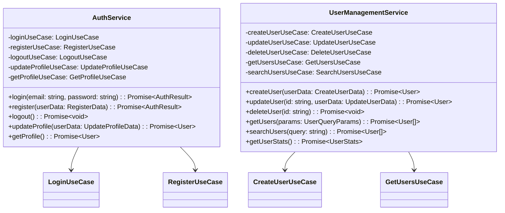

**Purpose:**
- Group related use cases
- Provide high-level API for presentation layer
- Handle cross-cutting concerns

#### DTOs (`application/dto/`)

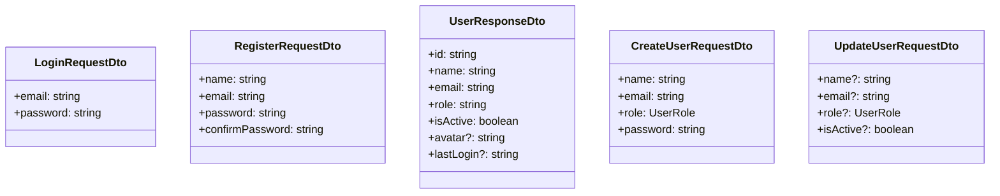

**Responsibilities:**
- Data transfer between layers
- API request/response formatting
- Input validation schemas

### Infrastructure Layer (`src/infrastructure/`)

The infrastructure layer implements the interfaces defined by the domain and application layers.

#### Repository Implementations (`infrastructure/repositories/`)

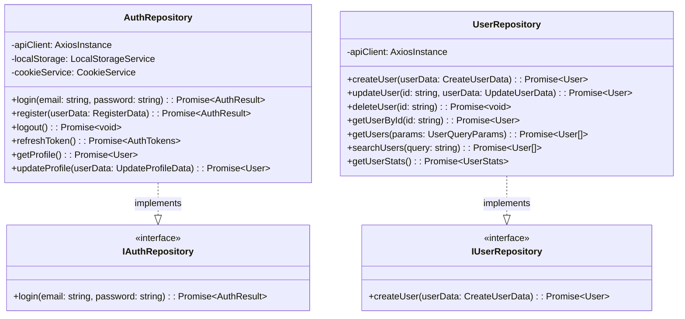

**Key Responsibilities:**
- HTTP API communication
- Data transformation
- Error handling and retry logic
- Caching strategies

#### API Layer (`infrastructure/api/`)

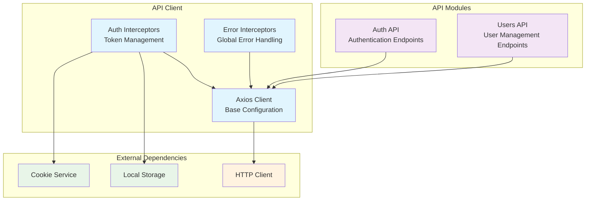

#### Storage Services (`infrastructure/storage/`)

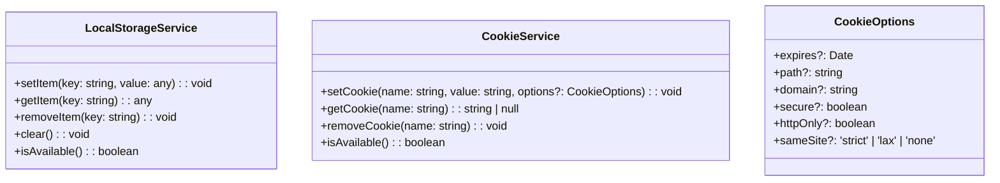

#### State Stores (`infrastructure/stores/`)

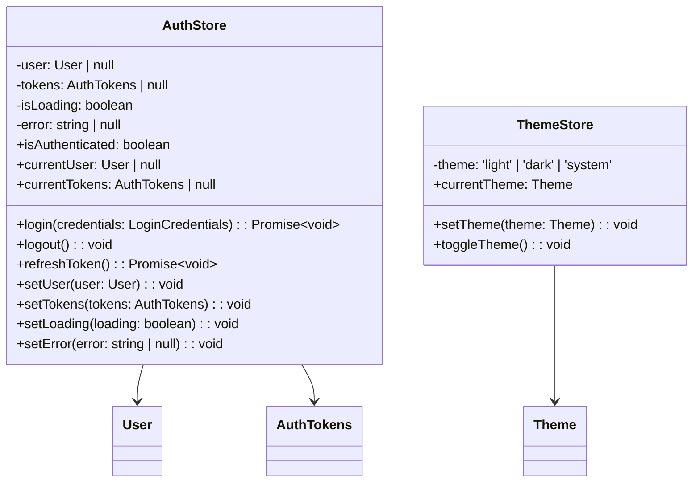

### Presentation Layer (`src/presentation/`)

The presentation layer handles UI concerns and user interactions.

#### Components (`presentation/components/`)

Following Atomic Design principles:

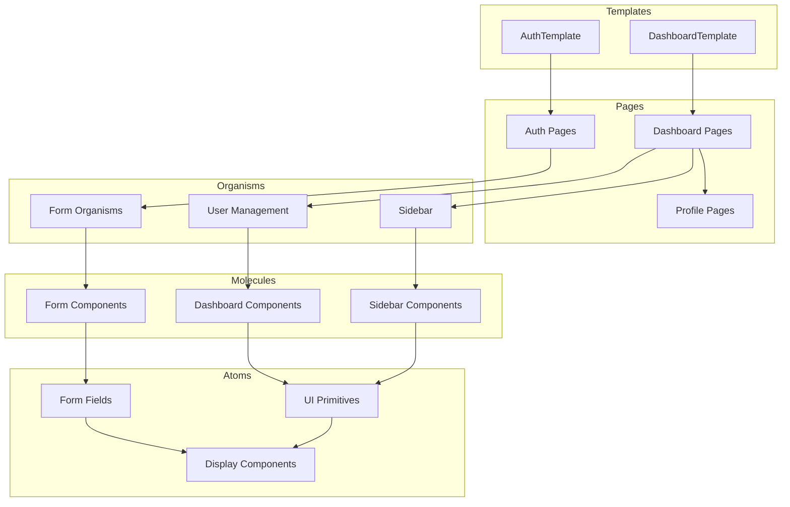

#### Contexts (`presentation/contexts/`)

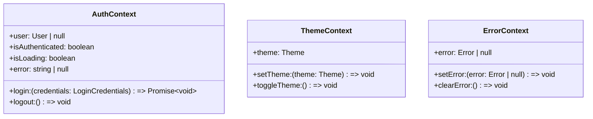

#### Hooks (`presentation/hooks/`)

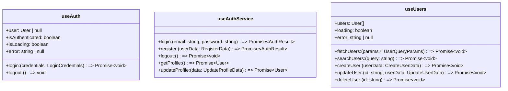

### Shared Layer (`src/shared/`)

Cross-cutting concerns and utilities.

#### Dependency Injection (`shared/di/`)

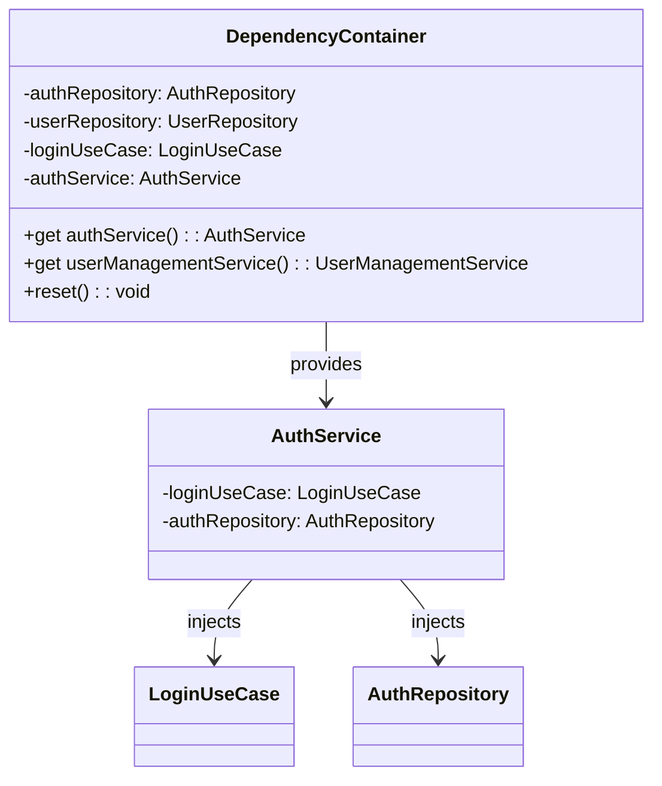

## 🔄 Implementation Patterns

### Dependency Injection Pattern

```typescript
// Container provides singleton instances
class DependencyContainer {
  get authService(): AuthService {
    if (!this._authService) {
      this._authService = new AuthService(
        this.authRepository,
        this.loginUseCase,
        this.registerUseCase,
        // ... other dependencies
      );
    }
    return this._authService;
  }
}

// Usage in components
const authService = container.authService;
await authService.login(email, password);
```

### Repository Pattern Implementation

```typescript
// Domain defines interface
interface IAuthRepository {
  login(email: string, password: string): Promise<AuthResult>;
}

// Infrastructure implements interface
class AuthRepository implements IAuthRepository {
  async login(email: string, password: string): Promise<AuthResult> {
    const response = await this.apiClient.post('/auth/login', {
      email,
      password,
    });

    return AuthResultMapper.toDomain(response.data);
  }
}

// Use case depends on interface
class LoginUseCase {
  constructor(private readonly authRepository: IAuthRepository) {}

  async execute(email: string, password: string): Promise<AuthResult> {
    // Domain logic here
    return this.authRepository.login(email, password);
  }
}
```

### Use Case Pattern

```typescript
class LoginUseCase {
  constructor(private readonly authRepository: IAuthRepository) {}

  async execute(email: string, password: string): Promise<AuthResult> {
    // 1. Validate input
    this.validateInput(email, password);

    // 2. Execute business logic
    const authResult = await this.authRepository.login(email, password);

    // 3. Apply application rules
    this.validateLoginResult(authResult);

    return authResult;
  }

  private validateInput(email: string, password: string): void {
    // Application-specific validation
  }

  private validateLoginResult(authResult: AuthResult): void {
    // Application-specific business rules
  }
}
```

## 🧪 Testing Strategy

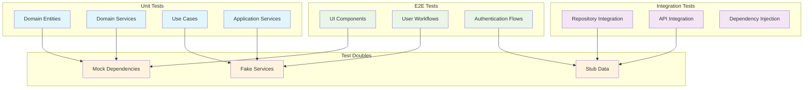

### Testing Pyramid

- **Unit Tests**: Domain entities, use cases, application services
- **Integration Tests**: Repository implementations, API clients
- **E2E Tests**: Complete user workflows

### Test Example

```typescript
// Unit test for use case
describe('LoginUseCase', () => {
  let mockAuthRepository: jest.Mocked<IAuthRepository>;
  let loginUseCase: LoginUseCase;

  beforeEach(() => {
    mockAuthRepository = {
      login: jest.fn(),
    };
    loginUseCase = new LoginUseCase(mockAuthRepository);
  });

  it('should login successfully with valid credentials', async () => {
    const mockAuthResult = AuthResult.authenticated(mockUser, mockTokens);
    mockAuthRepository.login.mockResolvedValue(mockAuthResult);

    const result = await loginUseCase.execute('user@example.com', 'password');

    expect(result.isAuthenticated).toBe(true);
    expect(mockAuthRepository.login).toHaveBeenCalledWith('user@example.com', 'password');
  });
});
```

## 📋 Development Guidelines

### Adding New Features

1. **Start with Domain**: Define entities and business rules
2. **Create Repository Interface**: Define data access contract
3. **Implement Use Case**: Orchestrate domain objects
4. **Create Application Service**: Group related use cases
5. **Implement Repository**: Handle external concerns
6. **Add Presentation**: Create UI components
7. **Write Tests**: Ensure quality and prevent regressions

### Code Organization Rules

- **Domain Layer**: No external dependencies
- **Application Layer**: Depends only on domain
- **Infrastructure Layer**: Depends on application and domain
- **Presentation Layer**: Depends on application and infrastructure

### Naming Conventions

- **Use Cases**: `[Action][Entity]UseCase` (e.g., `LoginUseCase`)
- **Services**: `[Entity][Layer]Service` (e.g., `AuthDomainService`)
- **Repositories**: `[Entity]Repository` (e.g., `AuthRepository`)
- **DTOs**: `[Action][Entity][Type]Dto` (e.g., `LoginRequestDto`)

This Clean Architecture implementation provides a solid foundation for maintainable, testable, and scalable frontend applications.
