# ABC Dashboard - System Overview

This document provides a comprehensive visual overview of the ABC Dashboard system architecture, user flows, and component relationships using Mermaid diagrams.

---

## 🏗️ System Architecture Overview


---

## 👥 User Role Hierarchy & Permissions

```mermaid
graph TD
    subgraph "User Roles & Permissions"
        ADMIN[👑 Administrator<br/>Full System Access]
        MANAGER[👨‍💼 Manager<br/>Team Management]
        STAFF[👥 Staff<br/>Limited Access]
    end

    subgraph "Admin Capabilities"
        A1[Create Managers]
        A2[Create Staff]
        A3[Assign Staff to Managers]
        A4[Reassign Staff]
        A5[View All Users]
        A6[Delete Users]
        A7[Full CRUD Operations]
    end

    subgraph "Manager Capabilities"
        M1[Create Staff Members]
        M2[View Assigned Staff]
        M3[Edit Staff Details]
        M4[Manage Team Only]
    end

    subgraph "Staff Capabilities"
        S1[View Own Profile]
        S2[Edit Own Information]
        S3[No Creation Rights]
        S4[No Management Rights]
    end

    ADMIN --> A1
    ADMIN --> A2
    ADMIN --> A3
    ADMIN --> A4
    ADMIN --> A5
    ADMIN --> A6
    ADMIN --> A7

    MANAGER --> M1
    MANAGER --> M2
    MANAGER --> M3
    MANAGER --> M4

    STAFF --> S1
    STAFF --> S2
    STAFF --> S3
    STAFF --> S4

    style ADMIN fill:#ffebee
    style MANAGER fill:#e8f5e8
    style STAFF fill:#e3f2fd
```



---

## 🔐 Complete Authentication & Authorization Flow


---

## 🚀 User Creation & Onboarding Flow


---

## 👨‍💼 Admin User Management Workflow


---

## 👨‍💻 Manager Team Management Workflow


---

## 🔄 Password Reset & Recovery Flow

```mermaid
graph TD
    subgraph "Forgot Password Process"
        A[User on Login Page] --> B[Clicks "Forgot Password"]
        B --> C[Forgot Password Form]
        C --> D[Enter Email Address]
        D --> E[Submit Request]
        E --> F[Validate Email Exists]
        F --> G{User Found?}
        G -->|No| H[Silent Success<br/>Security by obscurity]
        G -->|Yes| I{Check Account Status}
        I -->|Inactive| J[Silent Success<br/>Don't reveal status]
        I -->|Active| K[Generate Temp Password]
        K --> L[Update User Record<br/>requiresPasswordChange: true]
        L --> M[Send Email with Temp Password]
        M --> N[Show Success Message]
    end

    subgraph "Password Reset Email"
        M --> O[Email Content]
        O --> P[Subject: Password Reset - ABC Dashboard]
        O --> Q[Temp Password Display]
        O --> R[Security Warning]
        O --> S[Login Instructions]
        O --> T[Change Password Reminder]
    end

    subgraph "Forced Password Change"
        N --> U[User Receives Email]
        U --> V[Clicks Login Link]
        V --> W[Login with Temp Password]
        W --> X[System Detects<br/>requiresPasswordChange: true]
        X --> Y[Redirect to Change Password<br/>With forced flag]
        Y --> Z[Show Special UI<br/>No current password field]
        Z --> AA[User Enters New Password]
        AA --> BB[Validate Password Strength]
        BB --> CC[Update Password]
        CC --> DD[Clear Force Flag<br/>Set isActive: true]
        DD --> EE[Redirect to Dashboard]
        EE --> FF[Show Success Message]
    end

    style A fill:#e3f2fd
    style U fill:#f3e5f5
    style Y fill:#ffebee
```

---

## 🧩 Component Architecture Overview


---

## 📊 Data Flow & State Management


---

## 🚀 Deployment & Infrastructure


---

## 🎯 User Journey Summary


---

## 📈 System Metrics & Monitoring


These Mermaid diagrams provide a comprehensive visual overview of the ABC Dashboard system, showing how all components work together, user flows, data architecture, and deployment infrastructure. Each diagram focuses on a specific aspect while maintaining the big-picture view of the entire system. 🎯📊✨
