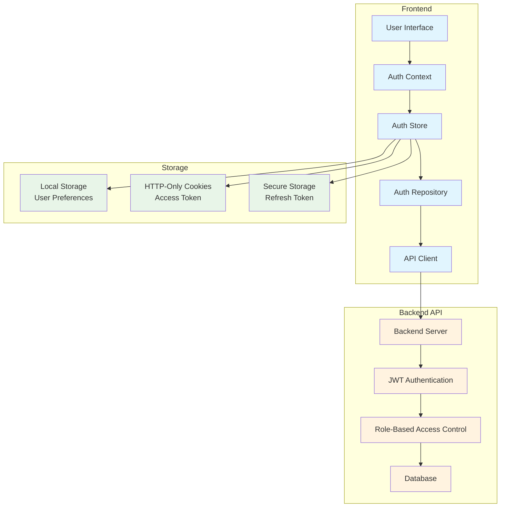
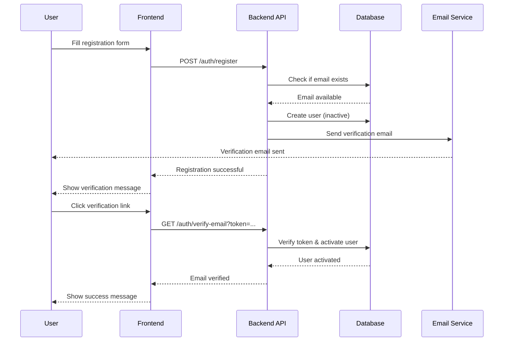
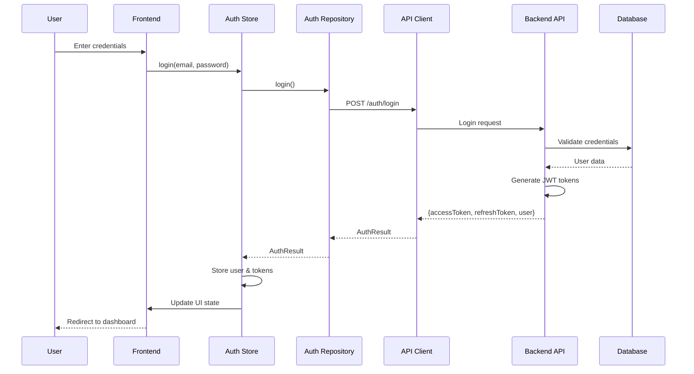
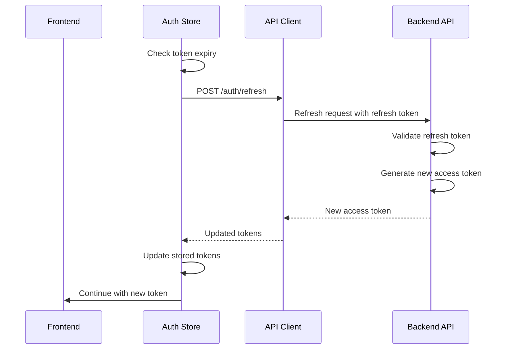
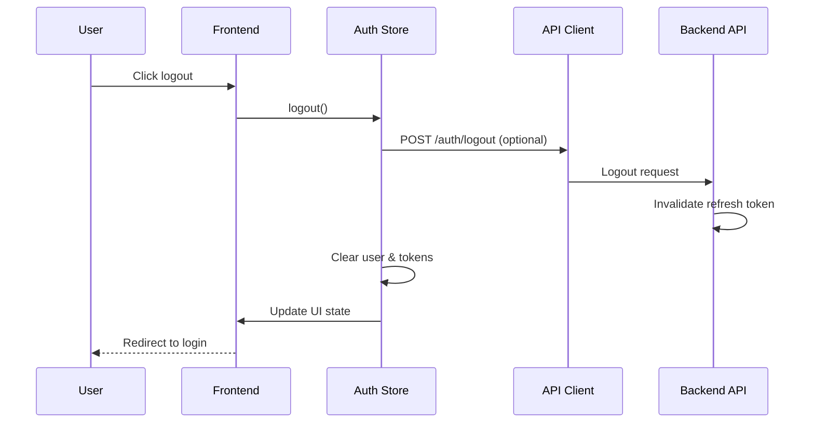
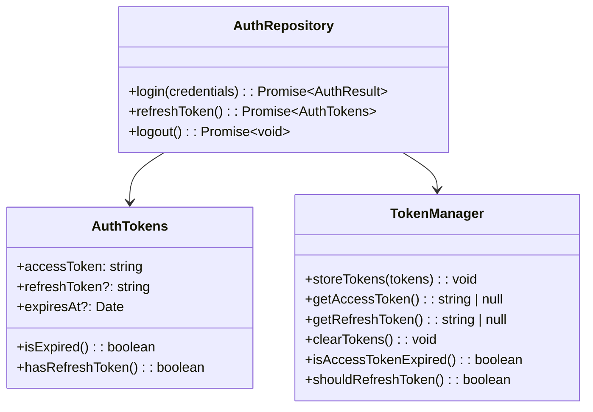
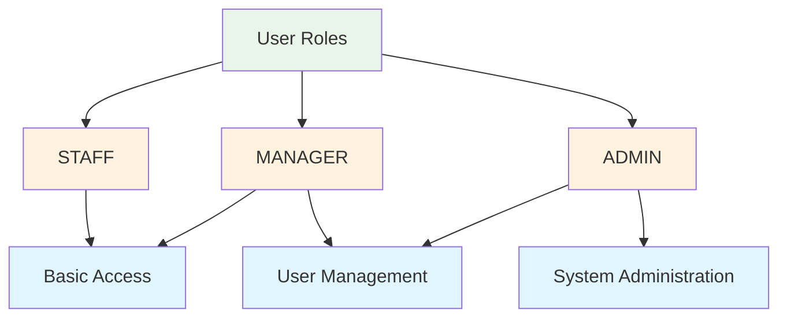
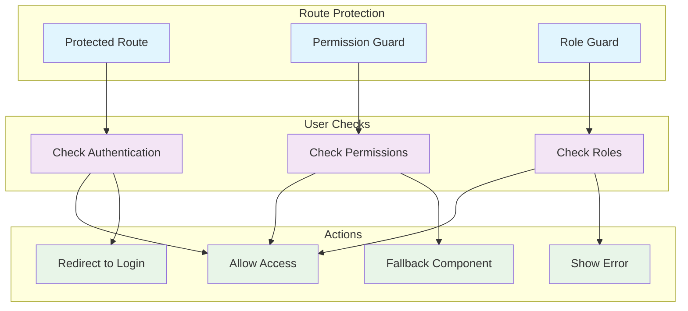
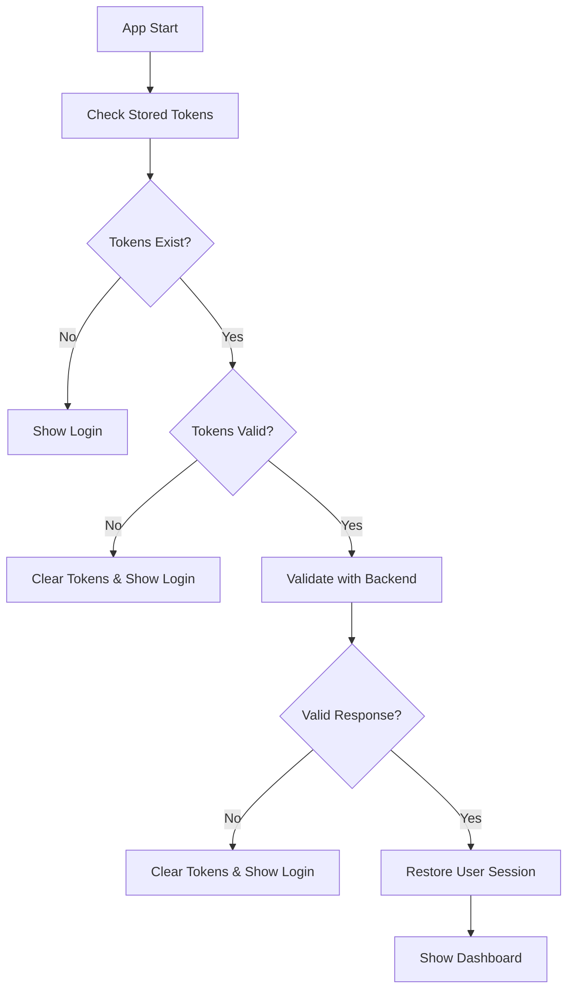

# Authentication & Authorization Flow

## Overview

The ABC Dashboard implements a comprehensive authentication and authorization system with JWT tokens, role-based access control, and secure session management. This document details the complete authentication flow and security implementation.

## 🔐 Authentication Architecture



## 🔄 Complete Authentication Flow

### User Registration Flow



### Login Flow



### Token Refresh Flow



### Logout Flow



## 🛡️ Security Implementation

### JWT Token Management



**Token Storage Strategy:**
- **Access Token**: Stored in HTTP-only cookies (prevents XSS attacks)
- **Refresh Token**: Stored in secure http-only cookies or secure local storage
- **User Data**: Stored in Zustand store (client-side only)

### API Request Interception

```typescript
// API Client with automatic token handling
class AuthInterceptor {
  interceptRequest(config: AxiosRequestConfig): AxiosRequestConfig {
    const token = this.getAccessToken();
    if (token) {
      config.headers.Authorization = `Bearer ${token}`;
    }
    return config;
  }

  interceptResponse(response: AxiosResponse): AxiosResponse {
    return response;
  }

  interceptError(error: AxiosError): Promise<AxiosError> {
    if (error.response?.status === 401) {
      // Token expired, try refresh
      return this.handleTokenRefresh(error);
    }
    return Promise.reject(error);
  }

  private async handleTokenRefresh(error: AxiosError): Promise<AxiosError> {
    try {
      const newTokens = await authRepository.refreshToken();
      // Retry original request with new token
      const originalRequest = error.config;
      originalRequest.headers.Authorization = `Bearer ${newTokens.accessToken}`;
      return axios(originalRequest);
    } catch (refreshError) {
      // Refresh failed, logout user
      authStore.logout();
      return Promise.reject(error);
    }
  }
}
```

## 👥 Role-Based Access Control (RBAC)

### User Roles



### Permission Hierarchy

```typescript
enum UserRole {
  STAFF = 'staff',     // Basic user access
  MANAGER = 'manager', // Can manage users
  ADMIN = 'admin'      // Full system access
}

interface Permissions {
  // User management
  users: {
    create: UserRole[];
    read: UserRole[];
    update: UserRole[];
    delete: UserRole[];
  };

  // Dashboard access
  dashboard: {
    view: UserRole[];
    admin: UserRole[];
  };

  // Profile management
  profile: {
    update: UserRole[];
    changePassword: UserRole[];
  };
}

const PERMISSIONS: Permissions = {
  users: {
    create: [UserRole.MANAGER, UserRole.ADMIN],
    read: [UserRole.STAFF, UserRole.MANAGER, UserRole.ADMIN],
    update: [UserRole.MANAGER, UserRole.ADMIN],
    delete: [UserRole.ADMIN],
  },
  dashboard: {
    view: [UserRole.STAFF, UserRole.MANAGER, UserRole.ADMIN],
    admin: [UserRole.ADMIN],
  },
  profile: {
    update: [UserRole.STAFF, UserRole.MANAGER, UserRole.ADMIN],
    changePassword: [UserRole.STAFF, UserRole.MANAGER, UserRole.ADMIN],
  },
};
```

### Route Protection



### Route Protection Components

```typescript
// Protected Route Component
interface ProtectedRouteProps {
  children: ReactNode;
  requiredRole?: UserRole;
  fallback?: ReactNode;
  redirectTo?: string;
}

export const ProtectedRoute: React.FC<ProtectedRouteProps> = ({
  children,
  requiredRole,
  fallback,
  redirectTo = '/login'
}) => {
  const { isAuthenticated, user } = useAuth();
  const router = useRouter();

  useEffect(() => {
    if (!isAuthenticated) {
      router.push(redirectTo);
      return;
    }

    if (requiredRole && user && !user.hasRole(requiredRole)) {
      router.push('/unauthorized');
      return;
    }
  }, [isAuthenticated, user, requiredRole, router, redirectTo]);

  if (!isAuthenticated) {
    return fallback || <Loading />;
  }

  if (requiredRole && user && !user.hasRole(requiredRole)) {
    return fallback || <UnauthorizedMessage />;
  }

  return <>{children}</>;
};
```

```typescript
// Permission Guard Component
interface PermissionGuardProps {
  permission: string;
  user: User;
  children: ReactNode;
  fallback?: ReactNode;
}

export const PermissionGuard: React.FC<PermissionGuardProps> = ({
  permission,
  user,
  children,
  fallback
}) => {
  const hasPermission = checkPermission(user, permission);

  if (!hasPermission) {
    return fallback ? <>{fallback}</> : null;
  }

  return <>{children}</>;
};

// Permission checking utility
export const checkPermission = (user: User, permission: string): boolean => {
  const [resource, action] = permission.split('.');

  if (!PERMISSIONS[resource] || !PERMISSIONS[resource][action]) {
    return false;
  }

  return PERMISSIONS[resource][action].includes(user.role);
};
```

## 🚪 Session Management

### Session Initialization



### Automatic Token Refresh

```typescript
// Auth Store - Automatic token refresh
useEffect(() => {
  if (tokens && tokens.expiresAt) {
    const expiresAt = tokens.expiresAt.getTime();
    const now = Date.now();
    const timeUntilExpiry = expiresAt - now;

    // Refresh token 5 minutes before expiry
    const refreshThreshold = 5 * 60 * 1000; // 5 minutes

    if (timeUntilExpiry > 0 && timeUntilExpiry <= refreshThreshold) {
      const timeoutId = setTimeout(() => {
        refreshToken().catch((error) => {
          console.error('Auto refresh failed:', error);
          // User will be logged out if refresh fails
        });
      }, timeUntilExpiry - refreshThreshold);

      return () => clearTimeout(timeoutId);
    }
  }
}, [tokens]);
```

### Session Persistence

```typescript
// Zustand persist configuration
persist(
  (set, get) => ({
    // Auth state and actions
  }),
  {
    name: 'auth-storage',
    partialize: (state) => ({
      user: state.user,
      tokens: state.tokens,
      // Only persist essential data
    }),
    // Custom serializer/deserializer for dates
    serialize: (state) => JSON.stringify(state, (key, value) => {
      if (value instanceof Date) {
        return { __type: 'Date', value: value.toISOString() };
      }
      return value;
    }),
    deserialize: (str) => JSON.parse(str, (key, value) => {
      if (value && typeof value === 'object' && value.__type === 'Date') {
        return new Date(value.value);
      }
      return value;
    }),
  }
)
```

## 🔒 Security Best Practices

### 1. Token Security
- **HTTP-Only Cookies**: Prevent XSS attacks by storing tokens in http-only cookies
- **Secure Flag**: Use HTTPS-only cookies in production
- **SameSite**: Set SameSite attribute to prevent CSRF
- **Short-lived Tokens**: Access tokens expire quickly (15-30 minutes)
- **Refresh Tokens**: Longer-lived tokens for session renewal

### 2. Input Validation
- **Client-side**: Zod schemas for form validation
- **Server-side**: Backend validation (defense in depth)
- **Sanitization**: Clean user inputs before processing

### 3. Error Handling
- **Generic Messages**: Don't leak sensitive information in errors
- **Logging**: Log security events without exposing data
- **Rate Limiting**: Prevent brute force attacks

### 4. Secure Storage
- **No Sensitive Data**: Don't store passwords or secrets in localStorage
- **Encryption**: Encrypt sensitive data when necessary
- **Clear on Logout**: Completely clear all stored data on logout

## 🧪 Testing Authentication

### Unit Tests

```typescript
describe('AuthStore', () => {
  let mockAuthRepository: jest.Mocked<IAuthRepository>;

  beforeEach(() => {
    mockAuthRepository = {
      login: jest.fn(),
      logout: jest.fn(),
      refreshToken: jest.fn(),
    };
  });

  it('should handle successful login', async () => {
    const mockResult = AuthResult.authenticated(mockUser, mockTokens);
    mockAuthRepository.login.mockResolvedValue(mockResult);

    const store = createAuthStore(mockAuthRepository);

    await store.login('user@example.com', 'password');

    expect(store.user).toEqual(mockUser);
    expect(store.tokens).toEqual(mockTokens);
    expect(store.isAuthenticated).toBe(true);
  });

  it('should handle login failure', async () => {
    mockAuthRepository.login.mockRejectedValue(new Error('Invalid credentials'));

    const store = createAuthStore(mockAuthRepository);

    await expect(store.login('user@example.com', 'wrong')).rejects.toThrow('Invalid credentials');

    expect(store.user).toBeNull();
    expect(store.isAuthenticated).toBe(false);
  });
});
```

### Integration Tests

```typescript
describe('Authentication Flow', () => {
  it('should complete full login flow', async () => {
    // Mock API responses
    mockServer.post('/auth/login').reply(200, {
      user: mockUser,
      accessToken: 'mock-access-token',
      refreshToken: 'mock-refresh-token',
    });

    render(
      <AuthProvider>
        <LoginForm />
      </AuthProvider>
    );

    // Fill form
    fireEvent.change(screen.getByLabelText('Email'), {
      target: { value: 'user@example.com' },
    });
    fireEvent.change(screen.getByLabelText('Password'), {
      target: { value: 'password' },
    });

    // Submit form
    fireEvent.click(screen.getByRole('button', { name: 'Sign In' }));

    // Wait for success
    await waitFor(() => {
      expect(screen.getByText('Welcome back!')).toBeInTheDocument();
    });

    // Check auth state
    expect(useAuthStore.getState().isAuthenticated).toBe(true);
  });
});
```

## 🚨 Error Handling

### Authentication Errors

```typescript
enum AuthError {
  INVALID_CREDENTIALS = 'INVALID_CREDENTIALS',
  ACCOUNT_LOCKED = 'ACCOUNT_LOCKED',
  EMAIL_NOT_VERIFIED = 'EMAIL_NOT_VERIFIED',
  TOKEN_EXPIRED = 'TOKEN_EXPIRED',
  NETWORK_ERROR = 'NETWORK_ERROR',
}

const handleAuthError = (error: any): AuthError => {
  if (error.response?.status === 401) {
    return AuthError.INVALID_CREDENTIALS;
  }

  if (error.response?.status === 423) {
    return AuthError.ACCOUNT_LOCKED;
  }

  if (error.code === 'NETWORK_ERROR') {
    return AuthError.NETWORK_ERROR;
  }

  return AuthError.TOKEN_EXPIRED;
};
```

### User-Friendly Messages

```typescript
const getAuthErrorMessage = (error: AuthError): string => {
  switch (error) {
    case AuthError.INVALID_CREDENTIALS:
      return 'Invalid email or password. Please try again.';
    case AuthError.ACCOUNT_LOCKED:
      return 'Your account has been temporarily locked. Please try again later.';
    case AuthError.EMAIL_NOT_VERIFIED:
      return 'Please verify your email address before signing in.';
    case AuthError.TOKEN_EXPIRED:
      return 'Your session has expired. Please sign in again.';
    case AuthError.NETWORK_ERROR:
      return 'Network error. Please check your connection and try again.';
    default:
      return 'An unexpected error occurred. Please try again.';
  }
};
```

This authentication and authorization system provides robust security, excellent user experience, and comprehensive protection for the ABC Dashboard application.
