# Component Structure & Atomic Design

## Overview

The ABC Dashboard frontend follows Atomic Design principles for organizing UI components. This document explains the component hierarchy, patterns, and best practices used in the application.

## 🏗️ Atomic Design Hierarchy

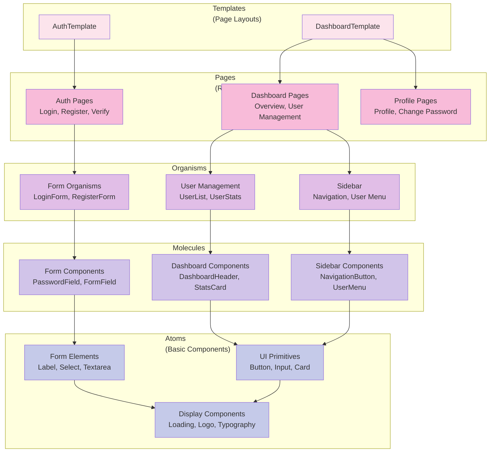

## 📁 Component Organization

### Directory Structure

```
src/presentation/components/
├── atoms/                    # Basic UI components
│   ├── display/             # Display components (Loading, Logo, etc.)
│   ├── forms/               # Form elements (Input, Label, etc.)
│   └── ui/                  # Shadcn-UI components (Button, Card, etc.)
├── molecules/               # Composite components
│   ├── common/              # Common molecules (Breadcrumb, Search, etc.)
│   ├── dashboard/           # Dashboard-specific molecules
│   ├── form/                # Form molecules (Password field, etc.)
│   └── sidebar/             # Sidebar components
├── organisms/               # Complex components
│   ├── common/              # Common organisms (Error boundary, etc.)
│   ├── form/                # Form organisms (Login, Register forms)
│   └── user-management/     # User management components
├── pages/                   # Page-level components
│   ├── auth/                # Authentication pages
│   ├── dashboard/           # Dashboard pages
│   └── profile/             # Profile pages
├── routes/                  # Route protection components
└── templates/               # Layout templates
```

## 🔧 Atoms (Basic Components)

### Display Components (`atoms/display/`)

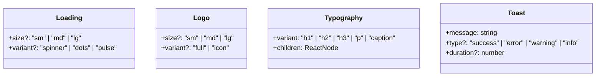

**Usage:**
```tsx
// Loading component
<Loading size="md" variant="spinner" />

// Typography component
<Typography variant="h1">Dashboard</Typography>

// Toast notification
<Toast message="User created successfully" type="success" />
```

### Form Components (`atoms/forms/`)

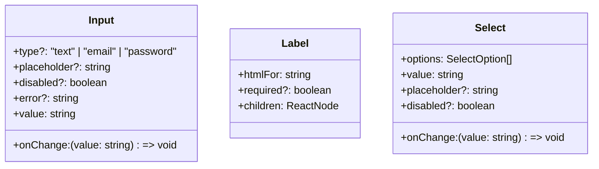

**Usage:**
```tsx
// Input with error state
<Input
  type="email"
  placeholder="Enter your email"
  value={email}
  onChange={setEmail}
  error={errors.email}
/>

// Label with required indicator
<Label htmlFor="email" required>
  Email Address
</Label>
```

### UI Components (`atoms/ui/`)

Based on Shadcn-UI and Radix UI primitives:

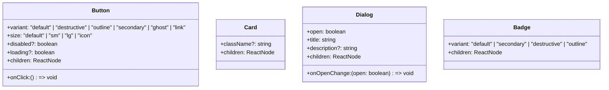

**Usage:**
```tsx
// Primary action button
<Button variant="default" size="lg" onClick={handleSubmit}>
  Create User
</Button>

// Card with content
<Card className="p-6">
  <h3>User Statistics</h3>
  <p>Total users: 150</p>
</Card>

// Status badge
<Badge variant="secondary">Active</Badge>
```

## 🧬 Molecules (Composite Components)

### Common Molecules (`molecules/common/`)

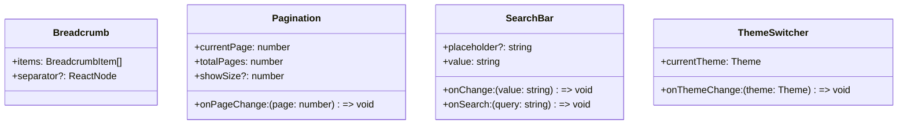

**Usage:**
```tsx
// Breadcrumb navigation
<Breadcrumb
  items={[
    { label: 'Dashboard', href: '/dashboard' },
    { label: 'Users', href: '/dashboard/users' },
    { label: 'Create User', href: '/dashboard/users/create' }
  ]}
/>

// Search with debounced input
<SearchBar
  placeholder="Search users..."
  value={searchQuery}
  onChange={setSearchQuery}
  onSearch={handleSearch}
/>
```

### Form Molecules (`molecules/form/`)

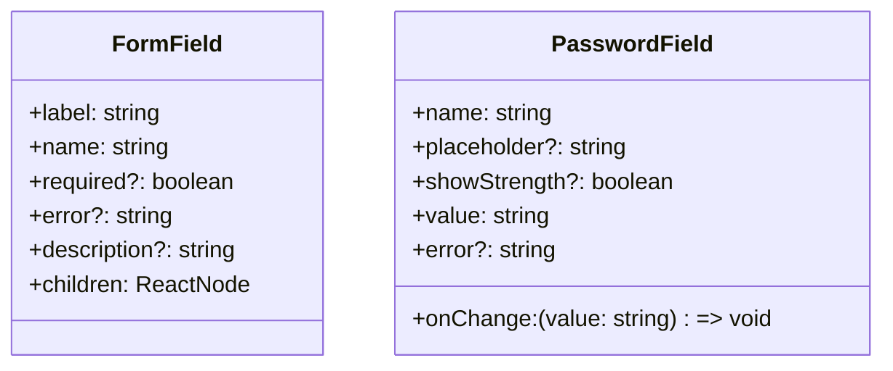

**Usage:**
```tsx
// Complete form field
<FormField
  label="Email Address"
  name="email"
  required
  error={errors.email}
  description="We'll never share your email"
>
  <Input
    type="email"
    placeholder="Enter your email"
    value={email}
    onChange={setEmail}
  />
</FormField>

// Password field with strength indicator
<PasswordField
  name="password"
  placeholder="Enter your password"
  showStrength
  value={password}
  onChange={setPassword}
  error={errors.password}
/>
```

### Sidebar Molecules (`molecules/sidebar/`)

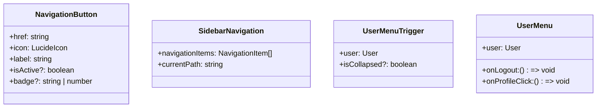

**Usage:**
```tsx
// Navigation button with icon
<NavigationButton
  href="/dashboard/users"
  icon={Users}
  label="User Management"
  isActive={pathname === '/dashboard/users'}
  badge={pendingUsersCount}
/>

// User menu in sidebar
<UserMenu
  user={currentUser}
  onLogout={handleLogout}
  onProfileClick={() => router.push('/profile')}
/>
```

## 🦠 Organisms (Complex Components)

### Form Organisms (`organisms/form/`)

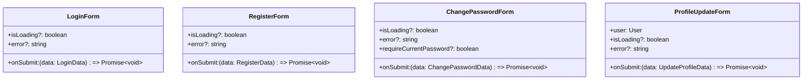

**LoginForm Implementation:**
```tsx
const LoginForm: React.FC<LoginFormProps> = ({
  onSubmit,
  isLoading = false,
  error
}) => {
  const {
    register,
    handleSubmit,
    formState: { errors }
  } = useForm<LoginData>({
    resolver: zodResolver(loginSchema)
  });

  return (
    <form onSubmit={handleSubmit(onSubmit)} className="space-y-4">
      <FormField
        label="Email"
        name="email"
        required
        error={errors.email?.message}
      >
        <Input
          type="email"
          placeholder="Enter your email"
          {...register('email')}
          disabled={isLoading}
        />
      </FormField>

      <PasswordField
        name="password"
        placeholder="Enter your password"
        {...register('password')}
        error={errors.password?.message}
        disabled={isLoading}
      />

      {error && <Alert variant="destructive">{error}</Alert>}

      <Button
        type="submit"
        className="w-full"
        disabled={isLoading}
        loading={isLoading}
      >
        {isLoading ? 'Signing in...' : 'Sign In'}
      </Button>
    </form>
  );
};
```

### User Management Organisms (`organisms/user-management/`)

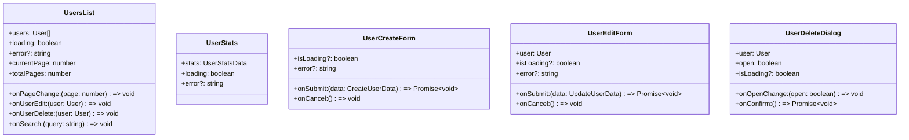

**UsersList Implementation:**
```tsx
const UsersList: React.FC<UsersListProps> = ({
  users,
  loading,
  error,
  currentPage,
  totalPages,
  onPageChange,
  onUserEdit,
  onUserDelete,
  onSearch
}) => {
  if (loading) return <Loading />;

  if (error) return <Alert variant="destructive">{error}</Alert>;

  return (
    <div className="space-y-4">
      <SearchBar
        placeholder="Search users..."
        onSearch={onSearch}
      />

      <div className="grid gap-4">
        {users.map(user => (
          <Card key={user.id} className="p-4">
            <div className="flex items-center justify-between">
              <div>
                <Typography variant="h3">{user.name}</Typography>
                <Typography variant="p" className="text-muted-foreground">
                  {user.email}
                </Typography>
              </div>
              <div className="flex items-center gap-2">
                <Badge variant={user.isActive ? "default" : "secondary"}>
                  {user.isActive ? 'Active' : 'Inactive'}
                </Badge>
                <DropdownMenu>
                  <DropdownMenuTrigger asChild>
                    <Button variant="ghost" size="icon">
                      <MoreHorizontal className="h-4 w-4" />
                    </Button>
                  </DropdownMenuTrigger>
                  <DropdownMenuContent>
                    <DropdownMenuItem onClick={() => onUserEdit(user)}>
                      Edit
                    </DropdownMenuItem>
                    <DropdownMenuItem
                      onClick={() => onUserDelete(user)}
                      className="text-destructive"
                    >
                      Delete
                    </DropdownMenuItem>
                  </DropdownMenuContent>
                </DropdownMenu>
              </div>
            </div>
          </Card>
        ))}
      </div>

      <Pagination
        currentPage={currentPage}
        totalPages={totalPages}
        onPageChange={onPageChange}
      />
    </div>
  );
};
```

## 📄 Pages (Route Components)

### Auth Pages (`pages/auth/`)

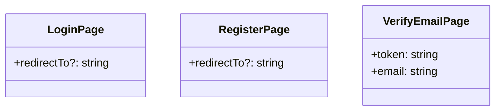

**LoginPage Implementation:**
```tsx
const LoginPage: React.FC<LoginPageProps> = ({ redirectTo = '/dashboard' }) => {
  const router = useRouter();
  const { login } = useAuth();
  const [isLoading, setIsLoading] = useState(false);
  const [error, setError] = useState<string>();

  const handleSubmit = async (data: LoginData) => {
    try {
      setIsLoading(true);
      setError(undefined);

      await login(data.email, data.password);
      router.push(redirectTo);
    } catch (err) {
      setError(err instanceof Error ? err.message : 'Login failed');
    } finally {
      setIsLoading(false);
    }
  };

  return (
    <AuthTemplate title="Sign In">
      <LoginForm
        onSubmit={handleSubmit}
        isLoading={isLoading}
        error={error}
      />

      <div className="text-center">
        <Typography variant="p">
          Don't have an account?{' '}
          <Link href="/register" className="text-primary hover:underline">
            Sign up
          </Link>
        </Typography>
      </div>
    </AuthTemplate>
  );
};
```

### Dashboard Pages (`pages/dashboard/`)

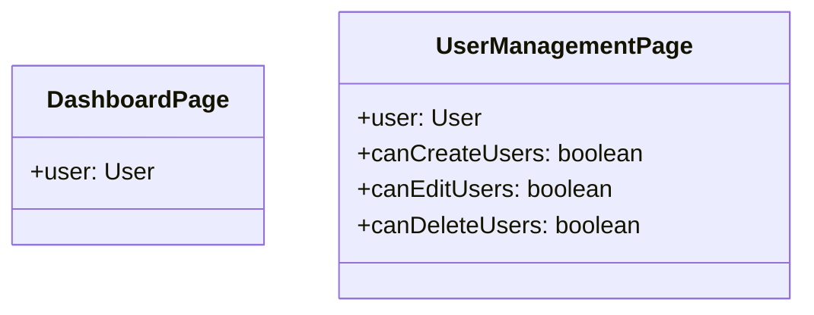

## 🎨 Templates (Layout Components)

### AuthTemplate

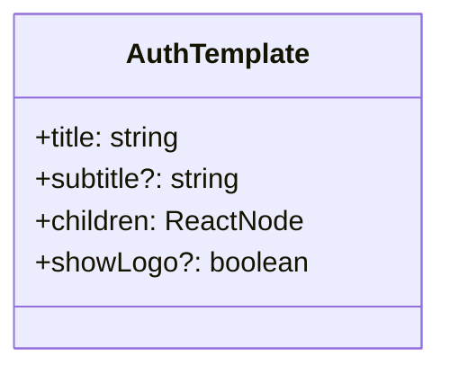

**Usage:**
```tsx
<AuthTemplate
  title="Welcome Back"
  subtitle="Sign in to your account"
  showLogo
>
  <LoginForm onSubmit={handleLogin} />
</AuthTemplate>
```

### DashboardTemplate

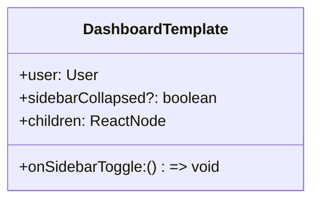

**Usage:**
```tsx
<DashboardTemplate
  user={currentUser}
  sidebarCollapsed={sidebarCollapsed}
  onSidebarToggle={toggleSidebar}
>
  <div className="p-6">
    <Typography variant="h1">Dashboard</Typography>
    {/* Dashboard content */}
  </div>
</DashboardTemplate>
```

## 🔒 Route Protection Components

### ProtectedRoute

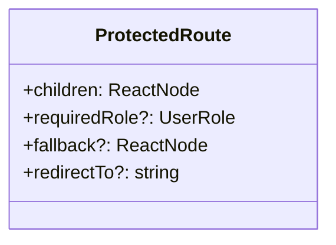

**Usage:**
```tsx
<ProtectedRoute requiredRole={UserRole.ADMIN}>
  <AdminDashboard />
</ProtectedRoute>
```

### PermissionGuard

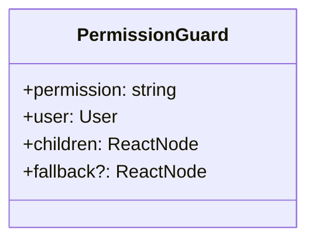

**Usage:**
```tsx
<PermissionGuard permission="users.create" user={currentUser}>
  <Button onClick={handleCreateUser}>Create User</Button>
</PermissionGuard>
```

## 🎯 Component Patterns & Best Practices

### 1. Props Interface Definition

```typescript
interface ButtonProps extends React.ButtonHTMLAttributes<HTMLButtonElement> {
  variant?: 'default' | 'destructive' | 'outline' | 'secondary' | 'ghost' | 'link';
  size?: 'default' | 'sm' | 'lg' | 'icon';
  loading?: boolean;
  children: ReactNode;
}
```

### 2. Forward Ref Pattern

```typescript
const Button = React.forwardRef<HTMLButtonElement, ButtonProps>(
  ({ className, variant, size, loading, children, ...props }, ref) => {
    return (
      <button
        className={cn(buttonVariants({ variant, size }), className)}
        ref={ref}
        disabled={loading || props.disabled}
        {...props}
      >
        {loading && <Loading size="sm" />}
        {children}
      </button>
    );
  }
);
Button.displayName = 'Button';
```

### 3. Compound Components Pattern

```typescript
interface DialogProps {
  open: boolean;
  onOpenChange: (open: boolean) => void;
  children: ReactNode;
}

const Dialog: React.FC<DialogProps> & {
  Trigger: typeof DialogTrigger;
  Content: typeof DialogContent;
  Header: typeof DialogHeader;
  Title: typeof DialogTitle;
  Description: typeof DialogDescription;
  Footer: typeof DialogFooter;
} = ({ children, ...props }) => {
  // Implementation
};

Dialog.Trigger = DialogTrigger;
Dialog.Content = DialogContent;
// ... other compound components
```

### 4. Custom Hooks for Logic

```typescript
const useUsers = () => {
  const [users, setUsers] = useState<User[]>([]);
  const [loading, setLoading] = useState(false);
  const [error, setError] = useState<string>();

  const fetchUsers = useCallback(async (params?: UserQueryParams) => {
    try {
      setLoading(true);
      setError(undefined);
      const result = await container.userManagementService.getUsers(params || {});
      setUsers(result);
    } catch (err) {
      setError(err instanceof Error ? err.message : 'Failed to fetch users');
    } finally {
      setLoading(false);
    }
  }, []);

  return {
    users,
    loading,
    error,
    fetchUsers,
  };
};
```

### 5. Error Boundaries

```typescript
class ErrorBoundary extends React.Component<
  ErrorBoundaryProps,
  ErrorBoundaryState
> {
  constructor(props: ErrorBoundaryProps) {
    super(props);
    this.state = { hasError: false, error: null };
  }

  static getDerivedStateFromError(error: Error): ErrorBoundaryState {
    return { hasError: true, error };
  }

  componentDidCatch(error: Error, errorInfo: React.ErrorInfo) {
    logger.error('Component error boundary caught an error', {
      error: error.message,
      stack: error.stack,
      componentStack: errorInfo.componentStack,
    });
  }

  render() {
    if (this.state.hasError) {
      return this.props.fallback || <ErrorFallback error={this.state.error} />;
    }

    return this.props.children;
  }
}
```

## 🎨 Styling Patterns

### 1. Class Variance Authority (CVA)

```typescript
import { cva, type VariantProps } from 'class-variance-authority';

const buttonVariants = cva(
  'inline-flex items-center justify-center rounded-md text-sm font-medium transition-colors focus-visible:outline-none focus-visible:ring-2 focus-visible:ring-ring focus-visible:ring-offset-2 disabled:opacity-50 disabled:pointer-events-none ring-offset-background',
  {
    variants: {
      variant: {
        default: 'bg-primary text-primary-foreground hover:bg-primary/90',
        destructive: 'bg-destructive text-destructive-foreground hover:bg-destructive/90',
        outline: 'border border-input hover:bg-accent hover:text-accent-foreground',
        secondary: 'bg-secondary text-secondary-foreground hover:bg-secondary/80',
        ghost: 'hover:bg-accent hover:text-accent-foreground',
        link: 'underline-offset-4 hover:underline text-primary',
      },
      size: {
        default: 'h-10 py-2 px-4',
        sm: 'h-9 px-3 rounded-md',
        lg: 'h-11 px-8 rounded-md',
        icon: 'h-10 w-10',
      },
    },
    defaultVariants: {
      variant: 'default',
      size: 'default',
    },
  }
);
```

### 2. Utility Classes with clsx/tailwind-merge

```typescript
import { clsx, type ClassValue } from 'clsx';
import { twMerge } from 'tailwind-merge';

export function cn(...inputs: ClassValue[]) {
  return twMerge(clsx(inputs));
}

// Usage
const buttonClasses = cn(
  'base-classes',
  variant === 'primary' && 'primary-classes',
  size === 'large' && 'large-classes',
  className // Additional classes from props
);
```

### 3. Theme-Aware Styling

```typescript
const ThemeAwareComponent = () => {
  return (
    <div className="bg-background text-foreground border-border">
      {/* Content automatically adapts to light/dark theme */}
    </div>
  );
};
```

This component structure provides a scalable, maintainable, and consistent UI architecture following Atomic Design principles and modern React patterns.
