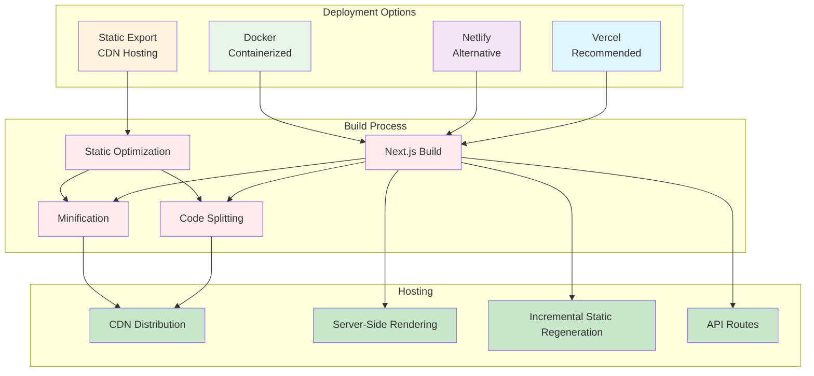

# Deployment & Environment Configuration

## Overview

This guide covers the deployment process and environment configuration for the ABC Dashboard frontend application. The application supports multiple deployment strategies and comprehensive environment management.

## 🚀 Deployment Strategies



## ⚙️ Environment Configuration

### Environment Files Structure

```
frontend/
├── .env.example          # Template file
├── .env.local           # Local development (ignored by git)
├── .env.development     # Development environment
├── .env.staging         # Staging environment
├── .env.production      # Production environment
└── next.config.ts       # Next.js configuration
```

### Environment Variables

#### Required Variables

```bash
# Backend API Configuration
NEXT_PUBLIC_API_URL=https://api.yourdomain.com/api

# Application Configuration
NEXT_PUBLIC_APP_NAME=ABC Dashboard
NEXT_PUBLIC_APP_ENV=production
```

#### Optional Variables

```bash
# External Services
NEXT_PUBLIC_SENTRY_DSN=https://your-sentry-dsn@sentry.io/project
NEXT_PUBLIC_GA_TRACKING_ID=GA-XXXXXXXXXX
NEXT_PUBLIC_HOTJAR_ID=your-hotjar-id

# Feature Flags
NEXT_PUBLIC_ENABLE_ANALYTICS=true
NEXT_PUBLIC_ENABLE_ERROR_REPORTING=true
NEXT_PUBLIC_ENABLE_DEBUG_MODE=false

# Security
NEXT_PUBLIC_CSP_NONCE_ENABLED=true
NEXT_PUBLIC_CSP_REPORT_URI=/api/csp-report

# Performance
NEXT_PUBLIC_ENABLE_PWA=true
NEXT_PUBLIC_SW_PATH=/sw.js
```

### Environment-Specific Configurations

#### Development (.env.development)

```bash
# Development environment settings
NEXT_PUBLIC_API_URL=http://localhost:5000/api/v1
NEXT_PUBLIC_APP_ENV=development
NEXT_PUBLIC_ENABLE_DEBUG_MODE=true
NEXT_PUBLIC_ENABLE_ANALYTICS=false
NEXT_PUBLIC_ENABLE_ERROR_REPORTING=false

# Development-specific settings
NEXT_PUBLIC_DEV_TOOLS_ENABLED=true
NEXT_PUBLIC_MSW_ENABLED=true
```

#### Staging (.env.staging)

```bash
# Staging environment settings
NEXT_PUBLIC_API_URL=https://api-staging.yourdomain.com/api
NEXT_PUBLIC_APP_ENV=staging
NEXT_PUBLIC_ENABLE_DEBUG_MODE=false
NEXT_PUBLIC_ENABLE_ANALYTICS=true
NEXT_PUBLIC_ENABLE_ERROR_REPORTING=true

# Staging monitoring
NEXT_PUBLIC_SENTRY_DSN=https://staging-sentry-dsn@sentry.io/project
NEXT_PUBLIC_GA_TRACKING_ID=GA-STAGING-XXXX
```

#### Production (.env.production)

```bash
# Production environment settings
NEXT_PUBLIC_API_URL=https://api.yourdomain.com/api
NEXT_PUBLIC_APP_ENV=production
NEXT_PUBLIC_ENABLE_DEBUG_MODE=false
NEXT_PUBLIC_ENABLE_ANALYTICS=true
NEXT_PUBLIC_ENABLE_ERROR_REPORTING=true

# Production monitoring
NEXT_PUBLIC_SENTRY_DSN=https://prod-sentry-dsn@sentry.io/project
NEXT_PUBLIC_GA_TRACKING_ID=GA-PROD-XXXXXXXXXX

# Security headers
NEXT_PUBLIC_CSP_NONCE_ENABLED=true
NEXT_PUBLIC_CSP_REPORT_URI=https://yourdomain.com/api/csp-report
```

## 🔧 Next.js Configuration

### next.config.ts

```typescript
import type { NextConfig } from 'next';

const nextConfig: NextConfig = {
  // Environment-specific configuration
  env: {
    APP_ENV: process.env.NEXT_PUBLIC_APP_ENV || 'development',
  },

  // Image optimization
  images: {
    domains: ['your-cdn-domain.com', 'avatars.githubusercontent.com'],
    formats: ['image/webp', 'image/avif'],
    minimumCacheTTL: 60,
  },

  // Headers for security and performance
  async headers() {
    return [
      {
        source: '/(.*)',
        headers: [
          {
            key: 'X-Frame-Options',
            value: 'DENY',
          },
          {
            key: 'X-Content-Type-Options',
            value: 'nosniff',
          },
          {
            key: 'Referrer-Policy',
            value: 'strict-origin-when-cross-origin',
          },
        ],
      },
      {
        source: '/api/(.*)',
        headers: [
          {
            key: 'Cache-Control',
            value: 'no-cache, no-store, must-revalidate',
          },
        ],
      },
    ];
  },

  // Redirects and rewrites
  async redirects() {
    return [
      {
        source: '/home',
        destination: '/',
        permanent: true,
      },
    ];
  },

  async rewrites() {
    return [
      {
        source: '/api/(.*)',
        destination: `${process.env.NEXT_PUBLIC_API_URL}/$1`,
      },
    ];
  },

  // Compression
  compress: true,

  // Build optimization
  swcMinify: true,

  // Output configuration
  output: 'standalone', // For Docker deployment

  // Experimental features
  experimental: {
    optimizeCss: true,
    scrollRestoration: true,
  },

  // Webpack configuration
  webpack: (config, { dev, isServer }) => {
    // Add custom webpack rules here

    // Bundle analyzer in development
    if (dev && !isServer) {
      const { BundleAnalyzerPlugin } = require('webpack-bundle-analyzer');
      if (process.env.ANALYZE === 'true') {
        config.plugins.push(
          new BundleAnalyzerPlugin({
            analyzerMode: 'server',
            openAnalyzer: true,
          })
        );
      }
    }

    return config;
  },
};

export default nextConfig;
```

## 🐳 Docker Deployment

### Dockerfile

```dockerfile
# Use Node.js 18 Alpine for smaller image size
FROM node:18-alpine AS base

# Install dependencies only when needed
FROM base AS deps
RUN apk add --no-cache libc6-compat
WORKDIR /app

# Copy package files
COPY package.json package-lock.json ./
RUN npm ci --only=production && npm cache clean --force

# Rebuild the source code only when needed
FROM base AS builder
WORKDIR /app
COPY --from=deps /app/node_modules ./node_modules
COPY . .

# Set build arguments
ARG NEXT_PUBLIC_API_URL
ARG NEXT_PUBLIC_APP_ENV
ENV NEXT_PUBLIC_API_URL=$NEXT_PUBLIC_API_URL
ENV NEXT_PUBLIC_APP_ENV=$NEXT_PUBLIC_APP_ENV

# Build the application
RUN npm run build

# Production image, copy all the files and run next
FROM base AS runner
WORKDIR /app

ENV NODE_ENV=production

# Create a non-root user
RUN addgroup --system --gid 1001 nodejs
RUN adduser --system --uid 1001 nextjs

# Copy the built application
COPY --from=builder /app/public ./public
COPY --from=builder --chown=nextjs:nodejs /app/.next/standalone ./
COPY --from=builder --chown=nextjs:nodejs /app/.next/static ./.next/static

USER nextjs

# Expose the port
EXPOSE 3000

# Set environment variables
ENV PORT=3000
ENV HOSTNAME="0.0.0.0"

# Start the application
CMD ["node", "server.js"]
```

### Docker Compose

```yaml
version: '3.8'

services:
  abc-dashboard:
    build:
      context: .
      dockerfile: Dockerfile
      args:
        NEXT_PUBLIC_API_URL: ${NEXT_PUBLIC_API_URL}
        NEXT_PUBLIC_APP_ENV: ${NEXT_PUBLIC_APP_ENV}
    ports:
      - "3000:3000"
    environment:
      - NODE_ENV=production
      - NEXT_PUBLIC_API_URL=${NEXT_PUBLIC_API_URL}
      - NEXT_PUBLIC_APP_ENV=${NEXT_PUBLIC_APP_ENV}
    restart: unless-stopped
    healthcheck:
      test: ["CMD", "curl", "-f", "http://localhost:3000/api/health"]
      interval: 30s
      timeout: 10s
      retries: 3
```

## 🚀 Vercel Deployment

### vercel.json

```json
{
  "version": 2,
  "builds": [
    {
      "src": "package.json",
      "use": "@vercel/next"
    }
  ],
  "functions": {
    "src/pages/api/**/*.ts": {
      "runtime": "nodejs18.x"
    }
  },
  "regions": ["iad1"],
  "env": {
    "NEXT_PUBLIC_APP_ENV": "production"
  },
  "headers": [
    {
      "source": "/(.*)",
      "headers": [
        {
          "key": "X-Frame-Options",
          "value": "DENY"
        },
        {
          "key": "X-Content-Type-Options",
          "value": "nosniff"
        },
        {
          "key": "Referrer-Policy",
          "value": "strict-origin-when-cross-origin"
        }
      ]
    }
  ],
  "rewrites": [
    {
      "source": "/api/(.*)",
      "destination": "https://api.yourdomain.com/api/$1"
    }
  ]
}
```

### Vercel Environment Variables

Set these in your Vercel dashboard:

```
NEXT_PUBLIC_API_URL=https://api.yourdomain.com/api
NEXT_PUBLIC_APP_ENV=production
NEXT_PUBLIC_SENTRY_DSN=your-sentry-dsn
NEXT_PUBLIC_GA_TRACKING_ID=GA-XXXXXXXXXX
```

## 📦 Static Export Deployment

### Next.js Static Export Configuration

```typescript
// next.config.ts for static export
const nextConfig: NextConfig = {
  output: 'export',
  trailingSlash: true,
  images: {
    unoptimized: true, // Required for static export
  },
  // Disable server-side features
  experimental: {
    // Disable ISR and SSR features that require a server
  },
};

export default nextConfig;
```

### Build Script for Static Export

```bash
# Build static export
npm run build

# The static files will be in the 'out' directory
# Deploy the 'out' directory to your CDN/hosting provider
```

## 🔒 Security Configuration

### Content Security Policy (CSP)

```typescript
// next.config.ts - CSP headers
async headers() {
  const csp = [
    "default-src 'self'",
    "script-src 'self' 'unsafe-inline' 'unsafe-eval' *.google-analytics.com *.googletagmanager.com",
    "style-src 'self' 'unsafe-inline' fonts.googleapis.com",
    "font-src 'self' fonts.gstatic.com",
    "img-src 'self' data: https: *.gravatar.com",
    "connect-src 'self' *.sentry.io",
    "frame-ancestors 'none'",
    "base-uri 'self'",
    "form-action 'self'",
  ].join('; ');

  return [
    {
      source: '/(.*)',
      headers: [
        {
          key: 'Content-Security-Policy',
          value: process.env.NODE_ENV === 'production' ? csp : "default-src 'self' 'unsafe-inline' 'unsafe-eval'",
        },
      ],
    },
  ];
}
```

### HTTPS and SSL

```typescript
// next.config.ts - HTTPS enforcement
const nextConfig: NextConfig = {
  // Force HTTPS in production
  ...(process.env.NODE_ENV === 'production' && {
    async redirects() {
      return [
        {
          source: '/(.*)',
          destination: 'https://yourdomain.com/:1',
          permanent: true,
          has: [
            {
              type: 'header',
              key: 'x-forwarded-proto',
              value: 'http',
            },
          ],
        },
      ];
    },
  }),
};
```

## 📊 Monitoring and Analytics

### Sentry Error Reporting

```typescript
// instrumentation.ts (App Router)
export async function register() {
  if (process.env.NEXT_RUNTIME === 'nodejs') {
    await import('./sentry.server.config');
  }

  if (process.env.NEXT_RUNTIME === 'edge') {
    await import('./sentry.edge.config');
  }
}

// sentry.client.config.ts
import * as Sentry from '@sentry/nextjs';

Sentry.init({
  dsn: process.env.NEXT_PUBLIC_SENTRY_DSN,
  environment: process.env.NEXT_PUBLIC_APP_ENV,
  tracesSampleRate: process.env.NODE_ENV === 'production' ? 0.1 : 1.0,
  replaysOnErrorSampleRate: 1.0,
  replaysSessionSampleRate: process.env.NODE_ENV === 'production' ? 0.1 : 1.0,
  integrations: [
    new Sentry.Replay({
      maskAllText: true,
      blockAllMedia: true,
    }),
  ],
});
```

### Google Analytics

```typescript
// lib/analytics.ts
import { GoogleAnalytics } from '@next/third-parties/google';

export function Analytics() {
  if (!process.env.NEXT_PUBLIC_GA_TRACKING_ID) {
    return null;
  }

  return <GoogleAnalytics gaId={process.env.NEXT_PUBLIC_GA_TRACKING_ID} />;
}
```

## 🔄 CI/CD Pipeline

### GitHub Actions Workflow

```yaml
# .github/workflows/deploy.yml
name: Deploy to Production

on:
  push:
    branches: [main]
  workflow_dispatch:

env:
  REGISTRY: ghcr.io
  IMAGE_NAME: ${{ github.repository }}

jobs:
  build-and-deploy:
    runs-on: ubuntu-latest

    steps:
      - name: Checkout repository
        uses: actions/checkout@v4

      - name: Set up Node.js
        uses: actions/setup-node@v4
        with:
          node-version: '18'
          cache: 'npm'

      - name: Install dependencies
        run: npm ci

      - name: Run tests
        run: npm run test:ci

      - name: Build application
        run: npm run build
        env:
          NEXT_PUBLIC_API_URL: ${{ secrets.NEXT_PUBLIC_API_URL }}
          NEXT_PUBLIC_APP_ENV: production

      - name: Run linting
        run: npm run lint

      - name: Deploy to Vercel
        uses: amondnet/vercel-action@v25
        with:
          vercel-token: ${{ secrets.VERCEL_TOKEN }}
          vercel-org-id: ${{ secrets.VERCEL_ORG_ID }}
          vercel-project-id: ${{ secrets.VERCEL_PROJECT_ID }}
          vercel-args: '--prod'
```

## 📈 Performance Optimization

### Build Optimization

```typescript
// next.config.ts - Performance optimizations
const nextConfig: NextConfig = {
  // Enable SWC minification
  swcMinify: true,

  // Optimize CSS
  experimental: {
    optimizeCss: true,
  },

  // Bundle analyzer (conditionally)
  webpack: (config, { dev }) => {
    if (!dev && process.env.ANALYZE === 'true') {
      const { BundleAnalyzerPlugin } = require('webpack-bundle-analyzer');
      config.plugins.push(
        new BundleAnalyzerPlugin({
          analyzerMode: 'static',
          openAnalyzer: false,
          reportFilename: './analyze/client.html',
        })
      );
    }
    return config;
  },
};
```

### Runtime Optimization

```typescript
// _app.tsx - Performance monitoring
import { useEffect } from 'react';
import { useRouter } from 'next/router';

function MyApp({ Component, pageProps }) {
  const router = useRouter();

  useEffect(() => {
    // Log route changes for performance monitoring
    const handleRouteChange = (url: string) => {
      if (process.env.NODE_ENV === 'production') {
        // Send to analytics
        console.log('Route changed:', url);
      }
    };

    router.events.on('routeChangeComplete', handleRouteChange);
    return () => router.events.off('routeChangeComplete', handleRouteChange);
  }, [router.events]);

  return <Component {...pageProps} />;
}

export default MyApp;
```

## 🧪 Testing Deployment

### Smoke Tests

```typescript
// cypress/integration/smoke-tests.spec.ts
describe('Smoke Tests', () => {
  it('should load the homepage', () => {
    cy.visit('/');
    cy.contains('ABC Dashboard').should('be.visible');
  });

  it('should handle authentication flow', () => {
    cy.visit('/login');
    cy.get('[data-testid="email-input"]').type('test@example.com');
    cy.get('[data-testid="password-input"]').type('password');
    cy.get('[data-testid="login-button"]').click();
    cy.url().should('include', '/dashboard');
  });

  it('should be responsive', () => {
    cy.viewport('iphone-6');
    cy.visit('/');
    cy.get('[data-testid="mobile-menu"]').should('be.visible');
  });
});
```

### Health Checks

```typescript
// pages/api/health.ts
import type { NextApiRequest, NextApiResponse } from 'next';

export default async function handler(
  req: NextApiRequest,
  res: NextApiResponse
) {
  if (req.method !== 'GET') {
    return res.status(405).json({ message: 'Method not allowed' });
  }

  try {
    // Check database connectivity
    // Check external API connectivity
    // Check cache connectivity

    res.status(200).json({
      status: 'healthy',
      timestamp: new Date().toISOString(),
      environment: process.env.NEXT_PUBLIC_APP_ENV,
      version: process.env.npm_package_version,
    });
  } catch (error) {
    res.status(500).json({
      status: 'unhealthy',
      timestamp: new Date().toISOString(),
      error: error.message,
    });
  }
}
```

## 🚨 Rollback Strategy

### Blue-Green Deployment

```typescript
// deployment script
const deploy = async (environment: string) => {
  const blue = `${environment}-blue`;
  const green = `${environment}-green`;

  // Determine which is active
  const active = await getActiveDeployment(environment);

  // Deploy to inactive environment
  const target = active === blue ? green : blue;
  await deployToEnvironment(target);

  // Run health checks
  await runHealthChecks(target);

  // Switch traffic
  await switchTraffic(target);

  // Run smoke tests on active environment
  await runSmokeTests(active);

  // Keep old deployment for rollback
  await keepOldDeployment(active, 24); // 24 hours
};
```

### Feature Flags for Gradual Rollout

```typescript
// Feature flag implementation
const features = {
  newDashboard: process.env.NEXT_PUBLIC_ENABLE_NEW_DASHBOARD === 'true',
  advancedAnalytics: process.env.NEXT_PUBLIC_ENABLE_ADVANCED_ANALYTICS === 'true',
};

export const useFeatureFlag = (feature: keyof typeof features): boolean => {
  return features[feature] || false;
};
```

This deployment guide provides comprehensive coverage of all deployment strategies, configuration management, security, and monitoring for the ABC Dashboard frontend application.
