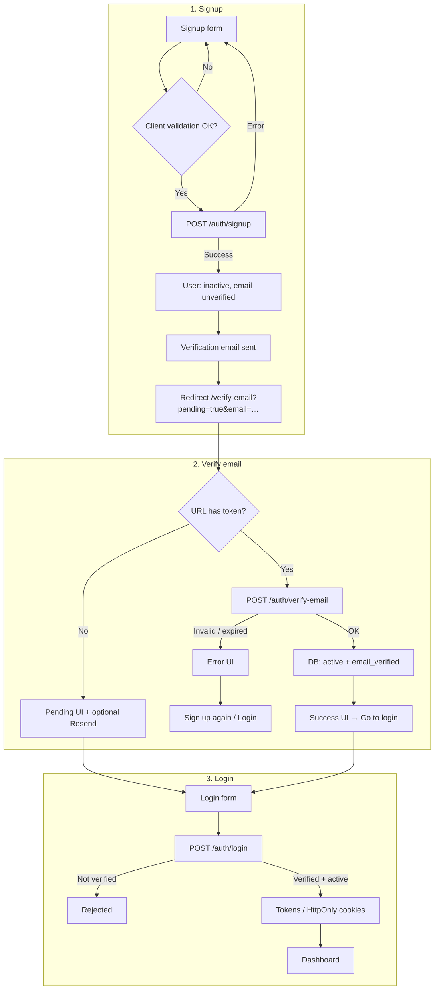
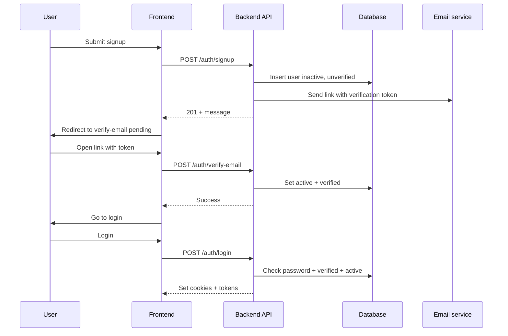
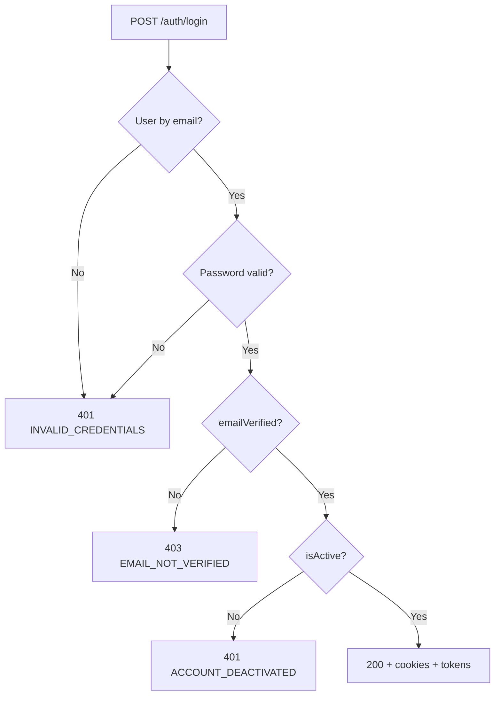

# Signup and email verification

This guide describes the **self-serve signup** path: account creation, verification email, activation, and **login**. License access for agents is assigned manually (e.g. a manager sets the agent’s email on the license **Agents** field in License Management)—there is **no** automatic license assignment on signup or verify. For password reset, session cookies, and middleware, see [authentication-flow.md](./authentication-flow.md).

## Summary

1. User submits **signup** (`POST /auth/signup`). The API creates a user with **`email_verified: false`** and **`is_active: false`**, then sends a verification email (link includes a JWT; URL uses backend **`CLIENT_URL`**).
2. The app redirects to **`/verify-email?pending=true&email=…`**. The user opens the link from email (**`/verify-email?token=…`**).
3. The app calls **`POST /auth/verify-email`**. On success the API sets **`email_verified: true`** and **`is_active: true`**. It does **not** create license assignments; staff link agents to licenses in License Management.
4. The user **logs in**. Login requires **verified email** and **active** account before tokens/cookies are issued.

Signup does **not** return tokens. Verification does **not** log the user in automatically.

## User journey

## System sequence

## Login gate (after password is valid)

Order matches [authentication-flow.md](./authentication-flow.md): invalid password always yields generic invalid credentials; only then does the API return **email not verified** or **account deactivated**.

## Payload and UX notes

- **Frontend signup** sends `email`, `password`, `role` (`agent` | `tech` | `accountant`), and optional `phone`. The email field may be labeled **License Email** in the UI as a hint for agents; it does not trigger automatic license linking.
- **Backend** accepts optional `firstName`, `lastName`, and `username`. If names are omitted, **`displayName`** falls back to the **local part of the email** (before `@`). Username is derived and uniquified when not provided.
- **Resend verification**: from the pending verify screen when `email` is present, **`POST /auth/resend-verification`** (enumeration-safe messaging).

## Code reference

| Area | Location |
|------|----------|
| Signup form | `frontend/src/presentation/components/organisms/auth/signup-form.tsx` |
| Verify page | `frontend/src/presentation/components/pages/auth/verify-email-page.tsx` |
| Auth store (signup / verify / resend) | `frontend/src/infrastructure/stores/auth/auth-store.ts` |
| Auth API client | `frontend/src/infrastructure/api/auth/auth-api.ts` |
| Signup use case | `backend/src/application/use-cases/auth/signup-use-case.js` |
| Verify use case | `backend/src/application/use-cases/auth/verify-email-use-case.js` |
| Joi signup schema | `backend/src/infrastructure/api/v1/schemas/auth.schemas.js` |
| Routes + rate limits | `backend/src/infrastructure/routes/auth-routes.js` |
| Activate user on verify | `backend/src/infrastructure/repositories/user-repository.js` (`updateEmailVerification`) |
## Configuration

Set **`CLIENT_URL`** in the backend environment to the public Next.js origin so verification links open the correct host. See also the “Email links and config” note in [authentication-flow.md](./authentication-flow.md).

## See also

- [authentication-flow.md](./authentication-flow.md) — full auth architecture, forgot-password, resend diagrams, middleware, and cookies.
