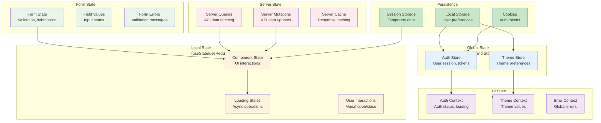
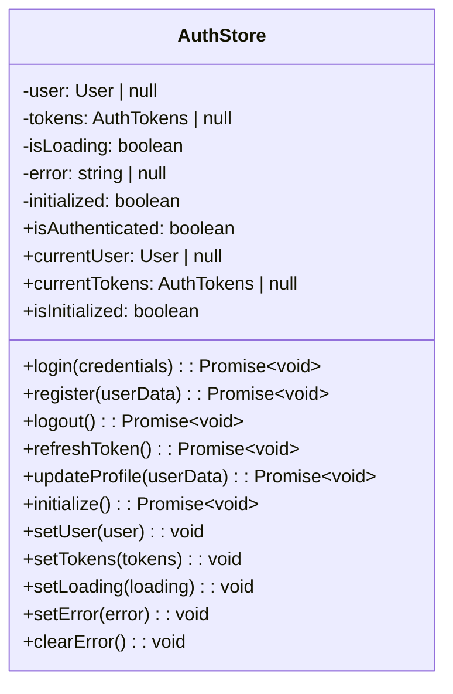
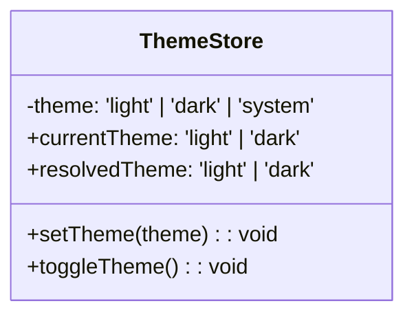
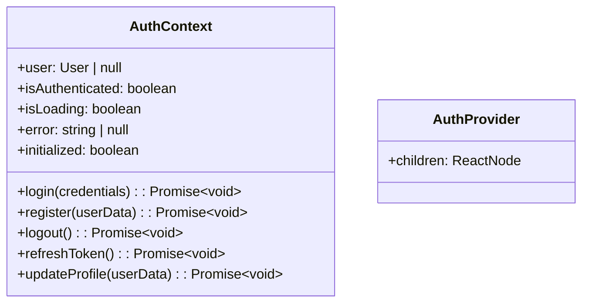
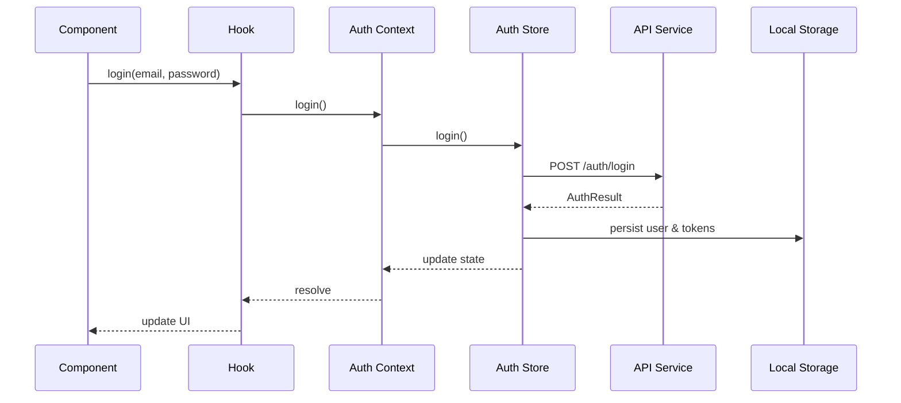
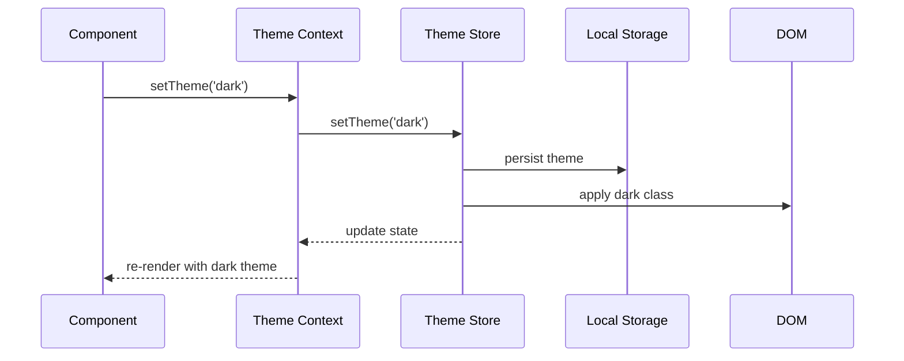
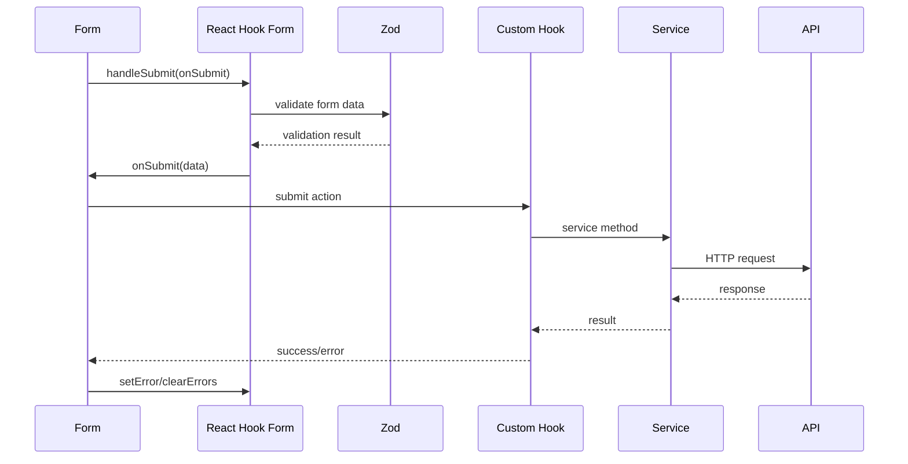

# State Management Architecture

## Overview

The ABC Dashboard frontend uses a multi-layered state management approach combining Zustand for global state, React Context for UI state, and React Hook Form for form state. This document explains the state management patterns and implementation.

## 🏗️ State Management Layers



## 📦 Zustand Stores

### Auth Store (`infrastructure/stores/auth-store.ts`)



**Implementation:**
```typescript
import { create } from 'zustand';
import { devtools, persist } from 'zustand/middleware';
import { User, AuthTokens } from '@/domain/entities/user-entity';
import { AuthService } from '@/application/services/auth-service';
import { container } from '@/shared/di/container';

interface AuthState {
  // State
  user: User | null;
  tokens: AuthTokens | null;
  isLoading: boolean;
  error: string | null;
  initialized: boolean;

  // Actions
  login: (email: string, password: string) => Promise<void>;
  register: (userData: RegisterData) => Promise<void>;
  logout: () => Promise<void>;
  refreshToken: () => Promise<void>;
  updateProfile: (userData: UpdateProfileData) => Promise<void>;
  initialize: () => Promise<void>;

  // Setters
  setUser: (user: User | null) => void;
  setTokens: (tokens: AuthTokens | null) => void;
  setLoading: (loading: boolean) => void;
  setError: (error: string | null) => void;
  clearError: () => void;
}

export const useAuthStore = create<AuthState>()(
  devtools(
    persist(
      (set, get) => ({
        // Initial state
        user: null,
        tokens: null,
        isLoading: false,
        error: null,
        initialized: false,

        // Computed properties
        isAuthenticated: () => !!get().user && !!get().tokens,

        // Actions
        login: async (email: string, password: string) => {
          try {
            set({ isLoading: true, error: null });

            const authService = container.authService;
            const result = await authService.login(email, password);

            if (result.isAuthenticated) {
              set({
                user: result.user,
                tokens: result.tokens,
                isLoading: false,
                initialized: true,
              });
            } else {
              throw new Error('Authentication failed');
            }
          } catch (error) {
            const errorMessage = error instanceof Error ? error.message : 'Login failed';
            set({
              isLoading: false,
              error: errorMessage,
              initialized: true,
            });
            throw error;
          }
        },

        register: async (userData: RegisterData) => {
          try {
            set({ isLoading: true, error: null });

            const authService = container.authService;
            const result = await authService.register(userData);

            set({
              user: result.user,
              tokens: result.tokens,
              isLoading: false,
              initialized: true,
            });
          } catch (error) {
            const errorMessage = error instanceof Error ? error.message : 'Registration failed';
            set({ isLoading: false, error: errorMessage });
            throw error;
          }
        },

        logout: async () => {
          try {
            const authService = container.authService;
            await authService.logout();

            set({
              user: null,
              tokens: null,
              error: null,
              initialized: true,
            });
          } catch (error) {
            // Even if logout fails, clear local state
            set({
              user: null,
              tokens: null,
              error: null,
              initialized: true,
            });
          }
        },

        refreshToken: async () => {
          try {
            const authService = container.authService;
            const newTokens = await authService.refreshToken();

            set({ tokens: newTokens });
          } catch (error) {
            // If refresh fails, logout user
            await get().logout();
            throw error;
          }
        },

        updateProfile: async (userData: UpdateProfileData) => {
          try {
            set({ isLoading: true, error: null });

            const authService = container.authService;
            const updatedUser = await authService.updateProfile(userData);

            set({
              user: updatedUser,
              isLoading: false,
            });
          } catch (error) {
            const errorMessage = error instanceof Error ? error.message : 'Profile update failed';
            set({ isLoading: false, error: errorMessage });
            throw error;
          }
        },

        initialize: async () => {
          try {
            // Check if we have stored tokens
            const storedTokens = get().tokens;

            if (storedTokens && !storedTokens.isExpired()) {
              // Try to refresh token to validate it's still valid
              await get().refreshToken();
            } else if (storedTokens) {
              // Tokens exist but are expired, try to refresh
              try {
                await get().refreshToken();
              } catch {
                // If refresh fails, clear tokens
                set({ tokens: null, user: null });
              }
            }

            set({ initialized: true });
          } catch (error) {
            set({ initialized: true });
          }
        },

        // Setters
        setUser: (user) => set({ user }),
        setTokens: (tokens) => set({ tokens }),
        setLoading: (isLoading) => set({ isLoading }),
        setError: (error) => set({ error }),
        clearError: () => set({ error: null }),
      }),
      {
        name: 'auth-storage',
        partialize: (state) => ({
          user: state.user,
          tokens: state.tokens,
        }),
      }
    ),
    { name: 'auth-store' }
  )
);
```

### Theme Store (`infrastructure/stores/theme-store.ts`)



**Implementation:**
```typescript
import { create } from 'zustand';
import { devtools, persist } from 'zustand/middleware';

type Theme = 'light' | 'dark' | 'system';

interface ThemeState {
  theme: Theme;
  setTheme: (theme: Theme) => void;
  toggleTheme: () => void;
  resolvedTheme: 'light' | 'dark';
}

export const useThemeStore = create<ThemeState>()(
  devtools(
    persist(
      (set, get) => ({
        theme: 'system',

        setTheme: (theme: Theme) => {
          set({ theme });

          // Apply theme to document
          const resolvedTheme = getResolvedTheme(theme);
          applyTheme(resolvedTheme);
        },

        toggleTheme: () => {
          const currentTheme = get().theme;
          const newTheme = currentTheme === 'light' ? 'dark' : 'light';
          get().setTheme(newTheme);
        },

        get resolvedTheme() {
          return getResolvedTheme(get().theme);
        },
      }),
      {
        name: 'theme-storage',
      }
    ),
    { name: 'theme-store' }
  )
);

function getResolvedTheme(theme: Theme): 'light' | 'dark' {
  if (theme === 'system') {
    return window.matchMedia('(prefers-color-scheme: dark)').matches ? 'dark' : 'light';
  }
  return theme;
}

function applyTheme(theme: 'light' | 'dark') {
  const root = document.documentElement;

  if (theme === 'dark') {
    root.classList.add('dark');
  } else {
    root.classList.remove('dark');
  }
}
```

## 🌐 React Contexts

### Auth Context (`presentation/contexts/auth-context.tsx`)



**Implementation:**
```typescript
import React, { createContext, useContext, useEffect, ReactNode } from 'react';
import { User } from '@/domain/entities/user-entity';
import { useAuthStore } from '@/infrastructure/stores/auth-store';

interface AuthContextType {
  // State
  user: User | null;
  isAuthenticated: boolean;
  isLoading: boolean;
  error: string | null;
  initialized: boolean;

  // Actions
  login: (email: string, password: string) => Promise<void>;
  register: (userData: RegisterData) => Promise<void>;
  logout: () => Promise<void>;
  refreshToken: () => Promise<void>;
  updateProfile: (userData: UpdateProfileData) => Promise<void>;
}

const AuthContext = createContext<AuthContextType | undefined>(undefined);

interface AuthProviderProps {
  children: ReactNode;
}

export const AuthProvider: React.FC<AuthProviderProps> = ({ children }) => {
  const authStore = useAuthStore();

  // Initialize auth state on mount
  useEffect(() => {
    if (!authStore.initialized) {
      authStore.initialize();
    }
  }, [authStore]);

  // Auto-refresh token before expiration
  useEffect(() => {
    if (authStore.tokens && authStore.tokens.expiresAt) {
      const expiresAt = authStore.tokens.expiresAt.getTime();
      const now = Date.now();
      const timeUntilExpiry = expiresAt - now;

      // Refresh 5 minutes before expiry
      const refreshThreshold = 5 * 60 * 1000;

      if (timeUntilExpiry > 0 && timeUntilExpiry <= refreshThreshold) {
        const timeoutId = setTimeout(() => {
          authStore.refreshToken().catch(() => {
            // If refresh fails, user will be logged out
          });
        }, timeUntilExpiry - refreshThreshold);

        return () => clearTimeout(timeoutId);
      }
    }
  }, [authStore.tokens]);

  const contextValue: AuthContextType = {
    user: authStore.user,
    isAuthenticated: authStore.isAuthenticated,
    isLoading: authStore.isLoading,
    error: authStore.error,
    initialized: authStore.initialized,
    login: authStore.login,
    register: authStore.register,
    logout: authStore.logout,
    refreshToken: authStore.refreshToken,
    updateProfile: authStore.updateProfile,
  };

  return (
    <AuthContext.Provider value={contextValue}>
      {children}
    </AuthContext.Provider>
  );
};

export const useAuth = (): AuthContextType => {
  const context = useContext(AuthContext);
  if (context === undefined) {
    throw new Error('useAuth must be used within an AuthProvider');
  }
  return context;
};
```

### Theme Context (`presentation/contexts/theme-context.tsx`)

```typescript
import React, { createContext, useContext, useEffect, ReactNode } from 'react';
import { useThemeStore } from '@/infrastructure/stores/theme-store';

interface ThemeContextType {
  theme: 'light' | 'dark' | 'system';
  resolvedTheme: 'light' | 'dark';
  setTheme: (theme: 'light' | 'dark' | 'system') => void;
  toggleTheme: () => void;
}

const ThemeContext = createContext<ThemeContextType | undefined>(undefined);

interface ThemeProviderProps {
  children: ReactNode;
  defaultTheme?: 'light' | 'dark' | 'system';
}

export const ThemeProvider: React.FC<ThemeProviderProps> = ({
  children,
  defaultTheme = 'system'
}) => {
  const themeStore = useThemeStore();

  // Initialize theme on mount
  useEffect(() => {
    if (themeStore.theme === 'system' && defaultTheme !== 'system') {
      themeStore.setTheme(defaultTheme);
    }
  }, [themeStore, defaultTheme]);

  // Listen for system theme changes
  useEffect(() => {
    const mediaQuery = window.matchMedia('(prefers-color-scheme: dark)');

    const handleChange = () => {
      if (themeStore.theme === 'system') {
        const resolvedTheme = mediaQuery.matches ? 'dark' : 'light';
        applyTheme(resolvedTheme);
      }
    };

    mediaQuery.addEventListener('change', handleChange);
    return () => mediaQuery.removeEventListener('change', handleChange);
  }, [themeStore.theme]);

  const contextValue: ThemeContextType = {
    theme: themeStore.theme,
    resolvedTheme: themeStore.resolvedTheme,
    setTheme: themeStore.setTheme,
    toggleTheme: themeStore.toggleTheme,
  };

  return (
    <ThemeContext.Provider value={contextValue}>
      {children}
    </ThemeContext.Provider>
  );
};

export const useTheme = (): ThemeContextType => {
  const context = useContext(ThemeContext);
  if (context === undefined) {
    throw new Error('useTheme must be used within a ThemeProvider');
  }
  return context;
};

function applyTheme(theme: 'light' | 'dark') {
  const root = document.documentElement;

  if (theme === 'dark') {
    root.classList.add('dark');
  } else {
    root.classList.remove('dark');
  }
}
```

### Error Context (`presentation/contexts/error-context.tsx`)

```typescript
import React, { createContext, useContext, ReactNode } from 'react';
import { useState, useCallback } from 'react';

interface ErrorContextType {
  error: Error | null;
  setError: (error: Error | null) => void;
  clearError: () => void;
}

const ErrorContext = createContext<ErrorContextType | undefined>(undefined);

interface ErrorProviderProps {
  children: ReactNode;
}

export const ErrorProvider: React.FC<ErrorProviderProps> = ({ children }) => {
  const [error, setError] = useState<Error | null>(null);

  const clearError = useCallback(() => {
    setError(null);
  }, []);

  const contextValue: ErrorContextType = {
    error,
    setError,
    clearError,
  };

  return (
    <ErrorContext.Provider value={contextValue}>
      {children}
    </ErrorContext.Provider>
  );
};

export const useError = (): ErrorContextType => {
  const context = useContext(ErrorContext);
  if (context === undefined) {
    throw new Error('useError must be used within an ErrorProvider');
  }
  return context;
};
```

## 📝 React Hook Form Integration

### Form Schema with Zod

```typescript
import { z } from 'zod';

export const loginSchema = z.object({
  email: z
    .string()
    .min(1, 'Email is required')
    .email('Invalid email format'),
  password: z
    .string()
    .min(1, 'Password is required')
    .min(8, 'Password must be at least 8 characters'),
});

export type LoginData = z.infer<typeof loginSchema>;
```

### Form Hook Usage

```typescript
import { useForm } from 'react-hook-form';
import { zodResolver } from '@hookform/resolvers/zod';
import { loginSchema, type LoginData } from '@/application/dto/auth-dto';

const LoginForm: React.FC = () => {
  const {
    register,
    handleSubmit,
    formState: { errors, isSubmitting },
    setError,
    clearErrors,
  } = useForm<LoginData>({
    resolver: zodResolver(loginSchema),
  });

  const onSubmit = async (data: LoginData) => {
    try {
      clearErrors();
      await login(data.email, data.password);
    } catch (error) {
      setError('root', {
        type: 'manual',
        message: error instanceof Error ? error.message : 'Login failed',
      });
    }
  };

  return (
    <form onSubmit={handleSubmit(onSubmit)}>
      <input
        {...register('email')}
        type="email"
        placeholder="Email"
      />
      {errors.email && <span>{errors.email.message}</span>}

      <input
        {...register('password')}
        type="password"
        placeholder="Password"
      />
      {errors.password && <span>{errors.password.message}</span>}

      {errors.root && <span>{errors.root.message}</span>}

      <button type="submit" disabled={isSubmitting}>
        {isSubmitting ? 'Signing in...' : 'Sign In'}
      </button>
    </form>
  );
};
```

## 🔄 Custom Hooks

### useAuth Hook (`presentation/hooks/use-auth.ts`)

```typescript
import { useAuth as useAuthContext } from '@/presentation/contexts/auth-context';

export const useAuth = () => {
  return useAuthContext();
};
```

### useAuthService Hook (`presentation/hooks/use-auth-service.ts`)

```typescript
import { useCallback } from 'react';
import { container } from '@/shared/di/container';

export const useAuthService = () => {
  const authService = container.authService;

  const login = useCallback(async (email: string, password: string) => {
    return authService.login(email, password);
  }, [authService]);

  const register = useCallback(async (userData: RegisterData) => {
    return authService.register(userData);
  }, [authService]);

  const logout = useCallback(async () => {
    return authService.logout();
  }, [authService]);

  const updateProfile = useCallback(async (userData: UpdateProfileData) => {
    return authService.updateProfile(userData);
  }, [authService]);

  const getProfile = useCallback(async () => {
    return authService.getProfile();
  }, [authService]);

  return {
    login,
    register,
    logout,
    updateProfile,
    getProfile,
  };
};
```

### useUsers Hook (`presentation/hooks/use-users.ts`)

```typescript
import { useState, useCallback } from 'react';
import { User } from '@/domain/entities/user-entity';
import { container } from '@/shared/di/container';

interface UseUsersReturn {
  users: User[];
  loading: boolean;
  error: string | null;
  fetchUsers: (params?: UserQueryParams) => Promise<void>;
  searchUsers: (query: string) => Promise<void>;
  createUser: (userData: CreateUserData) => Promise<void>;
  updateUser: (id: string, userData: UpdateUserData) => Promise<void>;
  deleteUser: (id: string) => Promise<void>;
}

export const useUsers = (): UseUsersReturn => {
  const [users, setUsers] = useState<User[]>([]);
  const [loading, setLoading] = useState(false);
  const [error, setError] = useState<string | null>(null);

  const userManagementService = container.userManagementService;

  const fetchUsers = useCallback(async (params?: UserQueryParams) => {
    try {
      setLoading(true);
      setError(null);
      const result = await userManagementService.getUsers(params || {});
      setUsers(result);
    } catch (err) {
      setError(err instanceof Error ? err.message : 'Failed to fetch users');
    } finally {
      setLoading(false);
    }
  }, [userManagementService]);

  const searchUsers = useCallback(async (query: string) => {
    try {
      setLoading(true);
      setError(null);
      const result = await userManagementService.searchUsers(query);
      setUsers(result);
    } catch (err) {
      setError(err instanceof Error ? err.message : 'Failed to search users');
    } finally {
      setLoading(false);
    }
  }, [userManagementService]);

  const createUser = useCallback(async (userData: CreateUserData) => {
    try {
      setError(null);
      await userManagementService.createUser(userData);
      // Refresh users list
      await fetchUsers();
    } catch (err) {
      setError(err instanceof Error ? err.message : 'Failed to create user');
      throw err;
    }
  }, [userManagementService, fetchUsers]);

  const updateUser = useCallback(async (id: string, userData: UpdateUserData) => {
    try {
      setError(null);
      await userManagementService.updateUser(id, userData);
      // Refresh users list
      await fetchUsers();
    } catch (err) {
      setError(err instanceof Error ? err.message : 'Failed to update user');
      throw err;
    }
  }, [userManagementService, fetchUsers]);

  const deleteUser = useCallback(async (id: string) => {
    try {
      setError(null);
      await userManagementService.deleteUser(id);
      // Refresh users list
      await fetchUsers();
    } catch (err) {
      setError(err instanceof Error ? err.message : 'Failed to delete user');
      throw err;
    }
  }, [userManagementService, fetchUsers]);

  return {
    users,
    loading,
    error,
    fetchUsers,
    searchUsers,
    createUser,
    updateUser,
    deleteUser,
  };
};
```

## 💾 Storage Services

### Local Storage Service (`infrastructure/storage/local-storage-service.ts`)

```typescript
export class LocalStorageService {
  setItem(key: string, value: any): void {
    try {
      const serializedValue = JSON.stringify(value);
      localStorage.setItem(key, serializedValue);
    } catch (error) {
      console.error(`Failed to set item in localStorage: ${key}`, error);
    }
  }

  getItem<T = any>(key: string): T | null {
    try {
      const item = localStorage.getItem(key);
      if (item === null) return null;

      return JSON.parse(item);
    } catch (error) {
      console.error(`Failed to get item from localStorage: ${key}`, error);
      return null;
    }
  }

  removeItem(key: string): void {
    try {
      localStorage.removeItem(key);
    } catch (error) {
      console.error(`Failed to remove item from localStorage: ${key}`, error);
    }
  }

  clear(): void {
    try {
      localStorage.clear();
    } catch (error) {
      console.error('Failed to clear localStorage', error);
    }
  }

  isAvailable(): boolean {
    try {
      const testKey = '__localStorage_test__';
      localStorage.setItem(testKey, 'test');
      localStorage.removeItem(testKey);
      return true;
    } catch {
      return false;
    }
  }
}
```

### Cookie Service (`infrastructure/storage/cookie-service.ts`)

```typescript
interface CookieOptions {
  expires?: Date;
  path?: string;
  domain?: string;
  secure?: boolean;
  httpOnly?: boolean;
  sameSite?: 'strict' | 'lax' | 'none';
}

export class CookieService {
  setCookie(name: string, value: string, options: CookieOptions = {}): void {
    try {
      let cookieString = `${encodeURIComponent(name)}=${encodeURIComponent(value)}`;

      if (options.expires) {
        cookieString += `; expires=${options.expires.toUTCString()}`;
      }

      if (options.path) {
        cookieString += `; path=${options.path}`;
      }

      if (options.domain) {
        cookieString += `; domain=${options.domain}`;
      }

      if (options.secure) {
        cookieString += '; secure';
      }

      if (options.sameSite) {
        cookieString += `; samesite=${options.sameSite}`;
      }

      document.cookie = cookieString;
    } catch (error) {
      console.error(`Failed to set cookie: ${name}`, error);
    }
  }

  getCookie(name: string): string | null {
    try {
      const nameEQ = encodeURIComponent(name) + '=';
      const cookies = document.cookie.split(';');

      for (let cookie of cookies) {
        cookie = cookie.trim();
        if (cookie.startsWith(nameEQ)) {
          return decodeURIComponent(cookie.substring(nameEQ.length));
        }
      }

      return null;
    } catch (error) {
      console.error(`Failed to get cookie: ${name}`, error);
      return null;
    }
  }

  removeCookie(name: string, options: CookieOptions = {}): void {
    this.setCookie(name, '', {
      ...options,
      expires: new Date(0),
    });
  }

  isAvailable(): boolean {
    try {
      const testCookie = '__cookie_test__';
      this.setCookie(testCookie, 'test');
      const value = this.getCookie(testCookie);
      this.removeCookie(testCookie);
      return value === 'test';
    } catch {
      return false;
    }
  }
}
```

## 🔄 State Flow Patterns

### Authentication Flow



### Theme Management Flow



### Form Submission Flow



## 🧪 Testing State Management

### Store Testing

```typescript
import { renderHook, act } from '@testing-library/react';
import { useAuthStore } from '@/infrastructure/stores/auth-store';

describe('AuthStore', () => {
  beforeEach(() => {
    // Reset store state
    useAuthStore.getState().reset();
  });

  it('should handle login successfully', async () => {
    const { result } = renderHook(() => useAuthStore());

    await act(async () => {
      await result.current.login('user@example.com', 'password');
    });

    expect(result.current.isAuthenticated).toBe(true);
    expect(result.current.user).toBeDefined();
  });
});
```

### Context Testing

```typescript
import { render } from '@testing-library/react';
import { AuthProvider, useAuth } from '@/presentation/contexts/auth-context';

const TestComponent = () => {
  const { isAuthenticated } = useAuth();
  return <div>{isAuthenticated ? 'Logged in' : 'Logged out'}</div>;
};

describe('AuthContext', () => {
  it('should provide auth state to children', () => {
    render(
      <AuthProvider>
        <TestComponent />
      </AuthProvider>
    );

    expect(screen.getByText('Logged out')).toBeInTheDocument();
  });
});
```

This state management architecture provides a robust, scalable solution for managing application state across different layers while maintaining clear separation of concerns.
