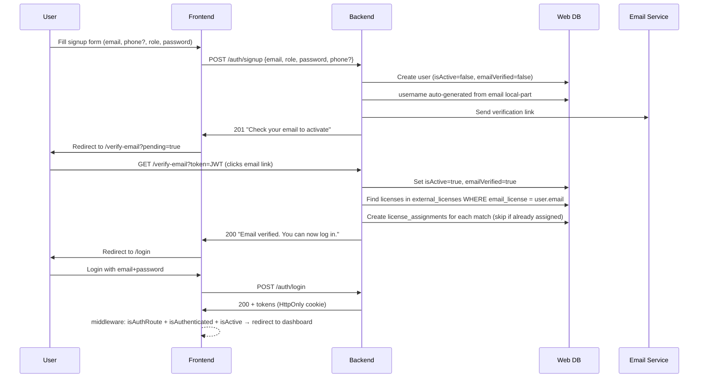

# Signup & Auth Flow Overhaul

## What already works (no changes needed)

- Email verification flow end-to-end (signup → JWT token email → `POST /auth/verify-email` → `updateEmailVerification`) — confirmed in [verify-email-use-case.js](backend/src/application/use-cases/auth/verify-email-use-case.js)
- Login blocks unverified accounts (`EmailNotVerifiedException` in [login-use-case.js](backend/src/application/use-cases/auth/login-use-case.js) line 62) — also blocks deactivated accounts separately
- Middleware redirect guard: authenticated+active users visiting `/login` already redirect to their dashboard in [middleware.ts](frontend/middleware.ts) line 314
- Rate limiting on `POST /auth/signup` (20 req / 15 min via `signupLimiter` in [auth-routes.js](backend/src/infrastructure/routes/auth-routes.js))
- `users` table stores only `display_name` (not separate first/last columns) — DB schema already compatible with the plan's displayName-from-email approach

---

## Current state confirmed by code audit

### Frontend signup form — [signup-form.tsx](frontend/src/presentation/components/organisms/auth/signup-form.tsx)

Current fields: `firstName` (required), `lastName` (required), `email` (required), `password` (required), `confirmPassword` (required), `role` (required), `username` (optional), `phone` (optional).

After `fe-form`: keep only `email`, `password`, `confirmPassword`, `role`, `phone?`.

Validation is manual local state (not RHF+Zod) — out of scope for this plan.

Submission chain: `SignupForm` → `useAuthStore.signup` → `authApi.signup` → `POST /auth/signup` — no application use-case layer on the frontend for signup.

### Backend validation — two layers, both need updating

| Layer | File | What to change |
|---|---|---|
| Joi schema | [auth.schemas.js](backend/src/infrastructure/api/v1/schemas/auth.schemas.js) | `be-schema`: make firstName/lastName `.optional()` |
| AuthValidator | [auth-validator.js](backend/src/application/validators/auth-validator.js) | `be-validator`: mirror the same optionality — currently duplicates required-field rules |

### Backend signup use case — [signup-use-case.js](backend/src/application/use-cases/auth/signup-use-case.js)

Currently: `displayName = firstName + ' ' + lastName` (both required). After `be-signup-uc`: fall back to email local-part when names absent. Username uniqueness loop already exists — no change needed there.

### VerifyEmailUseCase — [verify-email-use-case.js](backend/src/application/use-cases/auth/verify-email-use-case.js)

Currently calls only `userRepository.updateEmailVerification`. Does **not** touch licenses. `be-verify-uc` + `be-repo-all` + `be-di` add the auto-assign step after activation.

### Known risk (no change needed now)

If `sendEmailVerification` throws after `userRepository.save`, the user row exists but is unverified with no easy recovery path other than the resend endpoint. This is a pre-existing issue — out of scope, but worth a follow-up.

---

## Flow after changes

